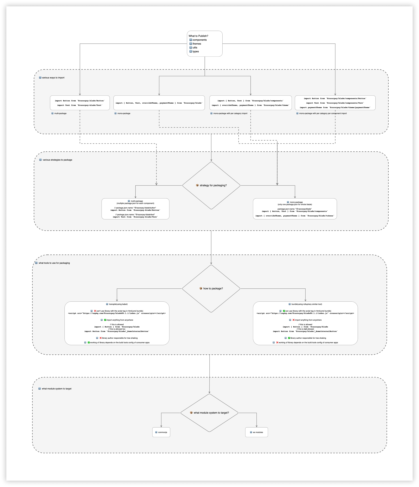

# 🛳 Shipping Blade <!-- omit in toc -->

### Table Of Contents <!-- omit in toc -->
- [Summary](#summary)
- [Basic Example](#basic-example)
- [Motivation](#motivation)
- [Detailed Design](#detailed-design)
  - [What do we want to actually ship?](#what-do-we-want-to-actually-ship)
  - [How will the consumers import things from blade?](#how-will-the-consumers-import-things-from-blade)
    - [1. `import` individual components](#1-import-individual-components)
      - [Pros](#pros)
      - [Cons](#cons)
    - [2. `import` everything from root package](#2-import-everything-from-root-package)
      - [Pros](#pros-1)
      - [Cons](#cons-1)
    - [3. `import` from each category(components, tokens,types, utils) root package](#3-import-from-each-categorycomponents-tokenstypes-utils-root-package)
      - [Pros](#pros-2)
      - [Cons](#cons-2)
    - [4. `import` named components from each category(components, tokens,types, utils) root package](#4-import-named-components-from-each-categorycomponents-tokenstypes-utils-root-package)
      - [Pros](#pros-3)
      - [Cons](#cons-3)
    - [Which approach we'll take?](#which-approach-well-take)
  - [What strategy to take for packaging?](#what-strategy-to-take-for-packaging)
    - [1. Multi-package](#1-multi-package)
    - [2. Mono-package](#2-mono-package)
    - [Conclusion](#conclusion)
  - [How to package?](#how-to-package)
    - [Shall we Transpile(using babel)?](#shall-we-transpileusing-babel)
    - [Shall we Bundle(using rollup/similar tools)?](#shall-we-bundleusing-rollupsimilar-tools)
    - [Conclusion](#conclusion-1)
  - [What module system to target?](#what-module-system-to-target)
    - [CommonJS(a.k.a cjs)](#commonjsaka-cjs)
    - [ES Modules(a.k.a esm)](#es-modulesaka-esm)
    - [Conclusion](#conclusion-2)
  - [Meta information in package.json](#meta-information-in-packagejson)
- [Drawbacks/Constraints](#drawbacksconstraints)
- [Alternatives](#alternatives)
- [Adoption strategy](#adoption-strategy)
- [Open Questions](#open-questions)
- [References](#references)

# Summary

We can't ship the raw code to the consumers so we need to ship/publish blade. But to make it publishable there are certain things we need to keep in mind and answer relevant questions.

# Basic Example
We should be able to install and use blade in our code without any overhead.
```js
import { Button, Text } from '@razorpay/blade/components'
import { overrideTheme, paymentTheme } from '@razorpay/blade/theme'
import { getColorScheme, useColorScheme } from '@razorpay/blade/utils'
```

# Motivation
- We can't ship raw source code to our consumers since we are not aware about the build tool chains they use, what config do they support.
- We need to prevent access to certain parts of the codebase. There might be certain files/functionality which are just used for internal purpose and we don't want to expose them to our consumers. So we want to publish few things and not publish few.

In the end we should be able to ship the code in such a way that:
* It doesn't increases the bundle size of our consumer apps.
* There's no compilation issue on their end.
* We restrict them to only use what is useful for them and hide away unnecessary underlying details.

# Detailed Design
This problem has multiple pieces to it and in order to come up with a solution I have tried to break it down into questions that we must ask to ourselves and then conclude every question.

Here's the visual representation for decision making of bundling. 
> You can look at the actual source [file of the diagram here](https://drive.google.com/file/d/1AM0ryQCXMbfP4z2PUWpt86KUU5iE8rvR/view?usp=sharing) if you can't see things properly in attached image



## What do we want to actually ship?
* components
* tokens/themes(need to decide on the naming)
* types
* utils

## How will the consumers import things from blade?
There are multiple ways that consumers can import components, themes, types, utils from blade. Let's look into it one by one

### 1. `import` individual components
```js
/* multi-package */
import Button from '@razorpay-blade/Button' 
import Text from '@razorpay-blade/Text'
import overrideTheme from '@razorpay-blade/overrideTheme'
import paymentTheme from '@razorpay-blade/paymentTheme'
import getColorScheme from '@razorpay-blade/getColorScheme'
import useColorScheme from '@razorpay-blade/useColorScheme'
```

#### Pros
* No need to maintain a top level re-exports. Just write the component and be done with it.

```js
// packages/blade/index.ts
export * from 'src/components/Button'
export * from 'src/components/Text'
export * from 'src/tokens/theme'
```

#### Cons
* We have to write the whole `import` statement for every component we want. Not a good DX. Imagine importing 15 components and writing 15 import statements for each of them.

### 2. `import` everything from root package
```js
/* mono-package */
import { Button, Text, overrideTheme, paymentTheme, getColorScheme, useColorScheme } from '@razorpay/blade'
```

#### Pros
* Don't have to write the whole import statement for every component we want. If there's an import statement already we just add it to the existing named import statement

```js
// consumer/src/App.tsx
import { Button, Text, overrideTheme, paymentTheme } from '@razorpay/blade'
```

#### Cons
* Everytime we add anything we need to ensure that we re-export it from the top level re-exports.

```js
// packages/blade/index.ts
export * from 'src/components/Button'
export * from 'src/components/Text'
export * from 'src/tokens/theme'
```

### 3. `import` from each category(components, tokens,types, utils) root package
```js
/* mono-package with per category import */
import { Button, Text } from '@razorpay/blade/components'
import { overrideTheme, paymentTheme } from '@razorpay/blade/theme'
import { getColorScheme, useColorScheme } from '@razorpay/blade/utils'
```

#### Pros
* Better readability and structured imports. We know what we want and from where will it come.
* No long running import statements with concerns mixed

```js
import { Button, Text, overrideTheme, paymentTheme, getColorScheme, useColorScheme } from '@razorpay/blade'
```

#### Cons
* We need to maintain top level re-exports per category
```js
// packages/blade/src/components/index.ts
export * from 'src/components/Button'
export * from 'src/components/Text'

// packages/blade/src/tokens/theme/index.ts
export * from 'src/tokens/theme/paymentTheme'
export * from 'src/tokens/theme/bankingTheme'
export * from 'src/tokens/theme/overrideTheme'

// packages/blade/src/utils/index.ts
export * from 'src/tokens/utils/getColorScheme'
export * from 'src/tokens/utils/useColorScheme'
```

### 4. `import` named components from each category(components, tokens,types, utils) root package
```js
/* mono-package with per category per component import */
import Button from '@razorpay/blade/components/Button'
import Text from '@razorpay/blade/components/Text'
import paymentTheme from '@razorpay/blade/theme/paymentTheme'
```

#### Pros
* No need to maintain top level re-exports per category. Just write your components and be done with it.

```js
// packages/blade/src/components/index.ts
export * from 'src/components/Button'
export * from 'src/components/Text'

// packages/blade/src/tokens/theme/index.ts
export * from 'src/tokens/theme/paymentTheme'
export * from 'src/tokens/theme/bankingTheme'
export * from 'src/tokens/theme/overrideTheme'

// packages/blade/src/utils/index.ts
export * from 'src/tokens/utils/getColorScheme'
export * from 'src/tokens/utils/useColorScheme'
```

#### Cons
* We have to write the whole named `import` statement for everything we want to import and with every category

### Which approach we'll take?
We'll go with approach [#3](#3-import-from-each-categorycomponents-tokenstypes-utils-root-package)

## What strategy to take for packaging?

### 1. Multi-package
We can have each component as individual packages. Each of them will have their own `package.json` and versioning.

```js
// package.json.name: "@razorpay-blade/button" 
import Button from '@razorpay-blade/button'

// package.json.name: "@razorpay-blade/text" 
import Text from '@razorpay-blade/text'

// package.json.name: "@razorpay-blade/tokens" 
import { overrideTheme, paymentTheme } from '@razorpay-blade/tokens'
```

### 2. Mono-package
We can have mono package i.e only one `package.json` for whole blade
```js
// package.json.name: "@razorpay/blade"
import { Button, Text } from '@razorpay/blade/components'
import { overrideTheme, paymentTheme } from '@razorpay/blade/tokens'
```

Let's understand the difference by taking a use case(note: there's no performance concern in either of the styles of packaging)

Payment and Banking teams both start using blade at 1.0.0(assuming we publish a mono package). 

Now, we add more features to blade and bump the version to 1.0.2

➡️ **Banking team** was using 1.0.0 and updated to 1.0.2.

➡️ **Payment team** is still using 1.0.0.

we made fixes/features and couple of releases in between and now our version stands at 1.0.7.

➡️ **Banking team** regularly updated versions and they are at 1.0.7.

➡️ **Payment team** is still using 1.0.0 and now they want to upgrade.

With the mono-package approach once they update to **1.0.7** they need to test their code to ensure nothing is breaking for them(even though we'll ensure we don't do breaking changes but still you never know).

Now, if we go with multi-package version, each component is versioned so **Payment team** can only update the components that they really need to upgrade without worrying about all the components. A lot of big companies follow this approach. Sounds like a good deal right?

Using individually versioned packages does have some downsides that we should look into as it might lead to bloat.

1. Manual upgrades

    * You must manage versioning yourself. Unlike the mono-package, multi-package versioned packages must be manually upgraded to ensure compatibility between components. Upgrading a component that depends on another component may require that component to also be updated to ensure compatibility.
    * Assume Payment's team is using `Modal` component and they need to just upgrade `Modal`.
    * But, `Modal` might have other components like `Button`, `Icon` and `Theme` which also would have undergone changes so they need to bump those packages too, now `Button` might depend on `Text` so they need to update `Text` too.

2. Avoid duplicate versions

   * You should ensure that you do not unintentionally introduce multiple versions of the same component into your app. While this does technically work, it will cause your application to include more code than necessary, so it should only be used as a temporary fix if at all.

   * For eg: You might use `Modal@1.0.2` which internally might have dependency on `Button@1.0.2`. Now what happens if you accidentally have `Button@1.0.1` as a dependency already? It might lead to inconsistent behaviors.

### Conclusion
* In theory the multi-package does looks appealing but has inherent consequences that are not worth the efforts on publishing team as well as consuming team side.
* Would we like teams to buy into blade as a whole and upgrade versions regularly? Yes, since there's no performance implication as such of mono-package. If teams are not regularly upgrading to newer versions then we'll figure out a way to solve that problem in a different way.

## How to package?
We have different tools at hand to package.
* Babel: It'll just transpile the code and won't bundle things
* Rollup: It'll bundle the code into one single file/multiple(depending on our config)
* Parcel: It'll bundle the code into one single file/multiple(depending on our config)
* Bob: This under the hood transpiles things using babel and is more suitable for complex libraries built for react native apps and esp ones interacting with native side(android/iOS). Don't yet see a use case for this so not considering it at the moment.

### Shall we Transpile(using babel)?
It'll just transpile the code and won't bundle things. Before we take a call let's see a checklist of what transpiling can/can't do.

1. We can't use library with the script tag in html(umd bundle).
    ```html
    <script src="https://unpkg.com/@razorpay/blade@0.1.1/index.js" crossorigin></script>
    ```
2. Consumers are allwoed to import anything from anywhere.
    ```js
    // this is allowed
    import { Button } from '@razorpay/blade'
    // this is allowed too
    import Button from '@razorpay/blade/_SomeInternalButton'
    ```
3. As library authors we are not responsible for tree shaking, we depend on the consumer applications to take care of that. We'll just give them transpiled code so their app tools can understand.
4. Working of library totally depends on the tools config and different versions of consumer apps. It should at least have the configs(babel presets/plugins) in which the library is built.
> 📝 We can create our custom plugins and ask consumers to import it but that's again too much effort to maintain another piece.

### Shall we Bundle(using rollup/similar tools)?
It'll bundle the code into one single file/multiple(depending on our config).Before we take a call let's see a checklist of what transpiling can/can't do.
1. We can use library with the script tag in html(umd bundle).
    ```html
    <script src="https://unpkg.com/@razorpay/blade@0.1.1/index.js" crossorigin></script>
    ```
2. The imports are restricted to what we re-export and bundle.
    ```js
    // this is allowed
    import { Button } from '@razorpay/blade'
    // this is not allowed as it's not re-exported
    import Button from '@razorpay/blade/_SomeInternalButton'
    ```
3. As library authors we are responsible for tree shaking since we'll be bundling the code which will be ready to be used by the consumers.
4. Since we ship the packaged code we don't care what tools config or versions the consumer app is using. We'll ship code that they just need to plug in and it would work.

### Conclusion
I feel below is the checklist that we need.

✅ Can use library with the script tag in html(umd bundle).

✅ Library author responsible for tree shaking

✅ Restricted imports(depends on what we re-export and bundle)

✅ Make the library work regardless of the consumer apps build tools chains or config

And this can be achieved by going with the approach of bundling using rollup.

> Not choosing parcel for following reasons:
> 1. Not familiar with the tool
> 2. We need to bundle react-native as well so I'm not too sure how smooth it will be with parcel.

## What module system to target?

### CommonJS(a.k.a cjs)
* Everything that we see using `require` or `module.exports` is commonjs
* Not great at tree shaking capabilities because when you import you get an object.
* More code shipped to the browsers which means more download, parse execute times.
### ES Modules(a.k.a esm)
* Everything that we see using `import` or `export` is esm.
* It's great at tree shaking as you can determine imports and exports at compile time (statically) — the tools only have to look at the source code, they don’t have to execute it.
* Less code shipped to the browsers which means better download, parse execute times.

### Conclusion
We should definitely go with ESM. There might be few gotchas and unknowns that might pop up but we'll move ahead and fix them instead of taking a back seat and ship CJS.

## Meta information in package.json
* If we decide to bundle(instead of transpile) then we need to define values for `main`, `module`, `react-native` fields in package.json.
* If we our final bundle has `components`, `tokens`, `types`, `utils`  as individual pieces then we can't define these values since these fields in `package.json` accepts only single string value. So we might need to explore `exports` field of `package.json`. [Check Preact for reference.](https://github.com/preactjs/preact/blob/master/package.json#L12-L71)
* if we just produce one final bundle then we can define values for `main`, `module`, `react-native` fields in package.json. I think the above point should be fine.


# Drawbacks/Constraints
I've already spoken about multiple approaches and constraints of each of them in the respective sections itself.

# Alternatives
I've already spoken about multiple approaches and constraints of each of them in the respective sections itself.

# Adoption strategy
There's no adoption strategy as such. We'll just need to document the usage of design system once it's published.

# Open Questions
1. Do we need any changes in our src directory structure to support our needs?
2. We have custom types defined at a lot of place so how do we merge them with the types generated by tsconfig?
   * Maybe use something similar to [this library](https://www.npmjs.com/package/npm-dts).

# References
Any references that you can share for those who are curious to understand anything beyond the scope of this RFC in general but related to the topic of this RFC.
