# Duration - Motion Design <!-- omit in toc -->

### Table Of Contents <!-- omit in toc -->
- [Summary](#summary)
- [Basic Example](#basic-example)
- [Motivation](#motivation)
- [Detailed Design](#detailed-design)
- [Drawbacks/Constraints](#drawbacksconstraints)
- [Alternatives](#alternatives)
- [Adoption Strategy](#adoption-strategy)
- [Open Questions](#open-questions)
- [References](#references)

# Summary
Easing refers to the way in which a motion proceeds between two states. You can think of easing as acceleration or deceleration. An object that moves from one side of the stage to the other side can start off slowly, then build up speed, and then stop suddenly.

# Basic Example

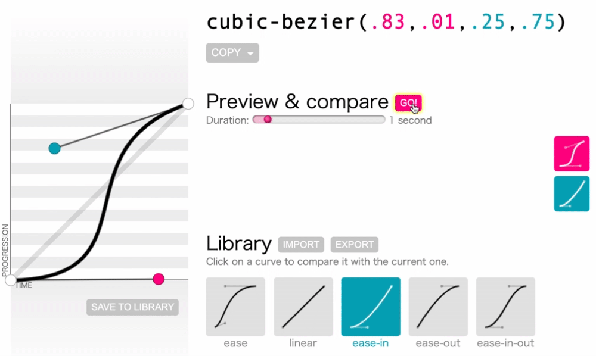   

### Basic Easing Style types: 
Linear, Ease-in, Ease-out, Ease-in-out
it can be infinite. Ref: https://easings.net/
  

### Easing value can be represented in multiple forms depending on the platform it is used:

| Platform | Protocol |
|---|---|
| Android | FastOutSlowInInterpolator | 
| CSS | cubic-bezier(0.4, 0.0, 0.2, 1) | 
| Flutter| standardEasing| 
| iOS| [[CAMediaTimingFunction alloc]   initWithControlPoints:0.4f:0.0f:0.2f:1.0f] | 
| After effects | outgoing 20%, incoming 62% | 

# Motivation
### Why are we doing this?
Easing is one of the elements of motion (out of 3 core actions, duration).
 
* Strictly linear movement appears unnatural to the human eye and we are trying to make it pleasing to users eyes.
* To maintain the consistency & branding throughout our motion styles so that it looks familiar to users and doesn't look out of the world. Defining these properties will help us in guiding the designers and communicating with the developers. 
* Motion helps users to reach their goals and makes it self-explanatory, and these easing curves will help us in achieving the motion stylesand self-explanatory motion hints.
* Defining the easing styles will help in guiding designers and communicating with developers.

### What is the expected outcome?
We shall be able to answer following questions as a conclusion to this RFC
1. What easings we'll be using for any motion?
2. How will we ensure accessibility in terms of motion?
3. How all easings will be used to elements or components.
4. How/where we will store the different easings as design tokens?

# Detailed Design
## Easing Types
Based on motion purposes we need 4 types of easings-

1. **Effective:** This Easing is appropriate for moments when the user needs to focus on completing tasks. Microinteractions in Carbon such as button states, dropdowns, revealing additional information, or rendering data tables and visualizations were all designed with Effective easing. It should be quicker.

2. **Reveling:** for significant moments such as opening a new page, clicking the primary action button, or when the movement itself conveys a meaning which builds self-explanatory motion hints. It can be more expressive

3. **Attentive:** This Easing helps in getting user attention when the user is confused or needs guidance or information. It should get user attention but don’t distract.

4. **Wary:** Easing which guide user about user or system errors, it should get instant user attention. It can be shaky.

## Design Approach:
1. Setting up Brand and word list.   ->Checkout [Razorpay Brand Document](https://razorpay.slack.com/files/UETR880K1/F01AMED4J6P/razorpay___branding_document_10.10.2020.pdf). 
2. With the help of the few brand defining words, we designed Few effective easings. 
3. Experimented with effective easing style concepts. 
4. Designed Other 3 easings based on the decided concept. 
- Final concept: Pick up Quick in starting like Racing car starts and the smooth ending which build trust. 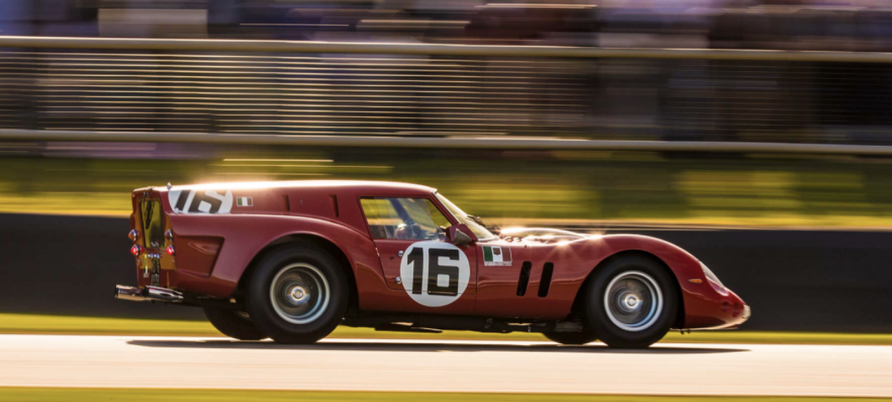
* Check out the [Process](https://www.figma.com/proto/iIbMKg31KfQTlpkxwlaBXG/Motion-design-system?page-id=1270%3A0&node-id=5937%3A3235&viewport=-760%2C188%2C0.04553482308983803&scaling=scale-down) here.

## Final easings
| Easing types | Easing Value | Example|
|---|---|---|
| **Effective** | (0.30,0.00,0.20,1.00)   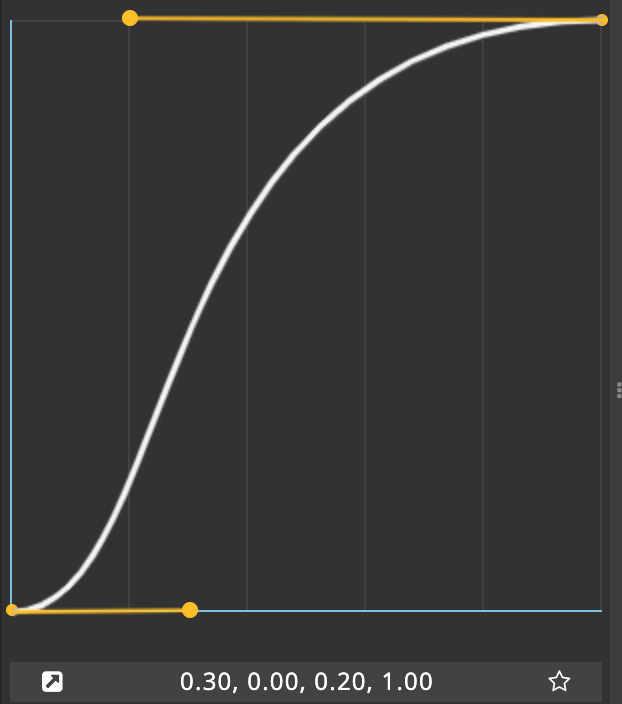 | 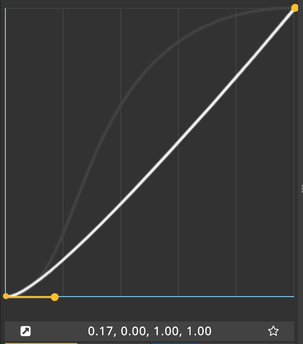 |
| **Reveling** | (0.50,0.00,0.00,1.00)   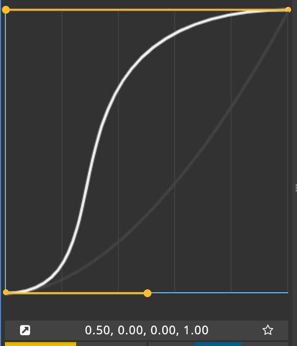 | 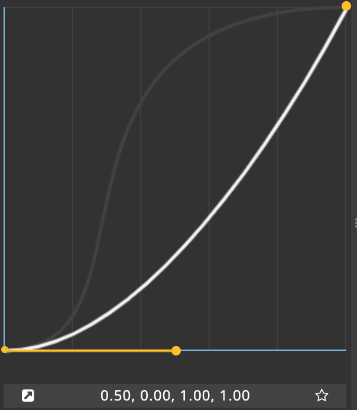 |
| **Attentive** | (0.50,0.00,0.30,1.50) 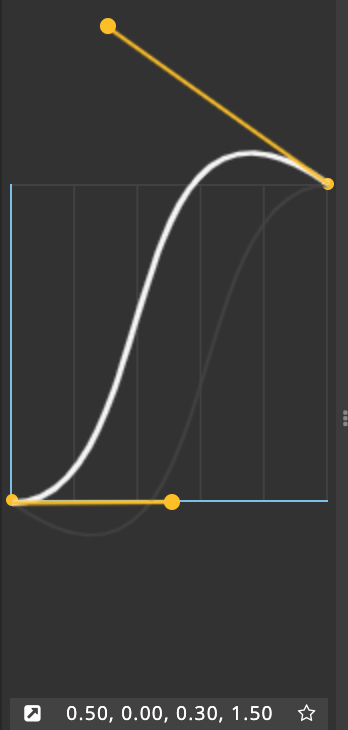| |
| **Wary** | (1.00,0.50,0.00,0.50)   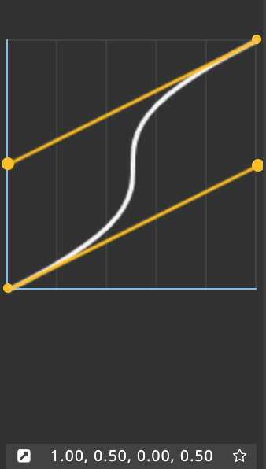 |  |

## Usage Approach
There are two ways to add easing to a Motion element:

1. **Apply on core-actions:**  all the animated properties have linear easing by default which we can change but the con is that we need to add the easing on all elements. Also, there are sub-easing that depend on if the element is appearing/disappearing or changing during the animation. 
### Sub-easings: 
these are 3 types
1. **Entrance Ease:** when an element is appearing in the viewport (first half part of the main easing)
2. **Standard Ease:** When elements are changing but stay in the viewport. (first and second halves)
3. **Exit Ease:** When an element is disappearing from the viewport (second half part of main easing)   

| Ease type | Entrance | Standard | Exit |
|---|---|---|---|
| **Effective** | (0.00,0.00,0.20,1.00) 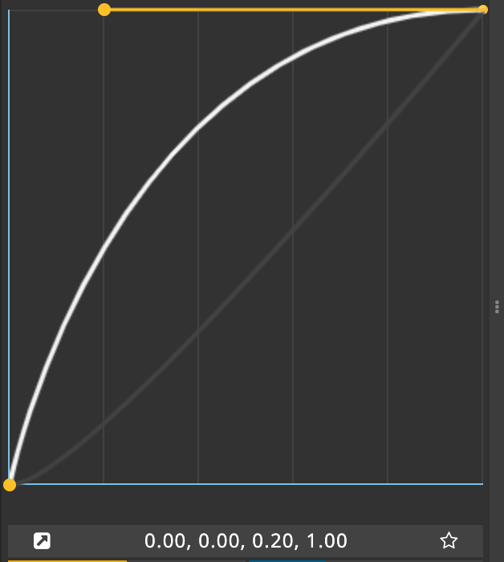| (0.30,0.00,0.20,1.00)    | (0.17,0.00,1.00,1.00)    |
| **Reveling** | (0.00,0.00,0.00,1.00) 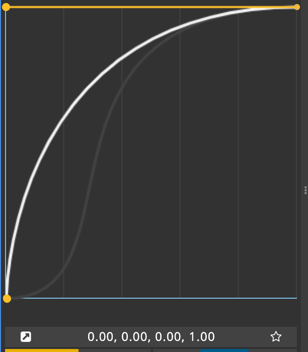| (0.50,0.00,0.00,1.00)    | (0.50,0.00,1.00,1.00)    |
| **Attentive** | (0.50,0.00,0.30,1.50) | - | (0.70,0.00,0.50,1.00)   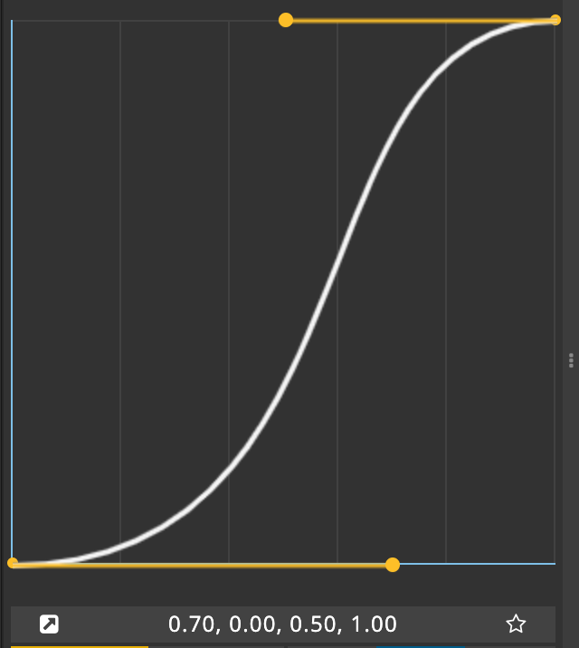 |
| **Wary** | - | (1.00,0.50,0.00,0.50)    | - |

2. **Apply on duration/time:** Time is linear function as default but we can change the time function non-linear way and add designed easing on this time function for the whole duration. We will get exact same output. The main con can be it can require more performance. But we do not need to worry about sub easing and we can just apply the main easing on Time and add time remapping.  
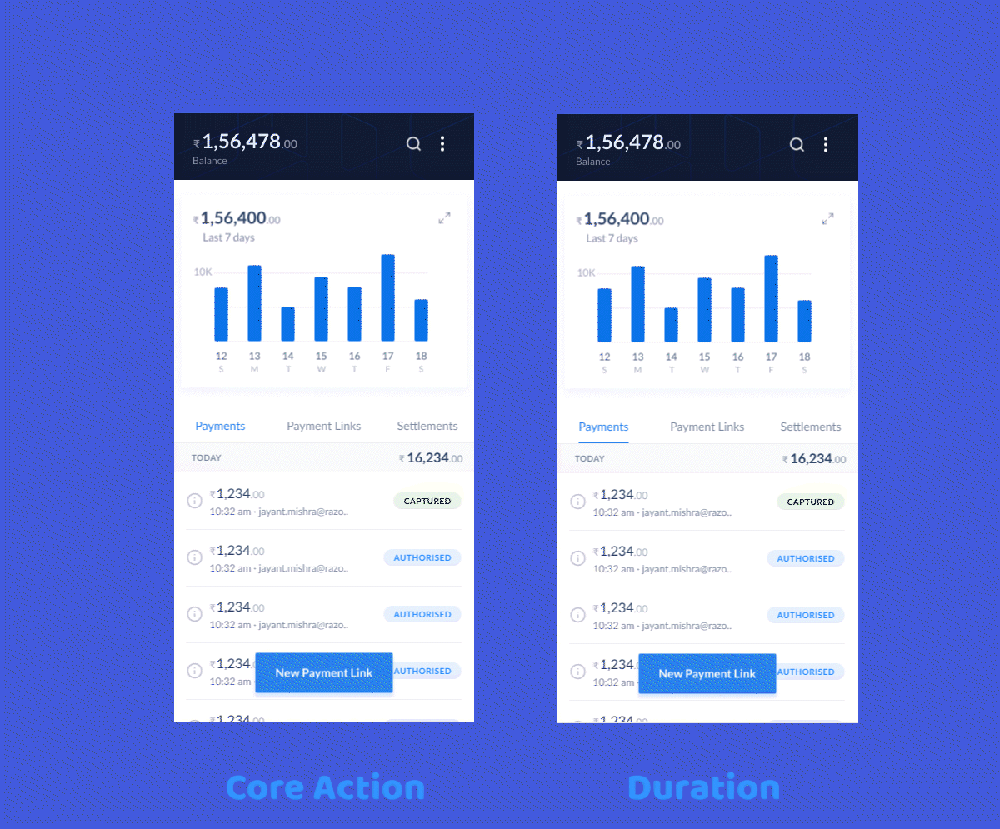  

### **Accessibility**
* For [reduced Motion](https://www.smashingmagazine.com/2020/09/design-reduced-motion-sensitivities/) (for motion sensitivities) - We can use relatively smoother easings with larger durations.

# Drawbacks/Constraints
1. In this, we didn’t consider animation of Icons, Loaders and Typography.
* Icons and loaders will have a library and designers will not be creating these occasionally, that’s why we didn’t include rotation property in core actions.
* Special animations related to typography is rare and will be covered separately, **Ex:** appearing of letters one by one. Otherwise, typeface can be considered as UI element only and can have properties like fade, etc.
2. These easings are for [non-real time interactions](https://images.squarespace-cdn.com/content/v1/546aeb13e4b06c7939161700/1491323190291-Y65KBIBB8LIX00JJFLVZ/image-asset.gif?format=1500w), As [real-time interaction](https://images.squarespace-cdn.com/content/v1/546aeb13e4b06c7939161700/1491323167574-FMS8AP2Z9CZ3E6F51O1Y/image-asset.gif?format=1500w) is directly related to user’s behavior/gestures on the interface and depending on how user is interacting with the interface can lead to different durations. For ex: Scroll (user can scroll quickly and slowly)

3. Usage approach on both core action and duration have cons:
- Core action requires easing on each element which vary depending on entering or exiting actions
- Duration approach is not good for elements that have different entering and exiting easings.

# Alternatives
1. [For Real-time interaction](https://images.squarespace-cdn.com/content/v1/546aeb13e4b06c7939161700/1491323167574-FMS8AP2Z9CZ3E6F51O1Y/image-asset.gif?format=1500w), the duration depends on the gesture strength, For ex: if user scroll quickly elements moves quickly where duration is less. Delay or smoothing in these interactions will increase the duration interval.
2. [React Spring:](https://react-spring-visualizer.com/#spring) different approach of how things move.

# Adoption strategy
 **For developers** 
-  Deciding if easing will be applied on Core actions or Duration/time.
- All these decisions shouldn't matter, as this will be stored in our tokens as an abstraction. The end consumers will just use the tokens for their purpose and not the actual values. **Exampe:** `bladeMotionEffectiveEntrance: cubic-bezier(0.00,0.00,0.20,1.00)`
- Developers use the these easing tokens to develop components.
- Migration of existing projects is out of the scope of this RFC since that will be a breaking change.

**For designers** 
- We can develop a tool for Figma which can help designers choose animation presets. Although, these should be baked inside the components itself.
- Ex: animation presets in this tool [jitter.video](https://jitter.video/)

# Open Questions
1. How can we help designers choose these animation tokens on Figma. Is it possible, or should we look for some other tool?

# References
* [Easing functions](https://easings.net/) *by Andrey Sitnik and Ivan Solovev*
* [Spring tool](https://react-spring-visualizer.com/#spring) *by Joost Kiens*
* [Carbon design system](https://www.carbondesignsystem.com/guidelines/motion/overview/#easing) *by IBM*
* [Cubic bezier](https://cubic-bezier.com/) *by Lea Verou*
* [Material design system](https://material.io/design/motion/speed.html#easing) *by Google*
* [Design for reduced motion sensitivities](https://www.smashingmagazine.com/2020/09/design-reduced-motion-sensitivities/) *by Smashing Magazine*
