# Units for typography and layout <!-- omit in toc -->

### Table Of Contents <!-- omit in toc -->
- [Summary](#summary)
- [Basic Example](#basic-example)
  - [Web](#web)
  - [React Native](#react-native)
- [Motivation](#motivation)
    - [Why are we doing this?](#why-are-we-doing-this)
    - [What use cases does it support?](#what-use-cases-does-it-support)
    - [What is the expected outcome?](#what-is-the-expected-outcome)
- [Detailed Design](#detailed-design)
  - [Screen resolutions and densities](#screen-resolutions-and-densities)
    - [Aspect Ratio](#aspect-ratio)
    - [PPI](#ppi)
    - [Software vs Hardware pixel](#software-vs-hardware-pixel)
    - [How things render on web](#how-things-render-on-web)
    - [How things render on native apps(React Native)](#how-things-render-on-native-appsreact-native)
  - [Checklist](#checklist)
  - [Different units:](#different-units)
    - [`px`](#px)
    - [`rem`](#rem)
    - [`dp`](#dp)
  - [Deep Dive](#deep-dive)
    - [Web](#web-1)
    - [React Native](#react-native-1)
  - [Absolute unit vs relative unit?](#absolute-unit-vs-relative-unit)
    - [Absolute unit vs relative unit matrix](#absolute-unit-vs-relative-unit-matrix)
    - [Accessibility Guideline?](#accessibility-guideline)
    - [What units other Design Systems are using?](#what-units-other-design-systems-are-using)
    - [What will work for us?](#what-will-work-for-us)
  - [How will we store and use it?](#how-will-we-store-and-use-it)
- [Drawbacks/Constraints](#drawbacksconstraints)
- [Alternatives](#alternatives)
- [Adoption strategy](#adoption-strategy)
- [Open Questions](#open-questions)
- [References](#references)
- [Lesser known facts](#lesser-known-facts)

# Summary
To render anything on the screen we need some space so in order to define that space we also need to define a unit of that measurement. There are different types of units like `px`, `rems`, `ems`, `percentages`, `dp` etc.

This RFC discusses about why and what units we will be using in our design system.

# Basic Example
Some examples of where and how units are used
## Web
```css
button {
  font-size: 14px;
  line-height: 16px;
  padding: 8px;
  margin: 2px;
  min-height: 48px;
  width: 200px;
}
```
```css
button {
  font-size: 1rem;
  line-height: 1.5;
  padding: 0.5rem;
  margin: 0.125rem;
  min-height: 3rem;
  width: 12.5rem;
}
```
## React Native
```js
Stylesheet.create({
  fontSize: 16, /* 16dp */
  padding: 8, /* 8dp */
  margin: 2, /* 2dp */
  minHeight: 48, /* 48dp */
  width: 200, /* 200dp */
})
```

# Motivation
### Why are we doing this?
As our applications will be used by our users on different platforms(web, mobile, native apps), different screens with different pixel densities and different screens sizes we need to make sure the content is accessible and the layout is consistent in different scenarios.

Units are one of the core foundation principle and building block that will define how our overall designs i.e components, layouts shall be designed as we progress so that we can make our apps work on different platforms, different screen sizes and different pixel densities.

### What use cases does it support?
It'll define what units we'll be using for different styling properties in our design system. Below are the categories to which units will be applied
1. Typography - font-size, line-height
2. Layout - padding, margin, width, height

### What is the expected outcome?
We shall be able to answer following questions as a conclusion to this RFC
1. What unit we'll be using for typography and layouts?
2. How will we ensure accessibility in terms of readability and layout both?
3. How will we use platform dependent units(px, rem, dp etc) in order to render the components on a particular platform in a generic way without polluting our design system components.
4. How/where we will store the unit as design tokens?

# Detailed Design
For anything to be rendered on the screen it needs to have a space on the screen and that space needs to have a measurable unit for the rendering engine to understand how to organise things on the screen.

The styling properties that require units are:
1. Typography
   * `font-size`
   * `line-height`
2. Layout
   1. Space
      * `padding` - top, right, bottom, left
      * `margin` - top, right, bottom, left
   2. Size
      * `height` - height, min-height, max-height
      * `width` - width, min-width, max-width

## Screen resolutions and densities
One of the main goal for layouts and content on the screen is that they should adapt to different screen resolutions and densities and things should still visually appear the same. Now what are some different factors that affect this?

### Aspect Ratio
Aspect ratio is basically `width x height` of a screen and then divide them with the greatest common number i.e find ratios

Examples:

800x600 = 4:3

1024x768 = 4:3

1920x1200 = 16:10

3840x2160 = 16:9
### PPI
PPI is short for pixels per inch which says the number of pixels that can be accommodated in 1 sq inch on the screen. 

PPI plays a signficant role of how things are physically rendered on the screen

How is PPI calculated? multiply the dimension for eg: **1920*1080 = 2073600 (21600 inches)** and then divide this by the area of screen size for eg: 20" monitor has an area of **20.5x12.5=256 sq.in** now to get the ppi do **21600/256 = 84ppi**

### Software vs Hardware pixel
* **Software pixel** - 
  * Software pixel is something that we define while implementing the styles. `16px`, `1rem`, `16dp` etc are all examples of software pixel.
  * Software pixels help us to write consistent code without bothering about the screen sizes and where things will be rendered.
* **Hardware pixel**
  * Hardware pixel is something that is a physical pixel on the screen visible to the users.
  * Software pixels are converted to hardware pixels before they get rendered on the screen.

The ratio of software pixel to hardware pixel is termed as device pixel ratio

>📝 Device Pixel Ratio = Software Pixel : Hardware Pixel

Now, how all these things are important when it comes to rendering? Let's see in the below sections.
### How things render on web
On web we write things in css pixel which is software pixel, it gets converted to hardware pixel by the browsers while rendering, which means `16px` in css doesn't render as `16` physical pixels on the screen.

Example:

_CSS Pixel = Device Pixels / Device Pixel Ratio_

_Device Pixel = CSS Pixel * Device Pixel Ratio_

Device Pixels for macbook pro screen - `3072x1920`(resolution) = `3072` width and `1920` height.

Pixel ratio - 2

so,

_CSS pixel(width) = 3072/2 = 1536_

_CSS pixel(height) = 1920/2 = 960_

That's the reason we design at `@1x`. So when we define width and height as `1536px` and `960px` and then when it gets rendered on a screen with device pixel ratio as `2` it becomes `3072x1920`. For web, browsers do all this heavy lifting so we don't need to put any extra efforts for scaling on different ppi screens we just write things in css pixels.

**How is device pixel ratio calculated?**

_Device Pixel Ratio = ppi/150_

For macbook pro screen the ppi is **226**

so,

_Device Pixel Ratio = 226/150 = 1.5 rounded to 2_

> ❓ Where did 150 came from in the denominator? It's a magic number and is standardised based on some calculations. Check the [detailed explanation here](https://www.html5rocks.com/en/mobile/high-dpi/)

### How things render on native apps(React Native)
On react native we write things in unitless format which is nothing but `dp` and when it gets rendered the respective platform(iOS/android) handles the conversion to actual hardware pixels based on screen resolution and densities so we don't need to explicitly do anything for it.

Example:

Device Pixels for iPhone7 - `750x1334`(resolution) = `750` width and `1334` height

Pixel ratio - 2

so,

_Density independent pixel(width) = 750/2 = 375_

_Density independent pixel(height) = 1334/2 = 667_

That's the reason we design at `@1x`. So when we define width and height as `375px` and `667px` and then when it gets rendered on a screen with device pixel ratio as `2` the platforms scale everything up if we use the `dp` as units

_Device Pixel(width) = 375*2 = 750_

_Device Pixel(height) = 667*2 = 1334_

**How is device pixel ratio calculated?**

_Device Pixel Ratio = ppi/160_

For iphone7 the ppi is 326

so,

_Device Pixel Ratio = 326/160 = 2.03 rounded to 2_

> ❓ Where did 160 came from in the denominator? It's a magic number and is standardised based on some calculations. Check the [detailed explanation here](https://developer.android.com/training/multiscreen/screendensities)

## Checklist
To choose which unit will work best for us we can use the below checklist:
1. Whether the content is accessible when the user changes the default font size of the browser.
2. Whether the content is accessible when the user zooms in/out on the browser. (As per the[ WCAG guideline](https://www.w3.org/WAI/WCAG21/Understanding/resize-text.html) the content shall be readable at 200% zoom)
3. Whether the interface is able to render on different screen sizes, pixel densities etc.

## Different units:
### `px`
* The most commonly used unit is `px` i.e pixels.
* It works on both web and iOS/android apps.
* `px` defines an absolute value but it's still a software pixel for typography and layout, which means anything that has px as a unit when it gets rendered the browser takes into account for screen resolutions and pixel densities and then it converts it into hardware pixels. For example, `padding: 16px` is `16px` software pixel and when it renders on different screen resolutions `1680x1050`, `1024x640` or `360x640` the browser takes care of scaling things as per the device pixel ratio. So `16px` rendered on a device with device pixel ratio of 1 will be rendered as 16 hardware pixels and if the device pixel ratio is 2 then it gets rendered as 32 hardware pixels.
### `rem`
* `rem` is a relative css unit which works in relative to the users device settings and screen resolutions.
* It works on web but **not** on iOS/android.

Eg-1: `font-size: 1rem` - It will be rendered as 16px by default. If the user changes their default browser font-size to 14 then it'll be rendered as 14px.

Eg-2: `padding: 1rem` - the padding will be calculated as 16px by defualt. If the user changes the default browser font-size to 14 then the padding will be calculated as 14px.

> 📝 Note: 1rem = 16px default in all the browsers unless the default font-size of the browser is set to anything else explicitly.

See below how browser devtools show `px` equivalent to `rem`

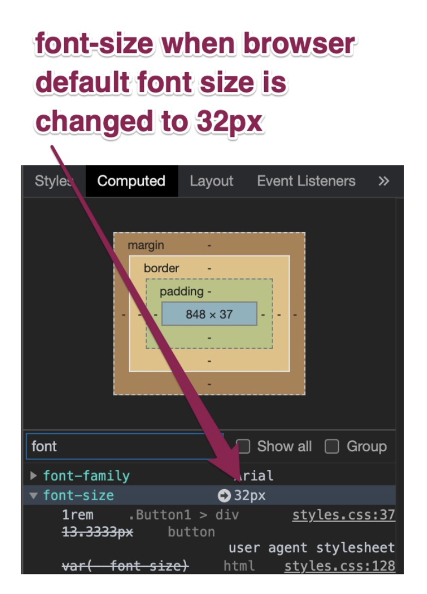

### `dp`
* `dp` is a density independent pixel unit which is used by react native apps
* It works on iOS/android but **not** on web.
* It auto scales with different screen densitites hence the name **density independent**. Think about `dp` as software pixels.

## Deep Dive
Until now we have understood few basic things. Now let's deep dive and see how this actually matters when things get rendered on screen. 


### Web
I've created an [interactive POC](https://codesandbox.io/s/scaling-test-szi8i) that you can play around with. I'll be using the same to demonstrate few things in this section.

I've created 4 buttons which have same css properties but the units are different.

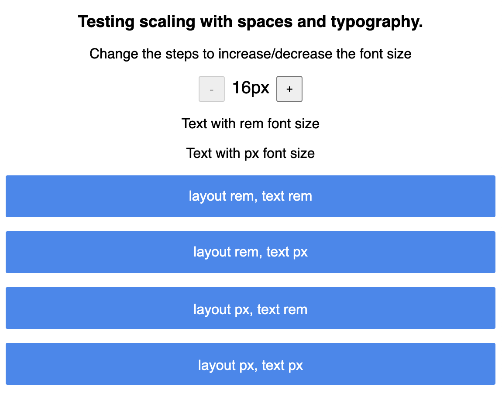

### layout rem, text rem <!-- omit in TOC -->
* This button has all the layout and typography properties defined in `rem`. Here's how the css looks like
   ```css
   .Button1 {
   background: #3987f0;
   border: 1px solid #3987f0;
   box-sizing: border-box;
   border-radius: 2px;
   
   margin-bottom: 16px;
   padding-left: 1.5rem; /* 24px */
   padding-right: 1.5rem; /* 24px */
   padding-top: 0.75rem; /* 12px */
   padding-bottom: 0.75rem; /* 12px */
   min-height: 3rem; /* 48px */
   }
   .Button1 > div {
   color: white;
   font-size: 1rem;
   }
   ```
* Now if we increase the browser font size **everything** will **increase relatively** to the browser font size. [Try it out here](https://codesandbox.io/s/scaling-test-szi8i)
### layout rem, text px <!-- omit in TOC -->
* This button has all the layout properties defined in `rem` but typography in `px`. Here's how the css looks like
   ```css
   .Button2 {
   background: #3987f0;
   border: 1px solid #3987f0;
   box-sizing: border-box;
   border-radius: 2px;
   
   margin-bottom: 16px;
   min-height: 3rem; /* 48px */
   padding-left: 1.5rem; /* 24px */
   padding-right: 1.5rem; /* 24px */
   padding-top: 0.75rem; /* 12px */
   padding-bottom: 0.75rem; /* 12px */
   }
   .Button2 > div {
   color: white;
   font-size: 16px;
   }
   ```
* Now if we increase the browser font size the **layout properties** will **increase relatively** but the **typography** will remain **unchanged** as it is using absolute unit i.e `16px`. [Try it out here](https://codesandbox.io/s/scaling-test-szi8i)
### layout px, text rem <!-- omit in TOC -->
* This button has all the layout properties defined in `px` but typography in `rem`. Here's how the css looks like
   ```css
   .Button3 {
   background: #3987f0;
   border: 1px solid #3987f0;
   box-sizing: border-box;
   border-radius: 2px;
   
   margin-bottom: 16px;
   min-height: 48px;
   padding: 16px;
   }
   .Button3 > div {
   color: white;
   font-size: 1rem;
   }
   ```
* Now if we increase the browser font size the **layout properties** will remain **unchanged** but the **typography** will **increase relatively**. [Try it out here](https://codesandbox.io/s/scaling-test-szi8i)
### layout px, text px <!-- omit in TOC -->
* This button has all the layout and typography properties defined in `px`. Here's how the css looks like
   ```css
   .Button4 {
   margin-bottom: 16px;
   min-height: 48px;
   background: #3987f0;
   border: 1px solid #3987f0;
   box-sizing: border-box;
   border-radius: 2px;
   
   margin-bottom: 16px;
   min-height: 48px;
   padding: 16px;
   }
   .Button4 > div {
   color: white;
   font-size: 16px;
   }
   ```
* Now if we increase the browser font size **everything** will remain **unchanged** to the browser font size since everything is in absolute units. [Try it out here](https://codesandbox.io/s/scaling-test-szi8i)

Let's see how things look when we increase the browsers default font size

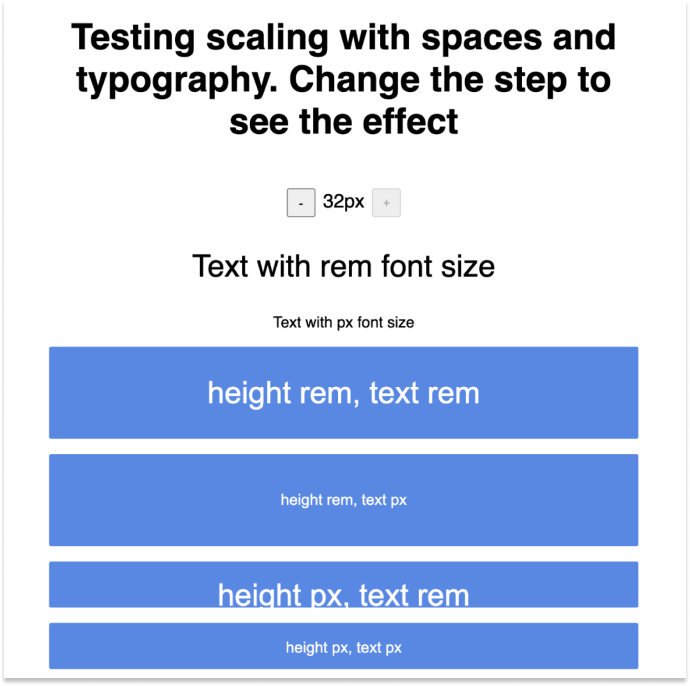

Let's see how things look when we zoom to 200% in the browser

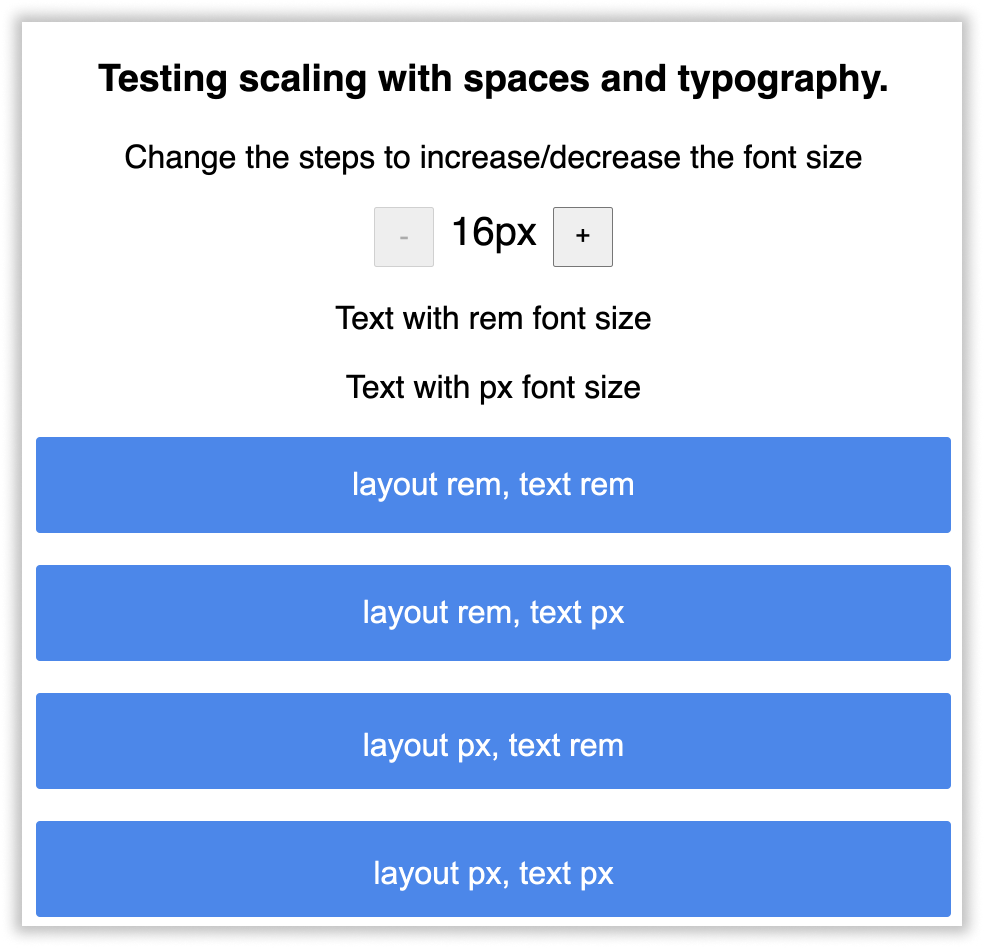

> 📝 Note: The page zoom and font size change don't mimic each other. Hence things at x font size are not same as y% zoom. 

### React Native
### layout pr(pixel ratio), text pr(pixel ratio) <!-- omit in TOC -->
* This button has all the layout and typography properties  defined using pixel ratio of device.
   ```js
   const styles = StyleSheet.create({
      button1: {
         marginBottom: 16,
         height: 48 * PixelRatio.get(),
         backgroundColor: '#3987f0',
         borderRadius: 2,
         paddingLeft: 24 * PixelRatio.get(),
         paddingRight: 24 * PixelRatio.get(),
         paddingTop: 12 * PixelRatio.get(),
         paddingBottom: 12 * PixelRatio.get(),
      },
      button1Text: {
         color: '#ffffff',
         textAlign: 'center',
         fontSize: 16 * PixelRatio.get(),
      },
   }
   ```
### layout dp, text pr(pixel ratio) <!-- omit in TOC -->
* This button layout properties defined in `dp` and typography in pixel ratio of the device.
   ```js
   const styles = StyleSheet.create({
      button2: {
         marginBottom: 16,
         minHeight: 48,
         backgroundColor: '#3987f0',
         borderRadius: 2,
         paddingLeft: 24,
         paddingRight: 24,
         paddingTop: 12,
         paddingBottom: 12,
      },
      button2Text: {
         color: '#ffffff',
         textAlign: 'center',
         fontSize: 16 * PixelRatio.get(),
      },
   }
   ```
### layout dp, text dp with autoscale <!-- omit in TOC -->
* This button has all the layout and typography properties  defined using `dp` and text scaling set to honor device's font size.
   ```js
   const styles = StyleSheet.create({
      button3: {
         marginBottom: 16,
         height: 48,
         backgroundColor: '#3987f0',
         borderRadius: 2,
         paddingLeft: 24,
         paddingRight: 24,
         paddingTop: 12,
         paddingBottom: 12,
      },
      button3Text: {
         color: '#ffffff',
         textAlign: 'center',
         fontSize: 16,
      },
   }
   ```
Let's see how things look on devices with different resolution and densities with default device font size

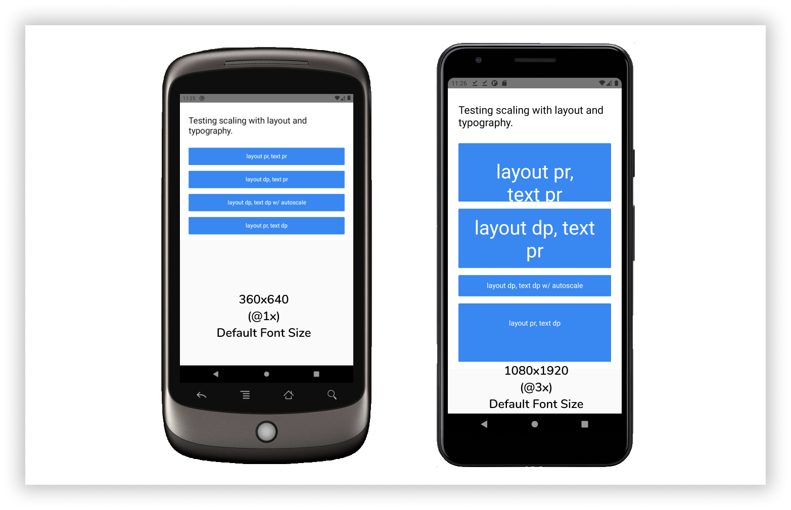

Let's see how things look on devices with different resolution and densities with largest device font size


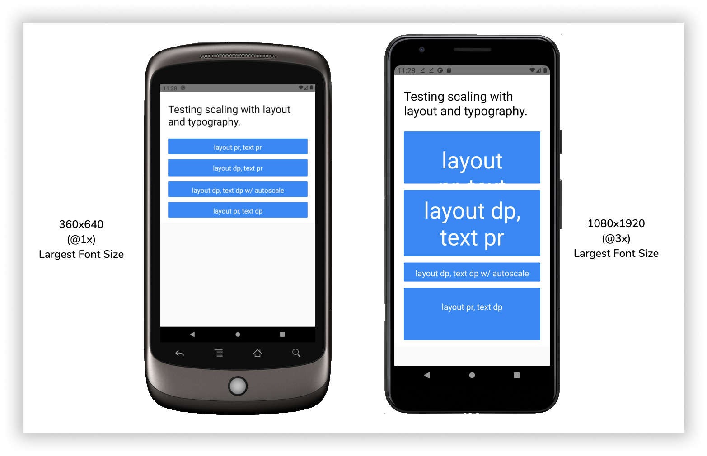

## Absolute unit vs relative unit?
Until now we saw how typography and layout reacts to font sizes and zoom with different units. Referring to [our checklist](#checklist) gives us 3 options:
1. **Everything `px`(web)**
   1. Changing default font-size on the browser level doesn't changes the text content size.
   2. Changing default font-size on the browser level doesn't changes the layout sizes. Nothing breaks as everything is in absolute unit.
   3. Page zoom works as expected and the layout never breaks.
   4. Image when font-size is `32px`
   
2. **Everything `rems`(web)**
   1. Changing default font-size changes the font size of the content.
   2. Changing default font-size changes layout sizes relatively. Things mostly doesn't break as everything is in ratios.
   3. Page zoom works as expected and the layout mostly doesn't breaks.
   4. Image when font-size is `32px`
   
3. **Typography `rems` and Layout `px`(web)**
   1. Changing default font-size changes the font size of the content.
   2. Changing default font-size changes doesn't changes the layout sizes. Some layout breakages can happen as the text may end up being bigger than you expect in your layout.
   3. Page zoom works as expected.
   4. Image when font-size is `32px`
   
4. **Everything `dp`(native)**
   1. Changing device font size changes the font size of the content.
   2. Changing device font size doesn't changes the layout size.
   3. Image when device font-size is largest `@1x`
   

   4. Image when device font-size is largest `@3x`
   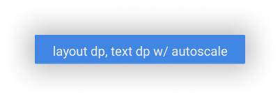
5. **Tyography auto scale, layout pixel ratio(native)**
   1. Changing device font size changes the font size of the content.
   2. Changing device font size doesn't changes the layout size. Some layout breakages can happen as the text may end up being bigger than you expect in your layout.
   3. Things just look bigger if we use pixel ratio as a multiplicative factor as react native uses `dp` it automatically does those things for us.
   4. Image when device font-size is largest `@1x`
   

   5. Image when device font-size is largest `@3x`
   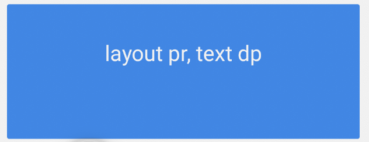
### Absolute unit vs relative unit matrix
| Unit                                             | content size changes? | layout size changes? | layout breakages? | page zoom works? |
| ------------------------------------------------ | :-------------------: | :------------------: | :---------------: | :--------------: |
| Everything px(web)                               |           ❌           |          ❌           |         ❌         |        ✅         |
| Everything rems(web)                             |           ✅           |          ✅           |         ⚠️         |        ✅         |
| Tyography rems, layout px(web)                   |           ✅           |          ❌           |         ✅         |        ✅         |
| Everything dp(native)                            |           ❌           |          ✅           |         ❌         |        🚫         |
| Tyography auto scale, layout pixel ratio(native) |           ✅           |          ❌           |         ✅         |        🚫         |

>⚠️ Doesn't breaks but doesn't renders as expected
### Accessibility Guideline?
The WCAG guideline says that content satisfies the **success criterion** if it can be **scaled up to 200%**. It can go beyond that but logically beyond that the scaling becomes more extreme and adaptive layouts may introduce usability problems.

For example, words may be too wide to fit into the horizontal space available to them, causing them to be truncated; layout constraints may cause text to overlap with other content when it is scaled larger; or only one word of a sentence may fit on each line, causing the sentence to be displayed as a vertical column of text that is difficult to read.
>🔗 [WCAG guideline link](https://www.w3.org/WAI/WCAG21/Understanding/resize-text.html)
### What units other Design Systems are using?

| Name                                                                                     | Typography | Layout | Comments                                 |
| ---------------------------------------------------------------------------------------- | ---------- | ------ | ---------------------------------------- |
| [Primer - GitHub](https://primer.style/css/support/spacing)                              | px         | px     | NA                                       |
| [Spectrum - Adobe](https://react-spectrum.adobe.com/react-spectrum/getting-started.html) | px         | px     | revisitng decision                       |
| [Braid - Seek](https://seek-oss.github.io/braid-design-system/)                          | px         | px     | revisiting decision                      |
| [Styled System](https://styled-system.com/)                                              | px         | px     | default px, can change by suffixing unit |
| [Facebook](https://twitter.com/naman34/status/1362626358539481090)                       | rems       | px     | NA                                       |
| [Chakra](https://chakra-ui.com/docs/getting-started)                                     | rems       | rems   | default rems, option for other units     |

>📝 Note: Couldn't find anything similar for react native
### What will work for us?
Looking at the POC and the [matrix](#absolute-unit-vs-relative-unit-matrix), relative units looks no brainer but it has some downsides too:
* Assume we have few responsive layouts then increasing the font-size on desktop might trigger the media queries to kick in and because of that our layout will be re-arranged assuming that the screen size has changed. Now the user was just intending to increase the font-size but they got tricked into different layout since everything is relative which impacts their experience.
* Since everything is relative, increase in font-size is identical to page zoom so the intent of the user to increase the content size goes for a toss.

So, what's the next best option? 
#### For Web <!-- omit in toc -->
It's **layout in px and typography in relative units**. Why?
* We want to give flexibility to the user to take the control of content readability and might want to still make the layout predictable and not change it when the font size of the browser changes.
* There might be layout breakages for sure but again it's serving the purpose of content readability for the user in the same layout in which they intended to. The cons weighs off the pros i.e **content readability**

Let's see some examples of layouts with `rems` and `px`
#### Output - `layout pixel, typography rem` with default font-size of 32px <!-- omit in toc -->
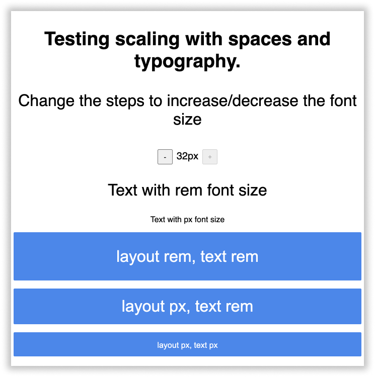

#### Output - `layout pixel, typography rem` with browser window zoomed in at 200% <!-- omit in toc -->
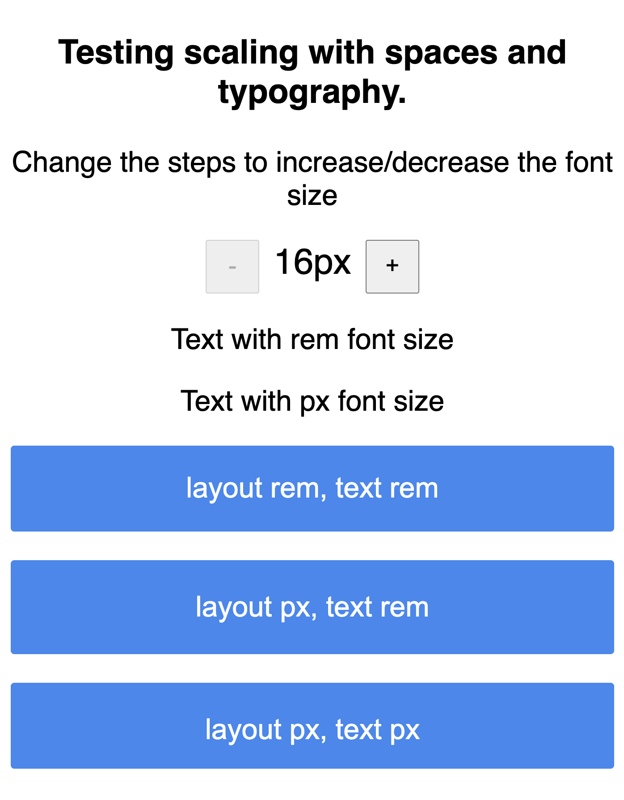

#### Output - `Layout absolute units, typography relative unit` with default font-size of 32px <!-- omit in toc -->
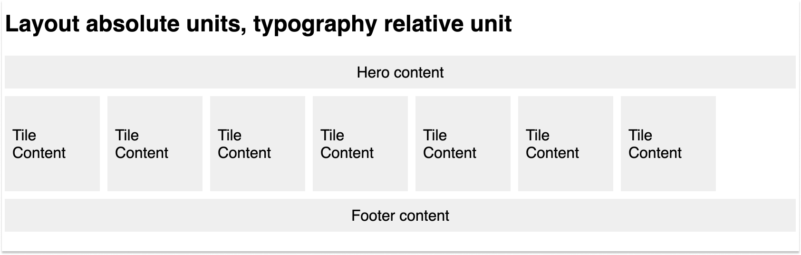

#### Output - `Layout relative units, typography relative unit` with default font-size of 32px <!-- omit in toc -->
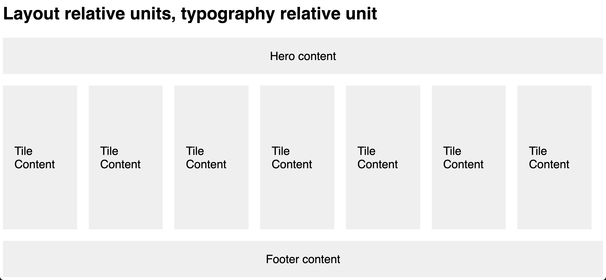
Can you spot the difference when everything is relative unit? The layout also changed with the increase in font size and it looks different from what we expected it to look like.
<br/> <br/>

> 🔗 You can play around with all the [demos here](https://szi8i.csb.app/)

#### For React Native <!-- omit in toc -->
It's **layout in dp and typography in dp w/ autoscale**. Why?
* React native platform only allows `dp` as units.
* It's better since the layouts become much more predictable as the platform just asks us to define things at a base layout and takes care of scaling on different devices with different screen densities automatically.
* We will always honor user's device font size since we want the content to be readable as per user's preference. It might break the layout in some cases but the cons weighs off the pros i.e **content readability**

Let's tally our decision with our [checklist](#checklist)
1. Whether the content is accessible when the user changes the default font size of the browser/device ✅
2. Whether the content is accessible when the user zooms in/out on the browser ✅
3. Whether the interface is able to render on different screen sizes, pixel densities etc ✅


## How will we store and use it?
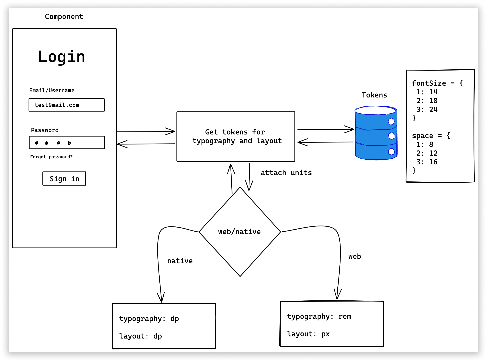

* While storing we can compute the value in `px/dp` and store it in a unitless way. While rendering we can attach the units.
   ```js
   const space = {
      1: 8,
      2: 12,
      3: 16,
   }
   const fontSize = {
      1: 14,
      2: 18,
      3: 24,
   }
   ```
* With the above approach we can keep the vocabulary consistent that everything is stored in `px` for web and `dp` for react native  but while rendering the respective platforms(web/react-native) attaches the unit for the target rendering engine.
* We will implement a generic funtion that will attach the units to the tokens.
* For typography the units that'll be constructed will be relative(`rems` for web and `autoScale` value on text enabled for react-native apps).
* For layout i.e height, width, padding, margin the units that'll be constructed will be absolute i.e `px`(pixels) for web and `dp` for react-native apps but with device pixel ratio to ensure consistency with various screen densities.
# Drawbacks/Constraints
- Vocabulary is the biggest drawback. Thinking and visualising in relative units is difficult compared to absolute units like pixels(`px`) or density independent pixels(`dp`) but we can work it out with the help of tools. We can think and store in pixels but render in relative units of the target platform(`rems` for web and `dp` with device pixel ratio for react-native apps).

# Alternatives
- Here's the [absolute unit vs relative unit matrix](#absolute-unit-vs-relative-unit-matrix) which states all the altternatives with the details.

# Adoption strategy
- **For developers** - All these decisions shouldn't matter, as this will be stored in our tokens as an abstraction. The end consumers will just use the typography and layout scale tokens for their purpose and not the actual values.
- Migration of existing projects is out of the scope of this RFC since that will be a breaking change.
- **For Designers** - All the designs shall be created `@1x` and the assets(images) shall be exported `@2x`, `@3x` accordingly. The standard artboard size for mobile is `360x640` for android and `375x677` for iPhone.
- **For Designers** - When doing visual QA of any design which is implemented the comparision cannot be done by keeping the screenshot from device side by side with the design implemented `@1x`. That'll always give wrong comparision results.

- We should have a different scale for each platform (mainly web & mobile) we are designing for instead of having a singular scale that accommodate all devices.

# Open Questions
1. Browser zoom and browser font size behave differently? Couldn't figure out what does browser zoom does differently like what css props does it changes so in order to have parity we need to mimic it?

   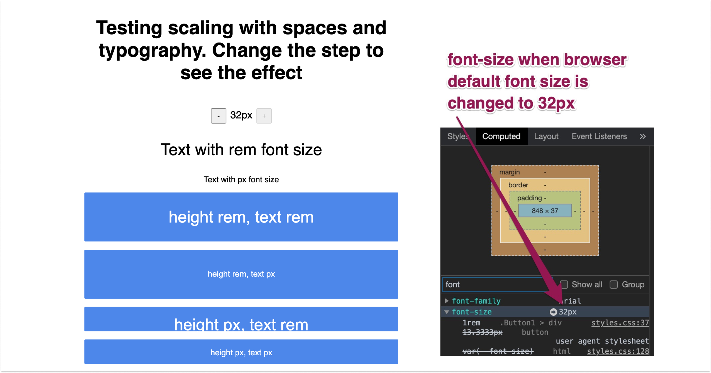

   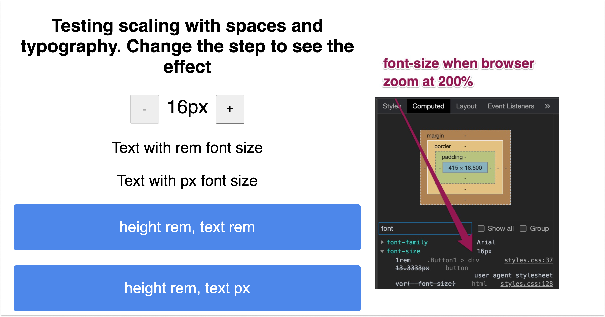

2. Design tokens for cross platforms(react for web, react native for apps) which means the typography and spacing scale needs to be stored in a unitless fashion?
   * Yes. we'll store things as unitless in tokens
3. Couldn't find what does WCAG says about this exactly? For eg: it just says the content should be readable at 200% zoom - [WCAG Guideline](https://www.w3.org/WAI/WCAG21/Understanding/resize-text.html)
4. React Native equivalent for rem?
   * There's no equivalent. React Native is unitless and everything is considerd as `dp`
5. The layout and typography scale for web and react native has to be differnt?
   * Probably yes. Because resolution on mobile are becoming denser and the area is still the same which means if we keep things on mobile comparatively bigger to it's desktop counterparts it'll yield better results. [Spectrum](https://spectrum.adobe.com/page/platform-scale/#Proportions) has did a user reasearch and came up with desktop to mobile ratio of `1:1.25` i.e on mobile, things are 25% bigger compared to desktop.

# References
* Accessible font Sizing - [CSS Tricks](https://css-tricks.com/accessible-font-sizing-explained/)
* Absolute vs Relative units - [24a11y](https://www.24a11y.com/2019/pixels-vs-relative-units-in-css-why-its-still-a-big-deal/)
* Discussion threads on Twitter which has thoughts from different people for different use cases and scenarios
  1. https://twitter.com/_kamlesh_/status/1361264818821468163
  2. https://twitter.com/threepointone/status/1362348163689033732
  3. https://twitter.com/naman34/status/1362626358539481090

* Scaling issues - https://twitter.com/_kamlesh_/status/1362384908375584774
* POC to visualise how things are different for different units on web - https://twitter.com/_kamlesh_/status/1362350508242042884
* [Designing for a new generation of mobile devices](https://juiceboxinteractive.com/blog/a-pixel-is-not-a-pixel-designing-for-a-new-generation-of-mobile-devices/)
* [Compare device's width, height, ppi](https://www.mydevice.io/#compare-devices)
* [How device pixel ratio is calculated for web](https://www.html5rocks.com/en/mobile/high-dpi/)
* [How device pixel ratio is calculated for native apps](https://www.perfecto.io/blog/how-mobile-screen-size-resolution-and-ppi-screen-affect-test-coverage)
* [Understanding Device Resolution for Web Design and Development](https://medium.com/@flik185/understanding-device-resolution-for-web-design-and-development-3bb4a5183478)
* [Pixel density on native apps](https://material.io/design/layout/pixel-density.html)
* [Designing for multiple screen densities on Android](https://developerlife.com/2018/07/21/designing-for-multiple-screen-densities-on-android/)
* [Build responsive React Native views for any device and support orientation change](https://medium.com/react-native-training/build-responsive-react-native-views-for-any-device-and-support-orientation-change-1c8beba5bc23)
* [iPhone Resolutions](https://www.paintcodeapp.com/news/ultimate-guide-to-iphone-resolutions)

# Lesser known facts
1. `1rem` = `16px` - default in all the browsers unless the default font-size of the browser is set to anything else explicitly.
2. `padding: 1rem` - rems always takes base value as font-size of the browser regardless of the property they are used on. In this example 1rem = 16px so `padding: 16px`.
3. `1dp = 1px` at `360x640` and `160ppi`(a.k.a `@1x`), therefore `1dp = 3px` at `1080x1920` and `440ppi`(a.k.a `@3x`).