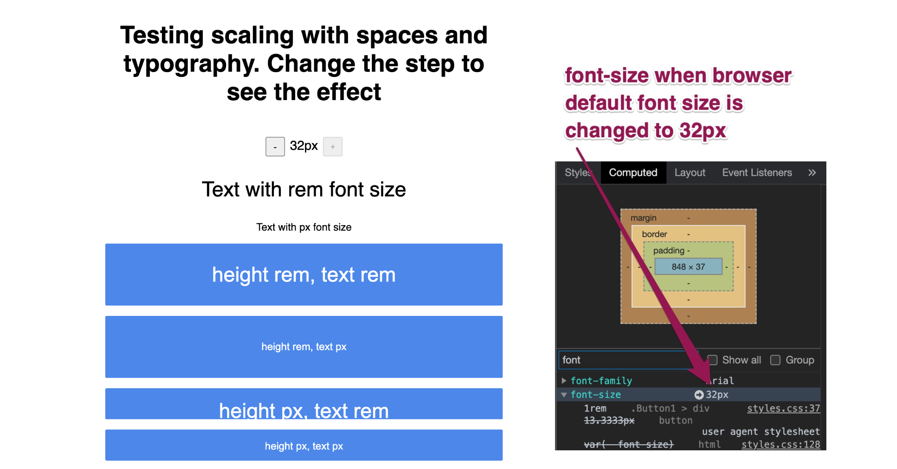
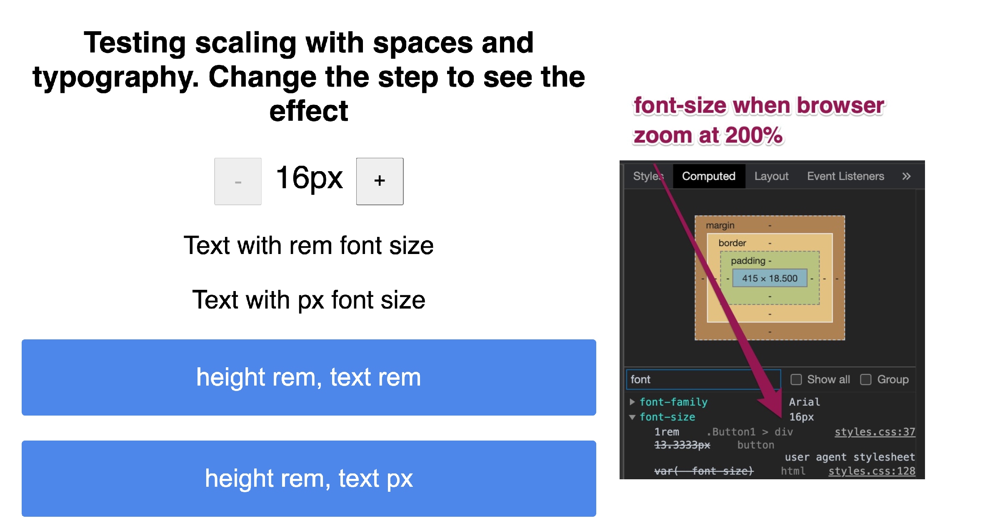

# Units for typography and layout <!-- omit in toc -->

### Table Of Contents <!-- omit in toc -->
- [Summary](#summary)
- [Basic Example](#basic-example)
- [Motivation](#motivation)
    - [Why are we doing this?](#why-are-we-doing-this)
    - [What use cases does it support?](#what-use-cases-does-it-support)
    - [What is the expected outcome?](#what-is-the-expected-outcome)
- [Detailed Design](#detailed-design)
  - [Checklist](#checklist)
  - [Different units:](#different-units)
    - [`px`](#px)
    - [`rem`](#rem)
    - [`dp`](#dp)
  - [Deep Dive](#deep-dive)
  - [Absolute unit vs relative unit?](#absolute-unit-vs-relative-unit)
    - [Absolute unit vs relative unit matrix](#absolute-unit-vs-relative-unit-matrix)
    - [Accessibility Guideline?](#accessibility-guideline)
    - [What units other Design Systems are using?](#what-units-other-design-systems-are-using)
    - [What will work for us?](#what-will-work-for-us)
  - [How will we store it?](#how-will-we-store-it)
- [Drawbacks/Constraints](#drawbacksconstraints)
- [Alternatives](#alternatives)
- [Adoption strategy](#adoption-strategy)
- [Open Questions](#open-questions)
- [References](#references)
- [Lesser known facts](#lesser-known-facts)

# Summary
To render anything on the screen we need some space so in order to define that space we also need to define a unit of that measurement. There are different types of units like `px`, `rems`, `ems`, `percentages` etc.

This RFC discusses about why and what units we will be using in our design system.

# Basic Example
Some examples of where and how units are used
```css
button {
  font-size: 14px;
  line-height: 16px;
  padding: 8px;
  margin: 2px;
  height: 48px;
  width: 200px;
}
```
```css
button {
  font-size: 1rem;
  line-height: 1.5;
  padding: 0.5rem;
  margin: 0.125rem;
  height: 3rem;
  width: 12.5rem;
}
```

# Motivation
### Why are we doing this?
As our applications will be used by our users on different platforms(web, mobile, native apps), different screens with different pixel densities and different screens sizes we need to make sure the content is accessible and the layout is consistent in different scenarios.

Units are one of the core foundation principle and building block that will define how our overall designs i.e components, layouts shall be designed as we progress so that we can make our apps work on different platforms, different screen sizes and different pixel densities.

### What use cases does it support?
It'll define what units we'll be using for different styling properties in our design system. Below are the categories to which units will be applied
1. Typography - font-size, line-height
2. Layout - padding, margin, width, height

### What is the expected outcome?
We shall be able to answer following questions as a conclusion to this RFC
1. What unit we'll be using for typography and layouts?
2. How will we ensure accessibility in terms of readability and layout both?
3. How will we use platform dependent units(px, rem, dp etc) in order to render the components on a particular platform in a generic way without polluting our design system components.
4. How/where we will store the unit as design tokens?

# Detailed Design
For anything to be rendered on the screen it needs to have a space on the screen and that space needs to have a measurable unit for the rendering engine to understand how to organise things on the screen.

The styling properties that require units are:
1. Typography
   * `font-size`
   * `line-height`
2. Layout
   1. Space
      * `padding` - top, right, bottom, left
      * `margin` - top, right, bottom, left
   2. Size
      * `height` - height, min-height, max-height
      * `width` - width, min-width, max-width

## Checklist
To choose which unit will work best for us we can use the below checklist:
1. Whether the content is accessible when the user changes the default font size of the browser.
2. Whether the content is accessible when the user zooms in/out on the browser.
3. Whether the interface is able to render on different screen sizes, pixel densities etc.

## Different units:
### `px`
* The most commonly used unit is `px` i.e pixels.
* It works on both web and iOS/android apps.
* `px` defines an absolute value for typography and layout, which means anything that has px as a unit will be rendered same at all the screen sizes, resolutions, pixel densities. For example, `padding: 16px` will be `16px` regardless of the screen resolution/platform `1680x1050`, `1024x640` or `360x640`.
### `rem`
* `rem` is a relative css unit which works in relative to the users device settings and screen resolutions.
* It works on web but **not** on iOS/android.

Eg-1: `font-size: 1rem` - It will be rendered as 16px by default. If the user changes their default browser font-size to 14 then it'll be rendered as 14px.

Eg-2: `padding: 1rem` - the padding will be calculated as 16px by defualt. If the user changes the default brwoser font-size to 14 then the padding will be calculated as 14px.

> 📝 Note: 1rem = 16px default in all the browsers unless the default font-size of the browser is set to anything else explicitly.

See below how browser devtools show `px` equivalent to `rem`


### `dp`
* density independent pixels
**WIP**

## Deep Dive
Until now we have understood few basic things. Now let's deep dive and see how this actually matters when things get rendered on screen. I've created an [interactive POC](https://codesandbox.io/s/scaling-test-szi8i) that you can play around with. I'll be using the same to demonstrate few things in this section.

I've created 4 buttons which have same css properties but the units are different.

### layout rem, text rem <!-- omit in TOC -->
* This button has all the layout and typography properties defined in `rem`. Here's how the css looks like
   ```css
   .Button1 {
   background: #3987f0;
   border: 1px solid #3987f0;
   box-sizing: border-box;
   border-radius: 2px;
   
   margin-bottom: 16px;
   padding-left: 1.5rem; /* 24px */
   padding-right: 1.5rem; /* 24px */
   padding-top: 0.75rem; /* 12px */
   padding-bottom: 0.75rem; /* 12px */
   height: 3rem; /* 48px */
   }
   .Button1 > div {
   color: white;
   font-size: 1rem;
   }
   ```
* Now if we increase the browser font size **everything** will **increase relatively** to the browser font size. [Try it out here](https://codesandbox.io/s/scaling-test-szi8i)
### layout rem, text px <!-- omit in TOC -->
* This button has all the layout properties defined in `rem` but typography in `px`. Here's how the css looks like
   ```css
   .Button2 {
   background: #3987f0;
   border: 1px solid #3987f0;
   box-sizing: border-box;
   border-radius: 2px;
   
   margin-bottom: 16px;
   height: 3rem; /* 48px */
   padding-left: 1.5rem; /* 24px */
   padding-right: 1.5rem; /* 24px */
   padding-top: 0.75rem; /* 12px */
   padding-bottom: 0.75rem; /* 12px */
   }
   .Button2 > div {
   color: white;
   font-size: 16px;
   }
   ```
* Now if we increase the browser font size the **layout properties** will **increase relatively** but the **typography** will remain **unchanged** as it is using absolute unit i.e `16px`. [Try it out here](https://codesandbox.io/s/scaling-test-szi8i)
### layout px, text rem <!-- omit in TOC -->
* This button has all the layout properties defined in `px` but typography in `rem`. Here's how the css looks like
   ```css
   .Button3 {
   background: #3987f0;
   border: 1px solid #3987f0;
   box-sizing: border-box;
   border-radius: 2px;
   
   margin-bottom: 16px;
   height: 48px;
   padding: 16px;
   }
   .Button3 > div {
   color: white;
   font-size: 1rem;
   }
   ```
* Now if we increase the browser font size the **layout properties** will remain **unchanged** but the **typography** will **increase relatively**. [Try it out here](https://codesandbox.io/s/scaling-test-szi8i)
### layout px, text px <!-- omit in TOC -->
* This button has all the layout and typography properties defined in `px`. Here's how the css looks like
   ```css
   .Button4 {
   margin-bottom: 16px;
   height: 48px;
   background: #3987f0;
   border: 1px solid #3987f0;
   box-sizing: border-box;
   border-radius: 2px;
   
   margin-bottom: 16px;
   height: 48px;
   padding: 16px;
   }
   .Button4 > div {
   color: white;
   font-size: 16px;
   }
   ```
* Now if we increase the browser font size **everything** will remain **unchanged** to the browser font size since everything is in absolute units. [Try it out here](https://codesandbox.io/s/scaling-test-szi8i)

Now let's see how things look when we increase the browsers default font size


Now let's see how things look when we zoom to 200% in the browser


> 📝 Note: The page zoom and font size change don't mimic each other. Hence things at x font size are not same as y% zoom. 

## Absolute unit vs relative unit?
Until now we saw how typography and layout reacts to font sizes and zoom with different units. Referring to [our checklist](#checklist) gives us 3 options:
1. **Everything px**
   1. Changing default font-size on the browser level doesn't changes the text content size.
   2. Changing default font-size on the browser level doesn't changes the layout sizes. Nothing breaks as everything is in absolute unit.
   3. Page zoom works as expected and the layout never breaks.
   4. Image when font-size is `32px`
   
2. **Everything rems**
   1. Changing default font-size changes the font size of the content.
   2. Changing default font-size changes layout sizes relatively. Things mostly doesn't break as everything is in ratios.
   3. Page zoom works as expected and the layout mostly doesn't breaks.
   4. Image when font-size is `32px`
   
3. **Typography rems and Layout px**
   1. Changing default font-size changes the font size of the content.
   2. Changing default font-size changes doesn't changes the layout sizes. Some layout breakages can happen as the text may end up being bigger than you expect in your layout.
   3. Page zoom works as expected.
   4. Image when font-size is `32px`
   
### Absolute unit vs relative unit matrix
| Unit                      | content size changes? | layout size changes? | layout breakages? | page zoom works? |
| ------------------------- | :-------------------: | :------------------: | :---------------: | :--------------: |
| Everything px             |           ❌           |          ❌           |         ❌         |        ✅         |
| Everything rems           |           ✅           |          ✅           |         ❌         |        ✅         |
| Tyography rems, layout px |           ✅           |          ❌           |         ✅         |        ✅         |

### Accessibility Guideline?
The WCAG guideline says that content satisfies the success criterion if it can be scaled up to 200%. It can go beyond that but logically beyond that the scaling becomes more extreme and adaptive layouts may introduce usability problems.

For example, words may be too wide to fit into the horizontal space available to them, causing them to be truncated; layout constraints may cause text to overlap with other content when it is scaled larger; or only one word of a sentence may fit on each line, causing the sentence to be displayed as a vertical column of text that is difficult to read.
>🔗 [WCAG guideline link](https://www.w3.org/WAI/WCAG21/Understanding/resize-text.html)
### What units other Design Systems are using?

| Name                                                                                     | Font Size | Layouts/Spacing | Comments                                 |
| ---------------------------------------------------------------------------------------- | --------- | --------------- | ---------------------------------------- |
| [Primer - GitHub](https://primer.style/css/support/spacing)                              | px        | px              | NA                                       |
| [Spectrum - Adobe](https://react-spectrum.adobe.com/react-spectrum/getting-started.html) | px        | px              | revisitng decision                       |
| [Braid - Seek](https://seek-oss.github.io/braid-design-system/)                          | px        | px              | revisiting decision                      |
| [Styled System](https://styled-system.com/)                                              | px        | px              | default px, can change by suffixing unit |
| [Facebook](https://twitter.com/naman34/status/1362626358539481090)                       | rems      | px              | NA                                       |
| [Chakra](https://chakra-ui.com/docs/getting-started)                                     | rems      | rems            | default rems, option for other units     |

### What will work for us?
Looking at the POC and the [matrix](#absolute-unit-vs-relative-unit-matrix), relative units looks no brainer but ideally it has some downsides too:
* Assume we have few responsive layouts then increasing the font-size on desktop might trigger the media queries to kick in and because of that our layout will be re-arranged assuming that the screen size has changed. Now the user was just intending to increase the font-size but they got tricked into different layout since everything is relative which impacts their experience.
* Since everything is relative increase in font-size is identical to page zoom so the intent of the user to increase the content size goes for a toss.

So, what's the next best option? It's **layout in px and typography in relative units**. Why?
* We want to give flexibility to the user to take the control of content readability and might want to still make the layout predictable and not change it when the font size of the browser changes.
* There might be layout breakages for sure but again it's serving the purpose of content readability for the user in the same layout in which they intended to. The cons weighs off the pros i.e **content readability**

#### Output - `layout pixel, typography rem` with default font-size of 32px <!-- omit in toc -->


#### Output - `layout pixel, typography rem` with zoomed in at 200% <!-- omit in toc -->


Layout demo in POC

## How will we store it?
* While storing we can compute the value in `px` and store it in a unitless way. While rendering we can attach the units.
   ```js
   const space = {
      1: 8,
      2: 12,
      3: 16,
   }
   const fontSize = {
      1: 14,
      2: 18,
      3: 24,
   }
   ```
* With the above approach we can keep the vocabulary consistent that everything is stored in `px` and while rendering the respective platforms(web/react-native) attaches the unit for the target rendering engine.
* We will implement a generic funtion that will attach the units to the scale values.
* For typography the units that'll be constructed will be relative(`rems` for web and `x` for react-native apps).
* For layout i.e height, width, padding, margin the units that'll be constructed will be absolute i.e `px`(pixels).

storing unitless scale values in tokens?
store in px and render in rems?
Global Reset to make it work for our use case i.e base = 14px
html {
  font-size: 100% // i.e 16px
  font-size: 87.5% // i.e 14px
}

# Drawbacks/Constraints
- Vocabulary is the biggest drawback. Thinking and visualising in relative units is difficult compared to absolute units like pixels(`px`) but we can work it out with the help of tools. We can think and store in pixels but render in relative units of the target platform(`rems` for web and `x` for react-native apps).

# Alternatives
- Here's the [absolute unit vs relative unit matrix](#absolute-unit-vs-relative-unit-matrix) which states all the altternatives with the details.

# Adoption strategy
- For devs All these decisions shouldn't matter, as this will be stored in our tokens as an abstraction. The end consumers will just use the typography and layout scale tokens for their purpose and not the actual values.
- For designers - ask Saurav how it will be done on Figma
- Migration of existing projects is out of the scope of this RFC since that will be a breaking change.

# Open Questions
1. Browser zoom and browser font size behave differently? Couldn't figure out what does browser zoom does differently like what css props does it changes so in order to have parity we need to mimic it? Asking since the POC I shared and the most systems they either work well with browser zoom or browser font size change but rarely both.


1. Design tokens for cross platforms(react for web, react native for apps) which means the typography and spacing scale needs to be stored in a unitless fashion?
2. Couldn't find what does WCAG says about this exactly? For eg: it just says the content should be readable at 200% zoom - put the link to wcag guideline
3. React Native equivalent for rem?

# References
* Accessible font Sizing - [CSS Tricks](https://css-tricks.com/accessible-font-sizing-explained/)
* px vs relative units - [24a11y](https://www.24a11y.com/2019/pixels-vs-relative-units-in-css-why-its-still-a-big-deal/)
* Discussion threads on Twitter which has thoughts from different people for different use cases and scenarios
  1. https://twitter.com/_kamlesh_/status/1361264818821468163
  2. https://twitter.com/threepointone/status/1362348163689033732
  3. https://twitter.com/naman34/status/1362626358539481090

* Scaling issues - https://twitter.com/_kamlesh_/status/1362384908375584774
* POC to visualise how things are different for different units on web - https://twitter.com/_kamlesh_/status/1362350508242042884

# Lesser known facts
1. `1rem` = `16px` - default in all the browsers unless the default font-size of the browser is set to anything else explicitly.
2. `padding: 1rem` - rems always takes base value as font-size of the browser regardless of the property they are used on. In this example 1rem = 16px so `padding: 16px`

Common Questions:
Do we need rems in typography?
Do we need rems in spacing?
Do we need spacing and sizing? or just spacing will do the job?
What happens with everything rems
what happens with everything px
what happens with font size rems and rest everything px
How do we store it in tokens? Store in px and render in dependent platform units?
React Native is still gray area. What are rems equivalent in RN?

Properties that will be affected with units

Font Size
font-size
line-height

Layout
  space
    padding
    margin
  size
    height
    width