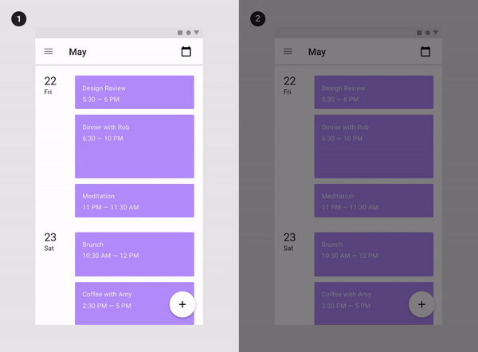
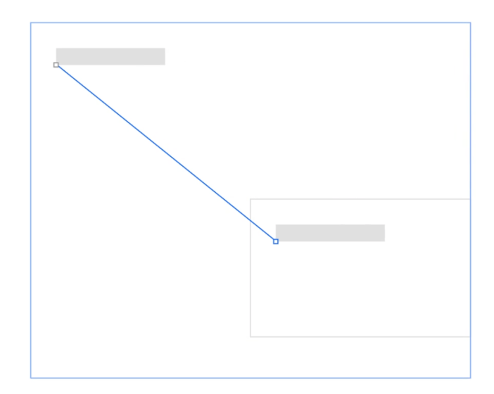

# Core Actions - Motion Design <!-- omit in toc -->

### Table Of Contents <!-- omit in toc -->
- [Summary](#summary)
- [Basic Example](#basic-example)
- [Motivation](#motivation)
- [Detailed Design](#detailed-design)
- [Drawbacks/Constraints](#drawbacksconstraints)
- [Alternatives](#alternatives)
- [Adoption Strategy](#adoption-strategy)
- [Open Questions](#open-questions)
- [References](#references)

# Summary
The core actions are the building blocks of any change that happens on the UI elements. In other words, animatable properties are the core of building a functional transition.

This RFC discusses about why and what units we will be using in our design system for these core actions:
- Scale
- Move
- Fade
- Rotation
- Fill
- Flip
- Morph
- Extrude
- Skew
- Stroke Size
- Blur
- Trim Path

# Basic Example
Few examples of core actions (scale, move & fade)

# Motivation
### Why are we doing this?
Core actions or animation properties is one of the elements of motion (out of 3 duration, easing).

For consistency and branding, we need to define what kind of actions we can use within an animation in our products. Defining these properties will help us in guiding the designers and communicating with the developers. Also, developers can optimize performance by using correct properties if these core actions are pre-defined.

### What is the expected outcome?
We shall be able to answer following questions as a conclusion to this RFC
1. What unit we'll be using for these core actions defined?
2. How will we ensure accessibility in terms of motion?
3. How will we use platform dependent units(px, rem, dp etc) in order to render the animation on a particular platform in a generic way without polluting our design system components.
4. How/where we will store the unit as design tokens?

# Detailed Design
## Core Actions
These are all the actions that can affect an element while implementing motion on an element:
1. **Scale:** Change in the dimensions; it can also be represented as moving in `z-axis` if `x` & `y` axes are constant.
2. **Move:** Change in the positions; generally in `x` & `y` axes.
3. **Fade:** Change in the opacity, appearing or disappearing of the element.
4. **Rotation:** Change in the rotation on `z-axis`.
5. **Fill:** Change in colour.
6. **Flip:** Change in the rotation on `x-axis`.
7. **Morph:** Change in the shape.
8. **Extrude:** Change in the thickness.
9. **Skew:** Change in the angle between sides of a polygon.
10. **Stroke size:** change in the width of borders.
11. **Blur:** Change in the sharpness; such as shadows.
12. **Trim Path:** Change in the start-point and end-point of a line.

## Animation Properties of the Core Actions
Based on our the products pre-existing actions and branding we've decided on these 5 core-actions and their attributes:
1. **Scale:** `length`, `height`, `anchor-point`, `size`.
2. **Move:** `anchor-points`, `pathway`.
3. **Fade:** `opacity`.
4. **Fill:** `colour-tokens`.
5. **Morph:** `shape-attributes`.

## Atrribute Details
### 1. **Scale**
* **Length:** Size on `x-axis`.
* **Height:** Size on `y-axis`.
* **Anchor point:** Coordinates of a point in the UI element which define the position of the element; usually it’s the center of the element. Basically a point in which all transformations are manipulated from.
* **Size:** Percentage(`%`) change in size if aspect ratio is constant.

### Types:
| Type | Description | Example |
|---|---|---|
| **Zoom** | Where the `aspect-ratio` is the same; don’t squash and stretch UI elements **Ex:** Hovering a card. **Unit:** `%` |  |
| **Expansion** | Where `length` and `height` changes separately. **Ex:** Expansion of a modal or opening of a dropdown. **Unit:** `px`,`%`,`%y`,`%` |  |

### 2. **Move**
* **Anchor points(`I` & `F`):** Initial & Final anchor-point coordinates; `(x1, y1)(x2, y2)`.
* **Pathway:** Control points (which decide curve of the line) [path](https://developer.mozilla.org/en-US/docs/Web/SVG/Tutorial/Paths) i.e., how the element moves from `position1` to `position2` representing the pathways; depending on the surroundings or the `z-axis`.
* **Example:** 

### Types:
| Type | Description | Example |
|---|---|---|
| **Elements in the same layer (`z-space`)** | Use type-2 pathway, it makes space for the movement **Ex:** Check out Spotify play icons and top-bar icons. |  |
| **No other element in the same layers** | Use type 1 pathway, it’s straight-forward and avoids unnecessary distraction. |  |

### 3. **Fade**
* **Opacity:** Percentage(`%`) change in the `opacity`.

### Types:
| Type | Description | Example |
|---|---|---|
| **Fade In** | Opacity value moves from a lower to higher.  **Ex:** Appearing of a card on a page. **Unit:** `%` |  |
| **Fade Out** | Opacity value moves from a higher to lower. **Ex:** Disappearing of a card from a page. **Unit:** `%` |  |

### 4. **Fill**
* **Color tokens:** Change in the color value.

### Types:
| Type | Description | Example |
|---|---|---|
| **Color token change** | When there is a change in state of a UI element, use the fill effect.  **Ex:** Hovering over a button. **Unit:** token value (`color.btn.primary.hover`) |  |

### 5. **Morph**
> It can be used on mask
* **Shape:** A graphics element that is defined by some combination of straight lines and curves. Read more on [Shapes](https://www.w3.org/TR/SVG2/shapes.html). Specifically: circle, ellipse, line, path, polygon, polyline and rect.

### Types:
| Type | Description | Example |
|---|---|---|
| **Shape change** | When a shape gets morhed into another.  **Ex:** Opening of dropdown menu. **Unit:** - |  |

### **Combination of Properties**
|  | Scale | Move | Fade | Fill | Morph |
|---|---|---|---|---|---|
| **Scale** | ⛔️ | ✅ | ✅ | ❌ | ❌ |
| **Move** | ✅ | ⛔️ | ✅ | ❌ | ✅ |
| **Fade** | ✅ | ✅ | ⛔️ | ❌ | ❌ |
| **Fill** | ❌ | ❌ | ❌ | ⛔️ | ✅ |
| **Morph** | ❌ | ✅ | ❌ | ✅ | ⛔️ |

### **Examples**
| Type | Example |
|---|---|
| **Scale Fade** |  |
| **Move Fade** |  |
| **Morph Move** |  |
| **Scale Move** |  |
| **Morph Fill** |  |

> **Note:** Try not to combine more than 2 properties.

### **Accessibility**
* For [reduced Motion](https://www.smashingmagazine.com/2020/09/design-reduced-motion-sensitivities/) (for motion sensitivities) we should use Fade action instead of Move.

# Drawbacks/Constraints
In this, we didn’t consider animation of Icons, Loaders and Typography.
* Icons and loaders will have a library and designers will not be creating these occasionally, that’s why we didn’t include rotation property in core actions.
* Special animations related to typography is rare and will be covered separately, **Ex:** appearing of letters one by one. Otherwise, typeface can be considered as UI element only and can have properties like fade, etc.

> Some CSS properties are more costly to animate than others. The harder a browser must work to animate a property, the slower the frame rate will be. Therefore, choosing the right CSS properties to animate can have a huge impact on page performance. For example, to change the size, use `scale()` rather than the `width()`.

# Alternatives
There are all the ways (listed above) to achieve an animation using the core actions. So as such no alternatives.

# Adoption strategy
- **For developers** - All these decisions shouldn't matter, as this will be stored in our tokens as an abstraction. The end consumers will just use the tokens for their purpose and not the actual values. **Exampe:** `bladeMotionSpeedSlow: 200ms`
- Migration of existing projects is out of the scope of this RFC since that will be a breaking change.
- **For Designers** - We can develop a tool for Figma which can help designers choose animation presets. Although, these should be baked inside the components itself.

# Open Questions
1. We need to analyse the performance metrics of the platform this animation would run on. This will help us choose the right units for a specific platforms.
2. How can we help designers choose these animation tokens on Figma. Is it possible, or should we look for some other tool?

# References
* [Animation Performance](https://www.keycdn.com/blog/animation-performance) *by KeyCDN*
* [Motion inside Adobe](https://spectrum.adobe.com/page/motion/) *by Adobe Spectrum*
* [Motion Paths](https://material.io/design/motion/customization.html#motion-paths) *by Google Material*
* [Shapes](https://www.w3.org/TR/SVG2/shapes.html) *by W3C*
* [Paths](https://developer.mozilla.org/en-US/docs/Web/SVG/Tutorial/Paths) *by MDN*
* [Design for reduced motion sensitivities](https://www.smashingmagazine.com/2020/09/design-reduced-motion-sensitivities/) *by Smashing Magazine*.
