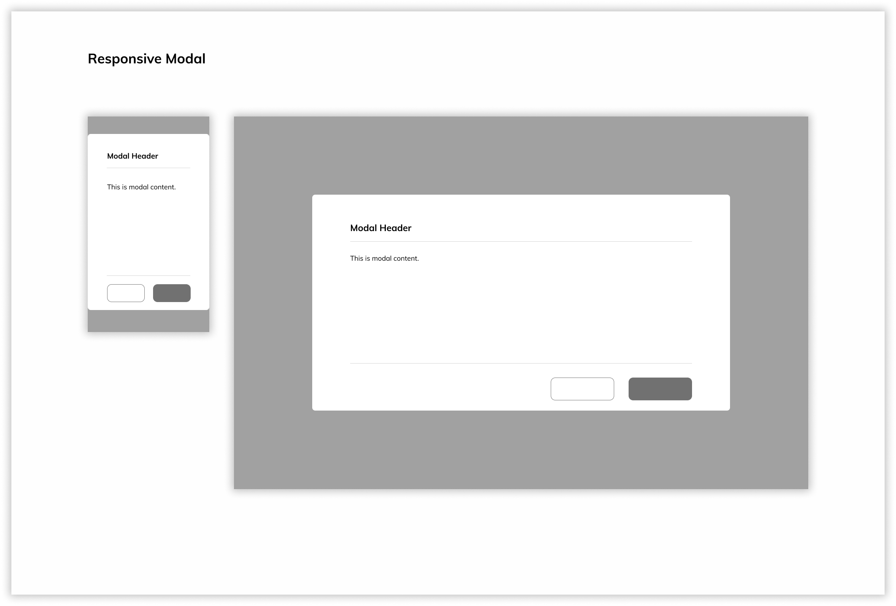
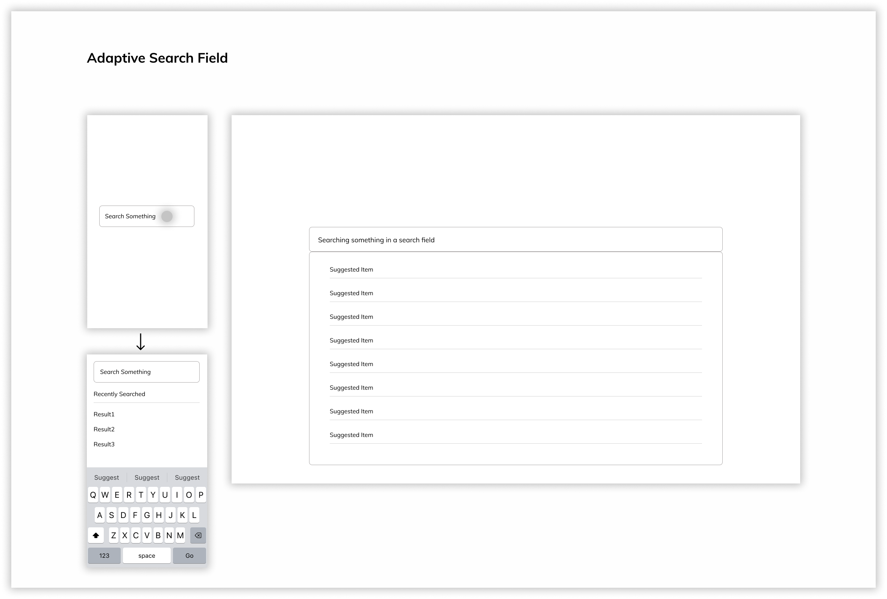
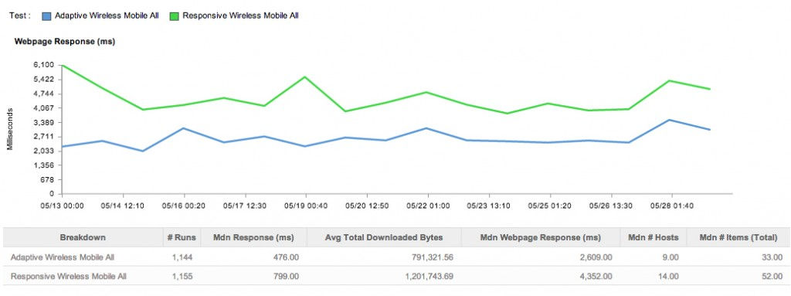
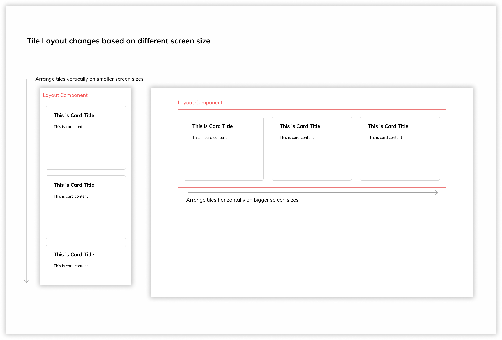
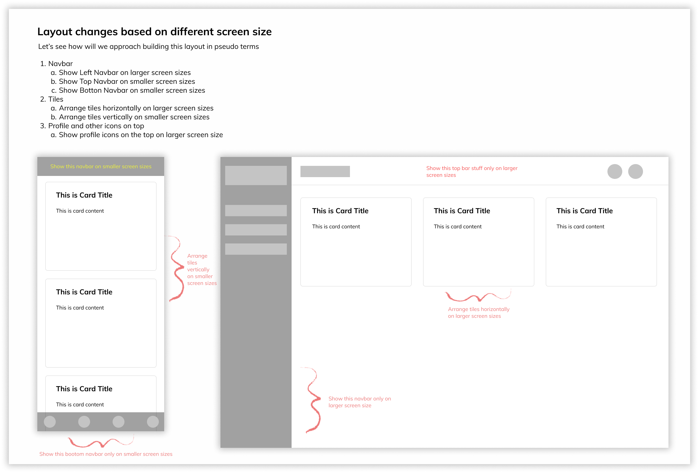

# Responsive and Adaptive Layout Strategy <!-- omit in toc -->

### Table Of Contents <!-- omit in toc -->

- [Summary](#summary)
- [Basic Example](#basic-example)
    - [Responsive Modal](#responsive-modal)
    - [Adaptive Search Field](#adaptive-search-field)
- [Motivation](#motivation)
    - [Why are we doing this?](#why-are-we-doing-this)
    - [What use cases does it support?](#what-use-cases-does-it-support)
    - [What is the expected outcome?](#what-is-the-expected-outcome)
- [Detailed Design](#detailed-design)
  - [Responsive Design](#responsive-design)
    - [Pros and Cons of Responsive Design](#pros-and-cons-of-responsive-design)
  - [Adaptive Design](#adaptive-design)
    - [Pros and Cons of Adaptive Design](#pros-and-cons-of-adaptive-design)
  - [Approaches taken by well-known Design Systems](#approaches-taken-by-well-known-design-systems)
  - [What would work for us?](#what-would-work-for-us)
    - [1. Components that can handle Responsiveness Internally](#1-components-that-can-handle-responsiveness-internally)
    - [2. Components that can give some flexibility to handle Responsiveness to consumers](#2-components-that-can-give-some-flexibility-to-handle-responsiveness-to-consumers)
    - [3. Components for Adaptive layout(rendering components conditionally)](#3-components-for-adaptive-layoutrendering-components-conditionally)
  - [How will we actually implement the approaches discussed above?](#how-will-we-actually-implement-the-approaches-discussed-above)
    - [On Blade Code Side](#on-blade-code-side)
    - [On Consumer Code Side](#on-consumer-code-side)
    - [On Blade Design Side](#on-blade-design-side)
    - [On Consumer Design Side](#on-consumer-design-side)
- [Adoption strategy](#adoption-strategy)
- [How do we educate people?](#how-do-we-educate-people)
- [Open Questions](#open-questions)
- [References](#references)

# Summary

To render content on different device screen resolutions there are different strategies. Modern web design gives us three options to use: Responsive, Adaptive, and Standalone Design, although standalone has fallen into disuse because of the overhead it comes with to maintain multiple codebase and their development lifecycle hence, we would just be focussing on Adaptive and Responsive.

1. Responsive - Make the content fluid so it'll render based on the available space
2. Adaptive - Make content targeted for specific screen sizes so it'll render exactly like that, regardless of the available space.

This RFC will focus on what approach and strategies we shall take in our Design System.

# Basic Example

### Responsive Modal

👇🏻 An example of a responsive design where we have modal which is responsive to the screen size and has a `maxWidth` defined for it to render on larger screen sizes, where on smaller screen sizes(mobile) it'll take `100%` of the width of the screen.



<br/>

### Adaptive Search Field

👇🏻 An example of a adaptive design where we have two implementation of a search field.

1. Larger Screen Size - Search Input with Autosuggestion
2. Smaller Screen Size - Search Field when clicked opens up a full screen modal which basically gives an optimised search experience on smaller screen size.



# Motivation

### Why are we doing this?

As of today, we don't have any strategy or approach in place for designing layouts for different screen sizes. Ensuring that elements fit within a page is not enough. There are different experiences that works for different screen sizes.

Just going Responsive(fluid) design blindly is not correct. Imagine for example, you have different experiences(styles, javascript) for mobile vs desktop but if you just go blindly with responsive we might unnecessary download assets for all the screen sizes our application would run on. For example it doesn't makes sense to implement [this Search Field](#adaptive-search-field) as a responsive layout since it'll result in unnecessary download of the assets(modal for mobile) and hence hampering the experience and performance for the consumers.

Similarly, just going adaptive blindly is not correct too. We might unnecessary be creating redundant variant of the same component. For example, imagine that we are creating 2 variants of a modal - 1 for desktop(which has a width of `600px`) and 1 for mobile(which has `100%` width). Now we could have just made it responsive by setting the `maxWidth` property of the modal so it could have been `600px` in width on desktop and `100%` in width on mobile. For eg, it doesn't makes sense to create multiple variant of [this Modal](#responsive-modal) while we can achieve this through responsive layout by setting `maxWidth` for Modal's Dialog component.

But because we don't have these strategies in place we don't know how to approach building layouts and components for different screen sizes.

### What use cases does it support?

- Handling responsiveness internally in the components based on different screen sizes.
- Layout components that will help you define different layouts based on screen sizes.
- Rendering different variants of a component based on screen sizes, optimising for performance without bloating the bundlesize.

### What is the expected outcome?

We'll basically define the approach and strategy we'll be taking in Blade to build components that will address the concerns of rendering based on different screen sizes.

# Detailed Design

## Responsive Design

- Responsive is fluid and adapts to the size of the screen no matter what the target device is.
- Responsive uses [CSS media queries](https://developer.mozilla.org/en-US/docs/Web/CSS/Media_Queries/Using_media_queries) to change styles based on the target device such as display `type`, `width`, `height`, etc., and only one of these is necessary for the site to adapt to different screens.
- Ensuring that elements fit within a page is not enough. For a responsive design to be successful, the design must also be usable at all screen resolutions and sizes.

### Pros and Cons of Responsive Design

| Pros                          | Cons                                                                                                                                                                                                                                                                                         |
| ----------------------------- | -------------------------------------------------------------------------------------------------------------------------------------------------------------------------------------------------------------------------------------------------------------------------------------------- |
| Abundance of templates to use | Elements can move around fluidly                                                                                                                                                                                                                                                             |
| Often easier to implement     | Longer mobile download times.                                                                                                                                                                                                                                                                |
|                               | Tons of `@media` queries often leads to a maintenance overhead in code                                                                                                                                                                                                                       |
|                               | Images and other high bandwidth features are simply scaled down rather than resized or eliminated outright(unless added some lines of JS which again degrades the performance and increases the mess in code), elements which may not be vital to user experience can cause poor performance |

## Adaptive Design

- While responsive design relies on changing the design pattern to fit the real estate available to it, **adaptive design** has multiple fixed layout sizes. When the site _detects_ the available space, it _selects_ the layout most appropriate for the screen. So, when you open a browser on the desktop, the site chooses the best layout for that screen, resizing the browser has no impact on the design(until it hit the breakpoint if we have mentioned it).
- Adaptive works to detect the screen size and load the appropriate layout for it – generally you would design an adaptive site for six common screen widths(confirm with Saurav once on exact sizes we are doing and update):
  - 320
  - 480
  - 760
  - 960
  - 1200
  - 1600
- Because adaptive allows for a different experience between the mobile and desktop versions, products that want to deliver a different experience for their mobile customers can do so without sacrificing quality in either version. It can also be tacked on to an existing site, whereas responsive layout requires rewriting all the original HTML code in the back end.
- There was a [case study by Catchpoint](https://www.catchpoint.com/blog/responsive-vs-adaptive) in which they selected 15 examples each of Adaptive and Responsive websites out of the Alexa Top 100 rankings (US), and tested the response times to see how the greater amount of data in responsive sites leads to higher latency. Unsurprisingly, the mobile response times showed a significant variance between Adaptive and Responsive sites.



### Pros and Cons of Adaptive Design

| Pros                                                                                                                                                                              | Cons                                                                                                                                             |
| --------------------------------------------------------------------------------------------------------------------------------------------------------------------------------- | ------------------------------------------------------------------------------------------------------------------------------------------------ |
| Allows designers to build the best UX for the appropriate device.                                                                                                                 | Takes a lot of effort to implement since now we essentially are implementing multiple versions of the same component for different screen sizes. |
| The system can evaluate the consumers screen resolution and send the appropriate content for them hence, preventing downloading unnecessary assets required for that screen size. | Can leave out users “in the middle” if the screen sizes are not properly defined and the content is not available for a particular screen size   |
| It offers an alternative to the “one-size-stretches-to-all” approach.                                                                                                             |                                                                                                                                                  |

## Approaches taken by well-known Design Systems

| Name                                                                                                    | Responsiveness handled internally/flexibility to consumers?                                                                          |
| ------------------------------------------------------------------------------------------------------- | ------------------------------------------------------------------------------------------------------------------------------------ |
| [Paste - Twilio](https://paste.twilio.design/primitives/text/#responsive-text)                          | Flexible with `[]` props accepting values for breakpoints on various components. Uses styled system under the hood                   |
| [Primer - GitHub](https://primer.style/react/core-concepts#responsive-props)                            | Flexible with `[]` props accepting props accepting values for breakpoints on various components. Uses styled system under the hood   |
| [Arcade](https://arcade.design/content/docs/tokens/typography)                                          | Handles internally, not customisable on the consumer end(nice strategy for less overhead)                                            |
| [React Spectrum - Adobe](https://react-spectrum.adobe.com/react-spectrum/layout.html#responsive-layout) | Flexible to define breakpoints for the entire application and flexible to define behavior for those breakpoints per components basis |

## What would work for us?

As you saw there are pros and cons to each of the approach so we can't abandon either of them but we need to strike a strategy where each of these approaches will work best.

After doing some research and aligning it with our uses cases at Razorpay, I propose following things at a broader level.

### 1. Components that can handle Responsiveness Internally

- Most of the components that don't deal with layouts shall handle responsiveness internally. For eg: Button, Modal, Avatar, Select, etc.

- The properties that affects responsiveness are:

  - `width`
  - `height`
  - `font-size`
  - `padding`
  - `margin`
  - `position`

- While a lot of [well known design systems gives flexibility](#approaches-taken-by-well-known-design-systems) on every component for above properties to accept responsive values, I can't think of a use case where we'll have to provide similar functionality. Majority of the cases that I could think of wouldn't be any different even if the consumers define the values for them explicitly. So seems like we'll be adding unnecessary learning curve to the component's API.

  - For eg: all the props(ones that are affected by responsive) for a component will then accept either single value or array/object of values for different screen sizes which is confusing and might lead to a lot of confusion at the API surface.

    ```jsx
    <Text fontSize="100" />

    <Text fontSize={{ small: 100, medium: 100, large: 100, xl: 400 }} />
    ```

- Hence the idea here is that all these components except the Layout components will handle responsiveness based on predefined breakpoints internally without the consumers explicitly defining anything for them.

### 2. Components that can give some flexibility to handle Responsiveness to consumers

- While most of the components can handle responsiveness internally there are use cases for components where we would need to give flexibility to accept responsive values for certain props. For eg: Layout Components that handles the overall layout of the page might change the layout on different screen sizes based on the available space.
  
- The idea here is to have certain components that deal with Layout of the page expose some flexibility to consumers to tweak if they want the layout to look different on different screen sizes

### 3. Components for Adaptive layout(rendering components conditionally)

- After handling responsiveness internally and also giving flexibility for few scenarios there are still few complex cases that we need to handle:

  - There are cases where we might need to render a completely different variation of a component based on the screen size and user experience. For eg: A Search Field component might be different for larger screen sizes and smaller screen sizes.
    

  - Another example is to show and hide certain elements based on the screen size so that we can optimise for user experience for each screen size
    

- The idea here is to make it feasible for consumers to handle these kind of complex use cases with ease, maybe with a set of predefined components and APIs.

## How will we actually implement the approaches discussed above?

### On Blade Code Side

- To begin with, as a first step we will first need to setup different screen sizes that we'll support and store it in tokens. This will handle our layout changes

  ```
  // confirm with Saurav once
  s: 320
  m: 480
  l: 760
  xl: 960
  2xl: 1200
  3xl: 1600
  ```

- We would then need to add a listener in the `BladeProvider` which will listen to screen size changes and trigger a layout change.

- For handling typography for different screen sizes we already have 2 scales one for smaller screens which are less than `960px` and the other for larger screens which are greater than `960px`. Now, once the screen size changes, the above listener would trigger a state change and then we can listen to it and swap the scales between small and large screens.
- The typography will scale in segments. Which means if `h1` at `1440px` is `40px`, then at `960px` it will become `32px` directly rather than going from `40px` ➡️ `38px` ➡️ `36px` ➡️ `34px` ➡️ `32px`. You can read more about it in our [Typography Scaling RFC](https://github.com/razorpay/blade/blob/master/rfcs/2021-01-05-typography-scaling.md)
- The obvious question that might come to your mind is that what happens to the content after a breakpoint. For eg: after say `960px` the mobile typography scale would be picked up by the system but there are mobile devices who have resolutions ranging from `320px`, `480px`, `760px`, `960px` so won't the mobile typography scale look too small on say `760px` screen width device? Well, that's the reason we have kept the units of typography to be `rems` so it can adjust to these use cases based on resolutions, browsers font size, etc. This will also handle use cases for high resolution mobile screens for eg: iPhone 12. You can [read more about that in our RFC about units for layout and typography](https://github.com/razorpay/blade/blob/master/rfcs/2021-02-19-units-for-typography-and-layout.md#what-will-work-for-us)

### On Consumer Code Side

Taking the [approaches discussed above](#what-would-work-for-us?)

**1. Components that can handle Responsiveness Internally**

For this to work, on the consumer side nothing has to be done explicitly, as far as the consumers have wrapped their app inside `<BladeProvider><ConsumerApp></BladeProvider>`, the components which will handle responsiveness internally will automatically listen to the screen size changes and scale automatically based on the available space

**2. Components that can give some flexibility to handle Responsiveness to consumers**

Consider, if we want to implement a layout similar to the below mockup


<br/>

Here's how the consumer will create a layout like this in code(_Note: the actual API might differ_)

```jsx
import { Stack, Card, Title } from '@razorpay/blade/components';

const Dashboard = () => (
  <Stack direction={{ s: 'column', l: 'row' }}>
    <Card>
      <Title>This is Card Title</Title>
      <Content>This is Card Content</Content>
    </Card>
    <Card>
      <Title>This is Card Title</Title>
      <Content>This is Card Content</Content>
    </Card>
    <Card>
      <Title>This is Card Title</Title>
      <Content>This is Card Content</Content>
    </Card>
  </Stack>
);

export default Dashboard;
```

**3. Components for Adaptive layout(rendering components conditionally)**

- Consider, if we want to implement a layout similar to the below mockup where we have 2 different search inputs for different screens of the same web app.
  

  <br/>

  Here's how the consumer will create a layout like this in code(_Note: the actual API might differ_).

  ```jsx
  import { LargeSearchInput, SmallSearchInput } from '@razorpay/blade/components';

  const SearchScreen = () => (isMobile ? <SmallSearchInput /> : <LargeSearchInput />);

  export default SearchScreen;
  ```

  Now, there's an issue with this approach. If you look we are importing both the components(LargeSearchInput, SmallSearchInput) for both the screens(Desktop/Mobile) which will unnecessary increase the bundlesize and hamper the performance. So to solve this we shall use [`React.Lazy`](https://reactjs.org/docs/code-splitting.html#reactlazy) if you're doing client side rendering or [`@loadable/component`](https://loadable-components.com/docs/component-splitting/) if you're doing server side rendering. Let's see how we can load them lazily

  ```jsx
  // With React.Lazy
  import { Suspense } from 'react';

  const LargeSearchInput = React.lazy(() => import('@razorpay/blade/components'));
  const SmallSearchInput = React.lazy(() => import('@razorpay/blade/components'));

  const SearchScreen = () => (
    <Suspense fallback={<div>Loading...</div>}>
      {isMobile ? <SmallSearchInput /> : <LargeSearchInput />}
    </Suspense>
  );

  export default SearchScreen;
  ```

  ```jsx
  // With @loadable/components
  import loadable from '@loadable/component';

  const LargeSearchInput = loadable(() => import('@razorpay/blade/components'));
  const SmallSearchInput = loadable(() => import('@razorpay/blade/components'));

  const SearchScreen = () => (isMobile ? <SmallSearchInput /> : <LargeSearchInput />);

  export default SearchScreen;
  ```

- Consider, another example where we want to show and hide bunch of components based on different screen sizes.
  

  <br/>

  Here's how we'll implement the above mockup in code

  ```jsx
  import loadable from '@loadable/component';
  import { Stack, Card, Title, Hidden, Avatar, Divider } from '@razorpay/blade/components';

  const DesktopNavBar = loadable(() => import('@razorpay/blade/components'));
  const MobileNavBar = loadable(() => import('@razorpay/blade/components'));
  const BottomNavBar = loadable(() => import('@razorpay/blade/components'));

  const Dashboard = () => (
    <Stack direction={{ s: 'column', l: 'row' }}>
      {isMobile ? <MobileNavBar /> : <DesktopNavbar />}
      <Stack direction="column">
        <Hidden hide={{ s: true, l: false }}>
          <Stack direction="row" justifyContent="space-between">
            <div>some profile information</div>
            <Stack direction="row">
              <Avatar />
              <Avatar />
            </Stack>
          </Stack>
        </Hidden>
        <Stack direction={{ s: 'column', l: 'row' }}>
          <Card>
            <Title>This is Card Title</Title>
            <Content>This is Card Content</Content>
          </Card>
          <Card>
            <Title>This is Card Title</Title>
            <Content>This is Card Content</Content>
          </Card>
          <Card>
            <Title>This is Card Title</Title>
            <Content>This is Card Content</Content>
          </Card>
        </Stack>
      </Stack>
      <Hidden hide={{ s: false, l: true }}>
        <BottomNavBar />
      </Hidden>
    </Stack>
  );
  ```

  So here we have introduced a new utility component called `Hidden` which accepts responsive props and enables us to hide/show component based on different screen sizes

### On Blade Design Side

While building components on Figma we have to keep in mind following things:

1. If the component is responsive, then design it for all the screens and properly define/document the responsive properties.

   - `width`
   - `height`
   - `font-size`
   - `padding`
   - `margin`
   - `position`

2. If the component is adaptive, then design it for all the screens and explicitly mention about the multiple variations of a component for different screen sizes.

### On Consumer Design Side

When designing layouts and consuming components from Design System Library on Figma make sure to do following things:

1. Design the mockups for all the different screen sizes.
   1. You can follow this nice guide on [how to start defining content for multiple screen sizes](https://web.dev/responsive-web-design-basics/#breakpoints)
2. Pick the right version of the component for respective screen sizes.
3. If for different screen sizes you want to render entirely different components(adaptive) then make sure to highlight it properly so the developers can understand it properly

# Adoption strategy

The adoption strategy for Consumer Designers [can be found in this section](#on-consumer-design-side) and for [Consumer Developers can be found in this section](#on-consumer-developer-side)

# How do we educate people?

- Through extensive documentation.

# Open Questions

- NA

# References

- [UXPin: Responsive Vs Adaptive](https://www.uxpin.com/studio/blog/responsive-vs-adaptive-design-whats-best-choice-designers/)
- [Catchpoint's Case Study on Responsive vs Adaptive](https://www.catchpoint.com/blog/responsive-vs-adaptive)
- [Interaction Design Foundation: Responsive Vs Adaptive](https://www.interaction-design.org/literature/article/adaptive-vs-responsive-design)
- [Desktop Vs Mobile App Design](https://99designs.com/blog/web-digital/desktop-vs-mobile-app-design/)
- [Arcade's Hidden Component Utility](https://arcade.design/content/docs/utilities/stack#hiding-items)
- [`react-media`: CSS media query component for React](https://github.com/ReactTraining/react-media)
- [React Spectrum: Responsive Layout](https://react-spectrum.adobe.com/react-spectrum/layout.html#responsive-layout)
- [GitHub Primer: Responsive Layout](https://primer.style/react/core-concepts#responsive-props)
- [Twilio Paste: Responsive Layout](https://paste.twilio.design/components/avatar/#responsive-sizing)
