# Motion - Tokens & Frameworks <!-- omit in toc -->

### Table Of Contents <!-- omit in toc -->
- [Summary](#summary)
- [Motivation](#motivation)
    - [Why are we doing this?](#why-are-we-doing-this)
    - [What use cases does it support?](#what-use-cases-does-it-support)
    - [What is the expected outcome?](#what-is-the-expected-outcome)
- [Detailed Design](#detailed-design)
  - [Types of Motion](#types-of-motion)
  - [Scope of Motion](#scope-of-motion)
  - [Actions of Motion](#actions-of-motion)
  - [Rules (Tokens) of Motion](#rules-tokens-of-motion)
    - [Delay](#delay)
      - [Tokens - Delay](#tokens---delay)
    - [Duration](#duration)
      - [Perception of Duration](#perception-of-duration)
      - [Tokens - Duration](#tokens---duration)
    - [Easing](#easing)
      - [Bezier Curve](#bezier-curve)
      - [Tokens - Easing](#tokens---easing)
  - [Vanilla Animation APIs vs Frameworks/Libraries](#vanilla-animation-apis-vs-frameworkslibraries)
    - [Web (React)](#web-react)
      - [Conclusion](#conclusion)
    - [Mobile (React Native)](#mobile-react-native)
      - [Conclusion](#conclusion-1)
- [Drawbacks/Constraints](#drawbacksconstraints)
    - [Library specific tokens](#library-specific-tokens)
    - [React Native `v0.62` and above](#react-native-v062-and-above)
    - [Multi-step keyframe animation with React Native](#multi-step-keyframe-animation-with-react-native)
- [Alternatives](#alternatives)
    - [Spring Animations instead of Easing Animations](#spring-animations-instead-of-easing-animations)
- [Adoption strategy](#adoption-strategy)
- [How do we educate people?](#how-do-we-educate-people)
- [Open Questions](#open-questions)
- [References](#references)

# Summary


# Motivation
### Why are we doing this?
Motion brings your UI to life. It makes your UI feel closer to our physical reality. Just like we have **pre-defined physical laws** in the **real world** that dictate the reactions to our different actions (like throwing a ball high up and expecting it to fall back down in a predictable manner), we want to define similar **set of rules** for **motion** **within** our **Design System**. If two balls thrown up with the same force, come back down in the same manner then why should two buttons on a UI react differently when hovered over?

With this RFC, we want to **establish** certain **rules** (*tokens*) through which we can build predictable motion for our components and **evaluate** **multiple ways** through which we can **use these rules** to build motion within Blade.

### What use cases does it support?
The rules we establish for motion here can be applied for both Web (**React**) and Mobile (**React Native**) 

### What is the expected outcome?
1. Have a **set of tokens** that can be consumed within our components for animating them
2. Conclude on **how we can consume** these **tokens** to create animations


# Detailed Design
## Types of Motion
We can have 2 types of motion while building user interfaces,
1. **Realtime**: User is directly interacting with an object on the UI.

    *Example: When a user drags a carousel, the carousel slides as per the user's drag.*
    
    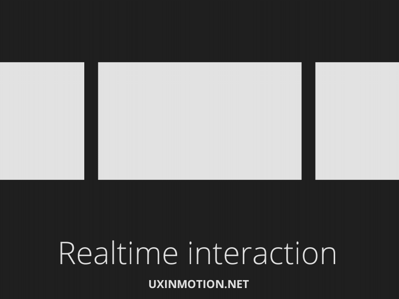

2. **Non-Realtime**: The object's behavior is *post-interactive* i.e it occurs after a user's action, and is transitional.

    *Example: When a user taps on a carousel card, it flips over within a set timeframe*
    
    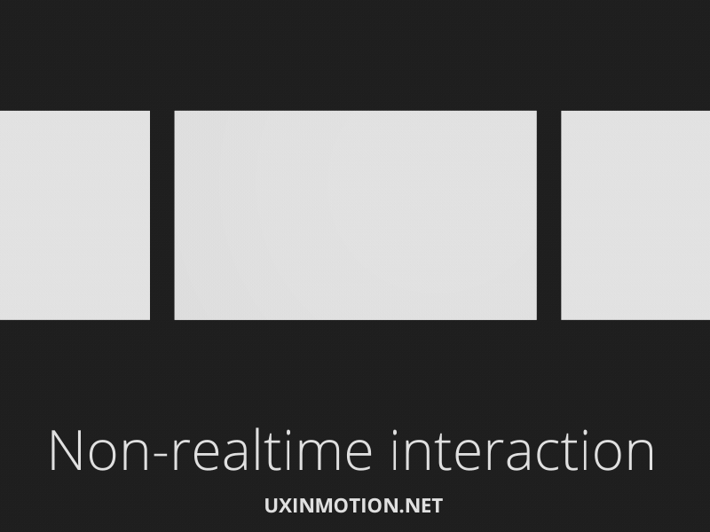

## Scope of Motion
As of this RFC, we will be defining rules of motion only for **Non-Realtime** interactions. 

Few examples of non-realtime motion are:
1. Changing the size of a button on mouse hover
2. Changing the opacity of a card on press
3. Fading out a modal when the user closes it


## Actions of Motion
These are the actions an object on our UI can perform:
> Motion for an object can be a combination of 2 actions as well

1. **Scale**: An object can change it's dimensions (size) in X and Y axis

    

3. **Move**: An object can change it's position in X and Y axis

    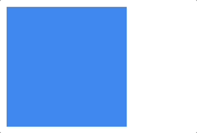

4. **Fade**: An object can change it's opacity within the range of 0 to 1

    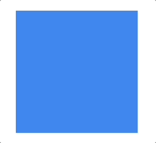

5. **Fill**: An object can change it's color

    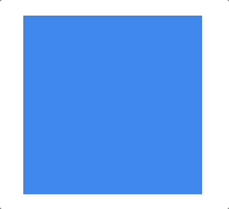

6. **Morph**: An object can morph itself into another object

    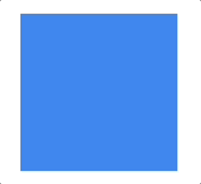

7. **Rotation**: An object can rotate itself in a range of 0 to 360 degrees

    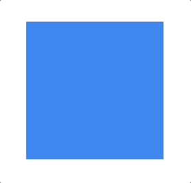

## Rules (Tokens) of Motion
While defining motion for an object transitioning from one state to another, we need to consider the following:
1. **Delay**: When should the motion start?
2. **Duration**: How long should an object take to transition from one state to another?
3. **Easing**: How should an object accelerate/decelerate while transitioning from one state to another?
> `Duration` and `Easing` are both necessary to define motion. `Delay` can be used as and when required depending on the use-case

### Delay
You can *start* or *stop* your motion with some delay. For example, in the image below, it becomes difficult to reach a sub-menu in the drop down since the exit animation for the sub-menu starts instantly after the mouse is out of hover range. This can be fixed by adding a delay to the exit animation.
> You can use `transition-delay` CSS property in the exit animation of the sub-menu to achieve this.


#### Tokens - Delay
We will be storing these tokens in `blade/src/tokens/global/motion.ts` as a `number` of milliseconds.

Here is the **list of tokens** that we will store in Blade for `Delay`:
```js
delay: {
  '2xshort': 70,
  xshort: 120,
  short: 180,
  long: 3000,
  xlong: 5000,
}
```

### Duration
Duration is the time taken to complete any transition, interaction and animation. Each animation can run for a duration of time depending on factors like size of the object, distance of travel, direction of travel, etc. 

*Example: The card takes 300ms to open and 250ms to close*

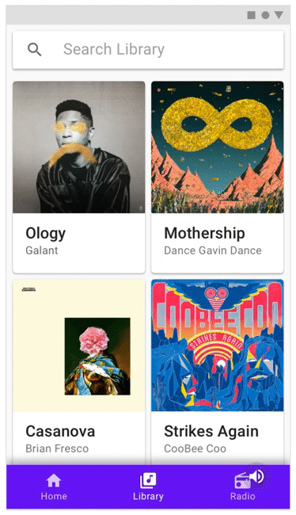

#### Perception of Duration
Letting an animation run for different durations will have an impact on whether the users perceive the action to be instant, fast, normal or slow. 

After thorough research & experimentation on perception our design team has created a guideline on how users would perceive different durations of animations. We will be using this as a reference while building out components and their animations.

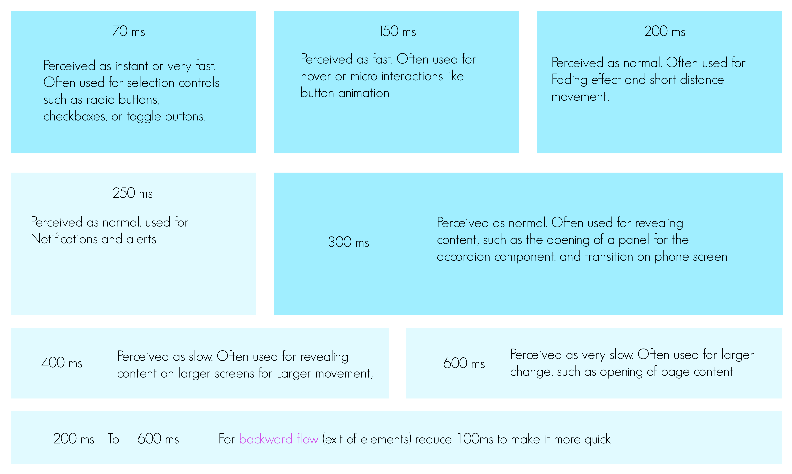

#### Tokens - Duration
We will be storing these tokens in `blade/src/tokens/global/motion.ts` as a `number` of milliseconds.

Here is the **list of tokens** that we will store in Blade for `Duration`:
```js
duration: {
  quick1: 70,
  quick2: 150,
  quick3: 200,
  moderate1: 250,
  moderate2: 300,
  gentle1: 400,
  gentle2: 600,
  gentle3: 900,
}
```

### Easing
Easing refers to the way in which a motion proceeds between two states. You can think of easing as acceleration or deceleration of an object's transition from one state to another. 

We can define easing using 
1. Predefined presets like `ease-in`, `ease-out`, `ease-in-out` for CSS or `ease()`, `bounce()`, `inOut()` for React Native
2. Custom easing functions like `cubic-bezier()`, `steps()`, `step-start()` for CSS or `bezier()`, `step0`, `step1` for React Native

We'll be using the Bezier Curve i.e `cubic-bezier()` for web & `bezier()` for mobile to define our easing.

#### Bezier Curve
- A bezier curve allows us to mathematically represent how our easing should behave. Bezier curves can be represented on a graph where the x-axis represents **time** and the y-axis represents the **progression** of the motion. It can also be represented with a `cubic-bezier()` function which takes 4 arguments (`x1`,`y1`,`x2`,`y2`) within the range of 0 to 1.

- We can use Bezier Curves with both **React** & **React Native** to define the easing of our animations.
 
- **CSS** natively understands `cubic-bezier` functions and allows you to define `transition-timing-function: cubic-bezier(0, 0, 1, 1)`. Other libraries like `framer-motion`, `react-spring` & `react-motion` also allow you to define your easing with a `cubic-bezier` function.

- React Native's **Animated API** understands `Easing` functions and allows you to define `easing: Easing.bezier(0, 0, 1, 1)`. Other libraries like `react-native-reanimated` also allow you to define your easing with their own `Easing.bezier` function.

To understand easing better, lets take a look at a few different examples of easing:

**Linear Easing:**

If we move an object from one point to another with a linear motion where it's acceleration as well as deceleration is linear, it would look like this: 


We can represent this as a bezier function `cubic-bezier(0, 0, 1, 1)` and a bezier curve:

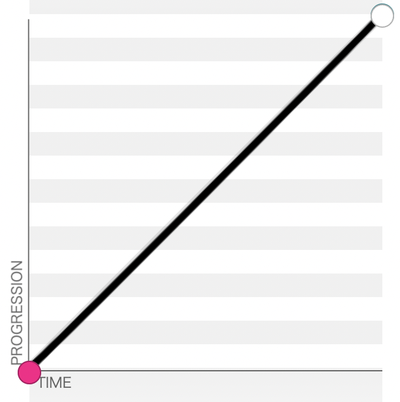

**Rapid Start - Slow End Easing:**

If we move an object from one point to another where it will start at a higher velocity and slow down as it approaches the destination, it would look like this:


We can represent this as a bezier function `cubic-bezier(0, 1, 1, 1)` and a bezier curve:

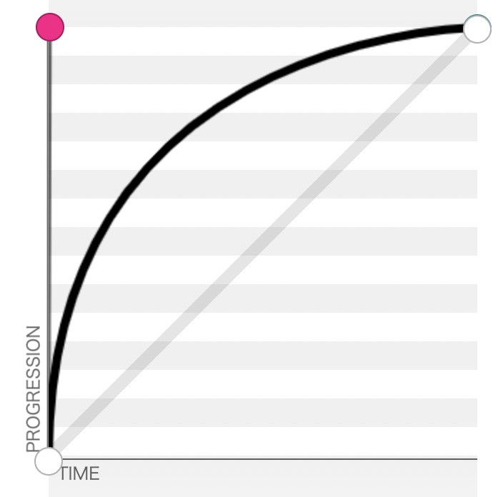

**Ease In - Ease Out Easing:**

If you're familiar with easing in CSS, you must have come across a transition timing property of `ease-in-out`. This is the same as linear but with a slower acceleration at the beginning and a slower deceleration at the end.

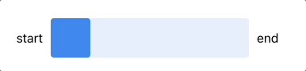

We can represent this as a bezier function `cubic-bezier(0.42, 0, 0.58, 1)` and a bezier curve:

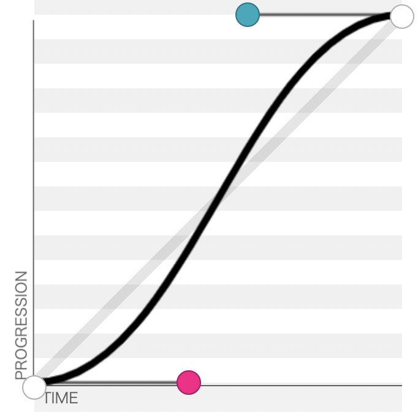

> You can experiment with different bezier curves to see how they look here: [cubic-bezier.com](https://cubic-bezier.com/)

#### Tokens - Easing
> Note: *The naming for these tokens is not finalized yet. We will be updating this in the future.*

- We will be storing **Easing tokens** in `blade/src/tokens/global/motion.ts` as a `cubic-bezier()` function.

- After thorough research & experimentation, our design team has created 3 broad **intents** of easing: 
  - `standard`
  -  `entrance`
  -   `exit` 
- Each of these intents can have easings which we can use in our motion as per our use case:
  - `effective`
  - `revealing`
  - `wary` (only for standard intent)
  - `attentive` 

- For example, if we want to have an easing on an object's entrance that needs to grab a user's attention, we can the `entrance.attentive` easing.

- Examples of how these easings would look like with relevant use-cases:
  > All of the following easings are for the `standard` intent
  - **Effective**:
  
    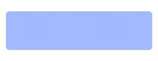
  
  - **Revealing**:

    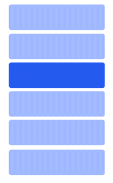
  
  - **Attentive**:

    
  
  - **Wary**:
  
    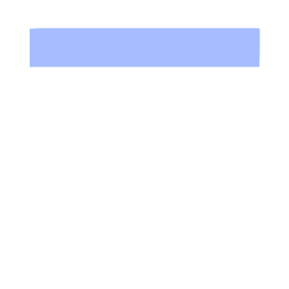

Here is the **list of tokens** that we will store in Blade for `Easing`:
```js
easing: {
  standard: {
    effective: 'cubic-bezier(0.3, 0, 0.2, 1)',
    revealing: 'cubic-bezier(0.5, 0, 0, 1)',
    attentive: 'cubic-bezier(0.5, 0, 0.3, 1.5)',
    wary: 'cubic-bezier(1, 0.5, 0, 0.5)',
  },
  entrance: {
    effective: 'cubic-bezier(0, 0, 0.2, 1)',
    revealing: 'cubic-bezier(0, 0, 0, 1)',
    attentive: 'cubic-bezier(0.5, 0, 0.3, 1.5)',
  },
  exit: {
    effective: 'cubic-bezier(0.17, 0, 1, 1)',
    revealing: 'cubic-bezier(0.5, 0, 1, 1)',
    attentive: 'cubic-bezier(0.7, 0, 0.5, 1)',
  },
}
```

For **React Native**, we need to store easing as `Easing.bezier` where `Easing` can be imported from react-native's `Animated` or `react-native-reanimated` depending on the library we are using (we'll conclude which library to use later in this RFC).

```js
easing: {
  standard: {
    effective: Easing.bezier(0.3, 0, 0.2, 1),
    revealing: Easing.bezier(0.5, 0, 0, 1),
    wary: Easing.bezier(1, 0.5, 0, 0.5),
    attentive: Easing.bezier(0.5, 0, 0.3, 1.5),
  },
  entrance: {
    effective: Easing.bezier(0, 0, 0.2, 1),
    revealing: Easing.bezier(0, 0, 0, 1),
    attentive: Easing.bezier(0.5, 0, 0.3, 1.5),
  },
  exit: {
    effective: Easing.bezier(0.17, 0, 1, 1),
    revealing: Easing.bezier(0.5, 0, 1, 1),
    attentive: Easing.bezier(0.7, 0, 0.5, 1),
  },
}
```

## Vanilla Animation APIs vs Frameworks/Libraries

### Web (React)
- For creating animations on web, we explored different libraries like [react-spring](https://react-spring.io/), [react-motion](https://github.com/chenglou/react-motion) & [framer-motion](https://framer.com/motion).
- Here is an example of how we could create a shake animation on mouse hover with **Framer Motion vs CSS animations**

**Framer Motion:**

```jsx
import { useAnimation } from 'framer-motion';

function Example() {
  const move = useAnimation(); // Create an animation control using `useAnimation`

  return (
    <motion.div
        animate={move} // Create a motion div with motion and pass the move animation control to it
        onHoverStart={() => // Start the `move` animation control inside `onHoverStart` that will translate the object in X axis
          move.start(
            {
              translateX: [
                "0px",   // 0%
                "-10px", // 10%
                "0px",   // 20%
                "10px",  // 30%
                "0px",   // 40%
                "-10px", // 50%
                "0px",   // 60%
                "10px",  // 70%
                "0px",   // 80%
                "-10px", // 90%
                "0px",   // 100%
              ],
            },
            {
              duration: motionToken.duration.quick3, // Set the duration of the animation using our motion tokens
              ease: motionToken.easing.standard.effective, // Set the easing of the animation using our motion tokens
            }
          )
        }
      />
    )
}
```

**CSS Animation:**

```jsx
import styled from 'styled-components';

const AnimatedBlock = styled.div` /* Create a styled div */
  :hover {
    animation: 
      shake /* Set a custom keyframe animation */
      ${motionToken.duration.quick3} /* Set the duration of the animation using our motion tokens */
      ${motionToken.easing.standard.effective}; /* Set the easing of the animation using our motion tokens */
  }

  @keyframes shake { /* Define the custom keyframe animation */
    0%,
    100% {
      transform: translateX(0);
    }
    10%,
    30%,
    50%,
    70%,
    90% {
      transform: translateX(-10px);
    }
    20%,
    40%,
    60%,
    80% {
      transform: translateX(10px);
    }
`

function Example() {

  return(
    <div>
      <AnimatedBlock />
    <div>
)
```

- Different 3rd party libraries have **different approaches** for creating the **same animation**.
- In our comparison between Framer Motion & native CSS Animations, we found that for **most non-realtime** animation use-cases where we want to create **simple transitions** & **keyframe** animations on **events** such as mouse **hover**, **CSS animations** are **sufficient** and easy to implement.
- Implementation becomes a bit **complicated** when we want to **trigger** certain **animations** from **Javascript**. 
- With **Framer Motion**, we can use it's **animation control** created with `useAnimation` to **trigger** the animation. Eg) `move.start()`
- For **CSS**, we would either need to **manipulate** component **state** or **manipulate** **CSS** **classes** list with `document.getElementById().classList.add()` / `document.getElementById().classList.remove()` that can dynamically add and remove an animated class from an element to **trigger** an animation.

#### Conclusion
- Since our **use case** right now is **only** for **non-realtime** animations, we can **use CSS animations** and **transitions.**
- We would be able to use our `delay`, `duration` & `easing` tokens **without** adding any **additional libraries** that would have increased our bundle size.
- We will **re-evaluate** 3rd party **libraries** in the depth when we start working on **realtime motion**.

### Mobile (React Native)
- For creating animations with React Native, we explored React Native's `Animated` API and `react-native-reanimated` library.
- Here is an example of how we could create a shake animation on button press with **React Native Animated API vs React Native Reanimated**

**React Native Animated API**
```jsx
import { Animated } from 'react-native';

function Example() {
  const shakeAnimation = React.useRef(new Animated.Value(0)).current; // Create a ref to hold Animated.Value

  return (
    <View>
      <Animated.View
        style={[styles.block, 
          {
            transform: [
              {
                translateX: shakeAnimation.interpolate({ // Interpolate the animated value in the range of 0 to 100 to create a shake effect
                  inputRange: [0, 10, 20, 30, 40, 50, 60, 70, 80, 90, 100],
                  outputRange: [0, -50, 50, -50, 50, -50, 50, -50, 50, -50, 0]
                }),
              },
            ],
          },
        ]}
      />
      <Button text="Shake" onPress={()=>
        Animated.timing(shakeAnimation, { // Change the value of shakeAnimation to 100
          toValue: 100,
          useNativeDriver: true,
          duration: motionToken.duration.quick3, // Define the duration it takes to change the value of shakeAnimation to 100
          easing: motionToken.easing.standard.effective, // Define the easing of the animation
        }).start()}
      />
    </View>
  );
}
```

**React Native Reanimated (v2)**
```jsx
import Animated, {
  useAnimatedStyle,
  withTiming,
  useSharedValue,
  interpolate,
} from 'react-native-reanimated';

function Example() {
  const shakeAnimation = useSharedValue(0); // Create a shared value to hold the value of shakeAnimation

  const shakeAnimationStyle = useAnimatedStyle(() => { // Define a worklet that is triggered whenever shakeAnimation changes
    return {
      transform: [
        {
          translateX: interpolate( // Interpolate the animated value in the range of 0 to 100 to create a shake effect
            shakeAnimation.value,
            [0, 10, 20, 30, 40, 50, 60, 70, 80, 90, 100], // Input range
            [0, -50, 50, -50, 50, -50, 50, -50, 50, -50, 0], // Output range
          ),
        },
      ],
    };
  });

  return (
    <View>
      <Animated.View style={[styles.block, shakeAnimationStyle]} />
      <Button text="Shake" onPress={() => {
        shakeAnimation.value = withTiming(100, { // Change the value of shakeAnimation to 100
          duration: motionToken.duration.quick3, // Define the duration it takes to change the value of shakeAnimation to 100
          easing: motionToken.easing.standard.effective, // Define the easing of the animation
        });
      }}
      />
    </View>
  );
}
```

- React Native's **Animated API** works on the **same principle as React Native**; you define your **animations** **in JS** and they **execute** on the **Native** **platforms**.
- The **downside** of this approach is that it still needs to **communicate with** the Native realm using **the bridge** which can lead to **dropped frames** in complex animations in cases where the **bridge is already choked up**.
- **React native reanimated** (v2) aims to provide ways of **offloading animation** and event handling logic off of the JavaScript thread and onto the **UI thread**.
- This is achieved by defining **Reanimated worklets** – chunks of JavaScript code that can be moved to a **separate JavaScript VM** and executed synchronously on the UI thread. This makes it possible to respond to touch events immediately and update the UI within the same frame when the event happens **without worrying about** the load that is put on the **main JavaScript thread**. 
- In the above example, we are using `useAnimatedStyle` to create a worklet that will be executed on the UI thread and has a **shared value** `translateXOffset` that is shared by JS as well as native realms.
- React Native reanimated is able to achieve this using React Native's `TurboModules` feature.

#### Conclusion
- Since we want to leverage all the above mentioned benefits of **we will be using React Native Reanimated** for our animations on Blade.


# Drawbacks/Constraints
### Library specific tokens
Consumers would need to be aware that certain tokens are library specific and would not work with other libraries
- For web, we expose `duration` as a `string` of *milliseconds* which works well with CSS's `transition-duration` property but will not work with Framer motion since it requires a `number` in *seconds*
- For web, we expose `easing` as a `string` of `cubic-bezier(..)` which works well with CSS's `transition-timing-function` property but will not work with Framer motion since it requires either,
  - The name of an existing easing function.
  - An array of four numbers to define a cubic bezier curve.
  - An easing function, that accepts and returns a value 0-1.
- For native, we expose `easing` as a function of `Easing.bezier(..)` imported from `react-native-reanimated` which won't work when used with React Native's `Animated` API.

### React Native `v0.62` and above
Since React Native Reanimated is dependent on `TurboModules`, it restricts us to using React Native `v0.62` and above. This means we'd have to ensure that all our consumer projects are not below `v0.62` of react native

### Multi-step keyframe animation with React Native
Multi-step animations on web are implemented by having more than 2 steps in an animation. Read more about [multi-step animations here](https://www.joshwcomeau.com/animation/keyframe-animations/#multi-step-animations)

Eg) 2-step keyframe
```css
@keyframes move {
    0% {
      transform: translateY(0px);
    }
    100% {
      transform: translateY(100px);
    }
}
```
Eg) Multi-step keyframe
```css
@keyframes move {
    0% {
      transform: translateY(0px);
    }
    50% {
      transform: translateY(50px);
    }
    100% {
      transform: translateY(100px);
    }
}
```

- In the 2-step keyframe, easing is applied for the animation taking place from 0% to 100%.
- In the multi-step keyframe, easing is applied for each step of the animation. That is, if we use `ease-in-out` easing, it would be applied to the animation happening from `0%` to `50%` and then again from `50%` to `100%`.
- This is not supported in React Native Reanimated _directly_ since we apply easing to the `timing` function.

  ```jsx
    shakeAnimation.value = withTiming(100, { 
      duration: motionToken.duration.quick3, 
      easing: motionToken.easing.standard.effective, 
    });
  ```

- We apply easing to the timing function as `shakeAnimation` value goes from 0 to 100. In this case if we apply an `ease-in-out` easing, it would be applied to the entire animation happening from `0%` to `100%` regardless of the fact that our interpolate's input & output range is more than 2 steps (array of more than 2 elements).
- If we _really_ want to replicate the web's behaviour on react native, we would need to apply easing on the `interpolate` function. 
- As of `v2.3.0` of `react-native-reanimated`, there is no support to add an easing to `interpolate`. 
- To be able to achieve this, we would need to implement the animation using React native's `Animated` API since it supports applying easing to interpolation like this:

  ```jsx
  ...
  function Example() {
  ...
    return (
      <View>
        <Animated.View
          style={[styles.block, 
            {
              transform: [
                {
                  translateX: shakeAnimation.interpolate({ // Interpolate the animated value in the range of 0 to 100 to create a shake effect
                    inputRange: [0, 10, 20, 30, 40, 50, 60, 70, 80, 90, 100],
                    outputRange: [0, -50, 50, -50, 50, -50, 50, -50, 50, -50, 0],
                    easing: motionToken.easing.standard.effective, // Define easing inside the interpolate function
                  }),
                },
              ],
            },
          ]}
        />
        <Button text="Shake" onPress={()=>
          Animated.timing(shakeAnimation, {
            toValue: 100,
            useNativeDriver: false, // Set native driver usage to false
            duration: motionToken.duration.quick3, // Define only duration here
          }).start()}
        />
      </View>
    );
  }
  ```
- You will need to ensure that you set `useNativeDriver` to `false` since adding easing to `interpolation` is not supported with `useNativeDriver`

# Alternatives
### Spring Animations instead of Easing Animations
- Instead of using Easing for our animations we can use spring-physics based animations. 
- Spring animations *claim* to look more fluid and natural since the animations are based on the same physical rules as that of a spring. 
- Spring animations can be controlled by defining the characteristics of a spring like `Mass`, `Tension` & `Friction`
- To use spring animations, we need to use some 3rd party library like `framer-motion` or `react-spring` since it is not natively supported by CSS.
- **Non-realtime** motion include a bunch of actions like scale, move, fade, fill, etc. All of which can be achieved using **spring animations as well as easing animations**.
- **Realtime** motion is a lot more complex and we would **not be able to achieve** the same fluid animations **just** by **using easing** animations.
- Spring animations make the most sense for animations that are dependent on user interactions like dragging Chat Messages, dragging bottom sheet to open and close, swiping cards to dismiss them, swiping to another tab
- **We will dive deeper** into whether or not we want to use **spring animations** when we explore **realtime motion** **in the future**. As of the scope of this RFC which is only Non-realtime motion, we will continue using easing animations.
- You can read more about spring based animations here:
  - [react-spring.io](https://react-spring.io/)
  - [A friendly introduction to spring physics
](https://www.joshwcomeau.com/animation/a-friendly-introduction-to-spring-physics/)
  - [The physics behind spring animations
](https://blog.maximeheckel.com/posts/the-physics-behind-spring-animations/) 

# Adoption strategy
- Consumers can start using motion tokens as they would with other DS tokens.
- Consumers would need to be aware of the drawback mentioned above at [Library specific tokens](#library-specific-tokens) before they start using them
- Blade's developers can use this RFC as a guideline to add motion to their components

# How do we educate people?
- Have a detailed guideline on our documentation site

# Open Questions
- ~How do we solve for the [Library specific tokens](#library-specific-tokens) drawback and make our tokens framework agnostic? Do we need to make them framework agnostic?~  We will be enforcing our consumers to only use these tokens with the specific libraries. We can add support with helper functions if the need arises for consuming these tokens with other libraries in the future.

# References
- https://shengbanx.gitbooks.io/motion-system/content/chapter2.html
- https://www.joshwcomeau.com/animation/css-transitions
- [Razorpay Motion Design team's research](https://github.com/razorpay/blade/pull/325)
- https://formidable.com/blog/2021/reanimated-two/
- https://blog.swmansion.com/introducing-reanimated-2-752b913af8b3
- https://docs.swmansion.com/react-native-reanimated/docs
