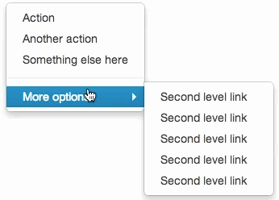

# Motion - Tokens & Frameworks <!-- omit in toc -->

### Table Of Contents <!-- omit in toc -->
- [Summary](#summary)
- [Motivation](#motivation)
    - [Why are we doing this?](#why-are-we-doing-this)
    - [What use cases does it support?](#what-use-cases-does-it-support)
    - [What is the expected outcome?](#what-is-the-expected-outcome)
- [Detailed Design](#detailed-design)
  - [Types of Motion](#types-of-motion)
  - [Scope of Motion](#scope-of-motion)
  - [Actions of Motion](#actions-of-motion)
  - [Rules (Tokens) of Motion](#rules-tokens-of-motion)
    - [Delay](#delay)
      - [Tokens - Delay](#tokens---delay)
    - [Duration](#duration)
      - [Perception of Duration](#perception-of-duration)
      - [Tokens - Duration](#tokens---duration)
    - [Easing](#easing)
      - [Tokens - Easing](#tokens---easing)
- [Drawbacks/Constraints](#drawbacksconstraints)
- [Alternatives](#alternatives)
- [Adoption strategy](#adoption-strategy)
- [How do we educate people?](#how-do-we-educate-people)
- [Open Questions](#open-questions)
- [References](#references)

# Summary


# Motivation
### Why are we doing this?
Motion brings your UI to life. It makes your UI feel closer to our physical reality. Just like we have **pre-defined physical** laws in the **real world** that dictate the reactions to our different actions (like throwing a ball high up and expecting it to fall back down in a predictable manner), we want to define similar **set of rules** for **motion** **within** our **Design System**. If two balls thrown up with the same force, come back down in the same manner then why should two buttons on a UI react differently when hovered over?

With this RFC, we want to **establish** certain **rules** (*tokens*) through which we can build predictable motion for our components and **evaluate** **multiple ways** through which we can **use these rules** to build motion within Blade.

### What use cases does it support?
The rules we establish for motion here can be applied for both Web (**React**) and Mobile (**React Native**) 

### What is the expected outcome?
1. Have a set of tokens that can be consumed within our components for animating them
2. Conclude on how we can consume these tokens to create animations


# Detailed Design
## Types of Motion
We can have 2 types of motion while building user interfaces
1. **Realtime**: User is directly interacting with an object on the UI. 
    *Example: When a user drags a carousel, the carousel slides as per the user's drag.*
    

2. **Non-Realtime**: The object's behavior is *post-interactive* i.e it occurs after a user's action, and is transitional.
    *Example: When a user taps on a carousel card, it flips over within a set timeframe*
    

## Scope of Motion
As of this RFC, we will be defining rules of motion only for **Non-Realtime** interactions. 

Few examples of non-realtime motion are:
1. Changing the size of a button on mouse hover
2. Changing the opacity of a card on press
3. Fading out a modal when the user closes it


## Actions of Motion
These are the actions an object on our UI can perform:

1. **Scale**: An object can change it's dimensions (size) in X and Y axis
    
3. **Move**: An object can change it's position in X and Y axis
    
4. **Fade**: An object can change it's opacity within the range of 0 to 1
    
5. **Fill**: An object can change it's color
    
6. **Morph**: An object can morph itself into another object
    
7. **Rotation**: An object can rotate itself in a range of 0 to 360 degrees
    

## Rules (Tokens) of Motion
While defining motion for an object transitioning from one state to another, we need to consider the following:
1. **Delay**: When should the motion start?
2. **Duration**: How long should an object take to transition from one state to another?
3. **Easing**: How should an object accelerate/decelerate while transitioning from one state to another?

### Delay
You can *start* or *stop* your motion with some delay. For example, in the image below, it becomes difficult to reach the sub-menu in the drop down since the exit animation for the sub-menu starts instantly after the mouse is out of the hover range. This can be fixed by adding a delay to the exit animation.
> You can use `transition-delay` CSS property in the exit animation of the sub-menu to achieve this.



#### Tokens - Delay
We will be storing these tokens in `blade/src/tokens/global/motion.ts`

> *Note: The naming for these tokens is not finalized yet. We will be updating this in the future.*

Here is the list of tokens that we will store in Blade for `Delay`:
```js
delay: {
  delay1: 70ms,
  delay2: 120ms,
  delay3: 180ms,
  delay4: 3000ms,
  delay5: 5000ms,
}
```

> For React Native, we would need to store delay as `number` instead of `string`. Eg: `delay1: 70`

### Duration
Duration is the time taken to complete any transition, interaction and animation. Each animation can run for a duration of time depending on factors like size of the object, distance of travel, direction of travel, etc. 

*Example: The card takes 300ms to open and 250ms to close*


#### Perception of Duration
Letting an animation run for different durations will have an impact on whether the users perceive the action to be instant, fast, normal or slow. 

After thorough research & experimentation our design team has created a chart on how users would perceive different durations of animations. We will be using this as a reference while building out components and their animations.


#### Tokens - Duration
We will be storing these tokens in `blade/src/tokens/global/motion.ts`

> *Note: The naming for these tokens is not finalized yet. We will be updating this in the future.*

Here is the list of tokens that we will store in Blade for `Duration`:
```js
duration: {
  duration1: '70ms',
  duration2: '150ms',
  duration3: '200ms',
  duration4: '250ms',
  duration5: '300ms',
  duration6: '400ms',
  duration7: '600ms',
}
```
> For React Native, we would need to store duration as `number` instead of `string`. Eg: `duration1: 70`

### Easing

#### Tokens - Easing
We will be storing these tokens in `blade/src/tokens/global/motion.ts`

> Note: *The naming for these tokens is not finalized yet. We will be updating this in the future.*

Here is the list of tokens that we will store in Blade for `Easing`:
```js
easing: {
  standard: {
    effective: 'cubic-bezier(0.3, 0, 0.2, 1)',
    revealing: 'cubic-bezier(0.5, 0, 0, 1)',
    wary: 'cubic-bezier(1, 0.5, 0, 0.5)',
    attentive: 'cubic-bezier(0.5, 0, 0.3, 1.5)',
  },
  entrance: {
    effective: 'cubic-bezier(0, 0, 0.2, 1)',
    revealing: 'cubic-bezier(0, 0, 0, 1)',
    attentive: 'cubic-bezier(0.5, 0, 0.3, 1.5)',
  },
  exit: {
    effective: 'cubic-bezier(0.17, 0, 1, 1)',
    revealing: 'cubic-bezier(0.5, 0, 1, 1)',
    attentive: 'cubic-bezier(0.7, 0, 0.5, 1)',
  },
}
```

# Drawbacks/Constraints
Why should we *not* do this? Maybe try to consider the following constraints
- Implementation cost, both in terms of code size and complexity.
- The impact of it on new as well as existing consumer projects.
- Cost of migration.

There are tradeoffs to choosing any path. Attempt to identify them here.

# Alternatives
What other designs/patterns/strategies have been considered?

# Adoption strategy
If we implement this proposal, how will existing consumer projects adopt it? 
- Is this a breaking change? 
- Can we write a codemod?
- How do we prioritise this with business and product folks?
- How do we communicate with other teams? Will updating docs suffice or do we need a dedicated interaction with them?

# How do we educate people?
- How should this be taught to other folks?
- What names and terminology work best for these concepts and why? 
- How is this idea best presented?

# Open Questions
- Any open questions that you have?
- Any undiscovered areas that you have encountered?
- Any dependencies on other teams(Design/Engineering) that needs to be resolved upfront?

# References
- https://shengbanx.gitbooks.io/motion-system/content/chapter2.html
- https://www.joshwcomeau.com/animation/css-transitions
