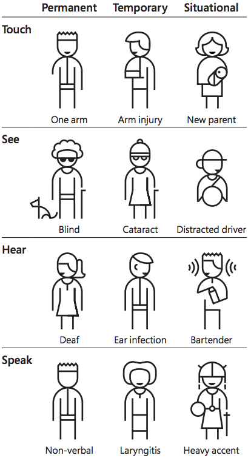
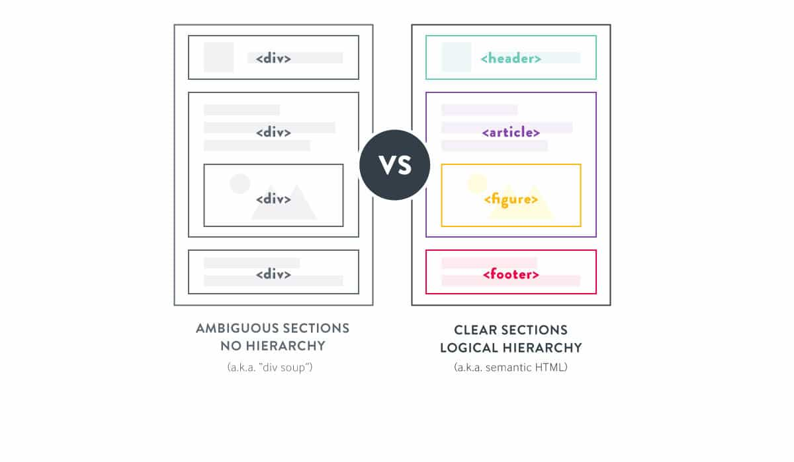
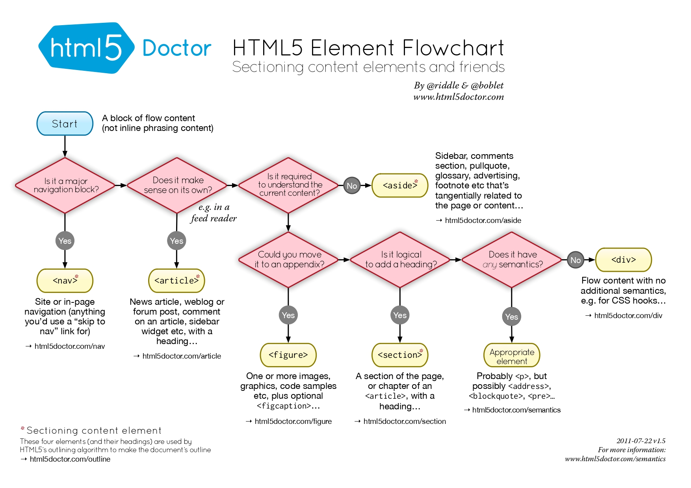
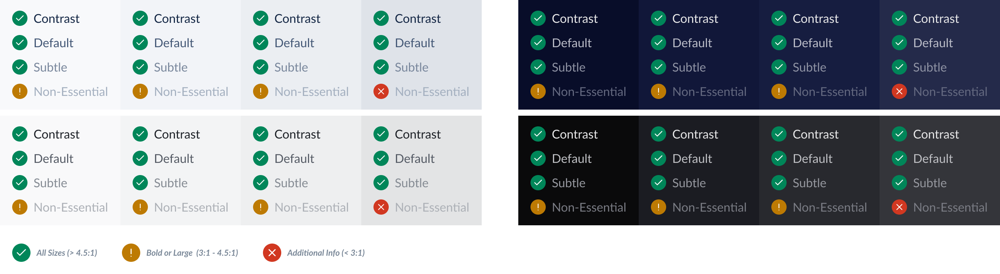

# Blade Accessibility <!-- omit in toc -->

### Table Of Contents <!-- omit in toc -->

- [Summary](#summary)
  - [What is Accessibility?](#what-is-accessibility)
  - [Accessibility for whom?](#accessibility-for-whom)
  - [Various types of disabilities](#various-types-of-disabilities)
  - [Accessibility Principles](#accessibility-principles)
- [Motivation](#motivation)
  - [Why are we doing this?](#why-are-we-doing-this)
  - [The current state](#the-current-state)
  - [What is the expected outcome?](#what-is-the-expected-outcome)
- [Detailed Design](#detailed-design)
  - [Keyboard Accessibility](#keyboard-accessibility)
    - [Keyboard tab order](#keyboard-tab-order)
    - [Composite widgets](#composite-widgets)
      - [Roving Tabindex](#roving-tabindex)
    - [Skip navigations](#skip-navigations)
    - [Manual Testing](#manual-testing)
  - [Focus management](#focus-management)
    - [Focus order](#focus-order)
    - [Focus ring styling](#focus-ring-styling)
    - [Focus trap](#focus-trap)
  - [Screen readers](#screen-readers)
    - [Semantic HTML](#semantic-html)
    - [ARIA attributes](#aria-attributes)
    - [Hidden Content](#hidden-content)
    - [Dynamic Content](#dynamic-content)
    - [ARIA Patterns](#aria-patterns)
  - [Design Accessibility](#design-accessibility)
- [Tools & Infrastructure](#tools--infrastructure)
- [Actionable Items](#actionable-items)
- [Drawbacks/Constraints](#drawbacksconstraints)
- [Adoption strategy](#adoption-strategy)
- [How do we educate people?](#how-do-we-educate-people)
- [Open Questions](#open-questions)
- [References](#references)

# Summary

## What is Accessibility?

Accessibility is the practice of making websites usable by people of all abilities and disabilities. This includes people with visual, auditory, physical, and cognitive impairments, as well as those with temporary disabilities such as broken bones, color blindness, and temporary loss of vision.

## Accessibility for whom?

Accessibility is essential for some, useful for all. It's not just for people with disabilities, accessible websites also improve the user experience of normal users.

For example:

- Ensuring keyboard accessibility helps people with temporary/permanent mobility but also improves the experience for normal users by providing a better user experience for components like Select or Modals.
- Large buttons and links helps people with reduced dexterity but also improve the user experience of mobile devices. For example - closing the modal or select menu on pressing <kbd>Esc</kbd> key.
- Providing captions for a video can benefit users who watch videos in loud environments or in a library.
- Sufficient color contrast is good for different lighting conditions and people with visual impairments.
- Older people with changing abilities due to aging can benefit from accessible experiences.

> Check out this youtube [video about Web Accessibility Perspectives](https://www.youtube.com/watch?v=3f31oufqFSM) by W3C for more details about how accessibility can help wide range of people with or without disabilities.

## Various types of disabilities

| Type of disabilities | Description | Example |
| :--- | :--- | :--- | 
| Visual | Anything that deals with sight | people who have different types of sight like color blindness |
| Cognitive | Difficulties with concentration, memory, judgment, problem solving | older people with changing abilities |
| Mobility | Anything that affects physical movement | broken/missing arm |
| Auditory | Disabilities related to sound or audio | someone who is deaf |

Other subcategories based on [Microsoft’s inclusive design](https://www.microsoft.com/design/inclusive):


| Type of disabilities | Description | Example |
| :--- | :--- | :--- | 
| Permanent | disability that does not go away | Someone who is deaf |
| Temporary | disability that will go away in time | Someone who has an ear infection |
| Situational | Context based disabilities | <ul><li>Someone who is at a loud sporting event</li> <li>Using the web app in bright sunlight</li> <li>Using your phone one handedly in a crowded metro station</li></ul> |



## Accessibility Principles

According to [Web Content Accessibility Guidelines](https://www.w3.org/WAI/standards-guidelines/wcag/) or WCAG, Web contents should be:

**Perceivable**

- Provide text alternatives for non-text content.
- Provide captions and other alternatives for multimedia.
- Create content that can be presented in different ways, including by assistive technologies, without losing meaning.
- Make it easier for users to see and hear content.

**Operable**

- Make all functionality available from a keyboard.
- Give users enough time to read and use content.
- Do not use content that causes seizures or physical reactions.
- Help users navigate and find content.
- Make it easier to use inputs other than keyboard.

**Understandable**

- Make text readable and understandable.
- Make content appear and operate in predictable ways.
- Help users avoid and correct mistakes.

**Robust**

- Maximize compatibility with current and future user tools.

# Motivation

## Why are we doing this?

Without proper accessibility, certain functionality used in web sites is not available to some users with disabilities, especially people who rely on screen readers and people who cannot use a mouse.

Making our products accessible is important for two reasons.

- It's the right thing to do. We believe that everyone deserves to be able to use our products, regardless of their abilities.
- It'll help build trust with our customers. By making our products accessible, we can expand our potential customer base and make our products more appealing to a wider range of people.

> [The Business Case Study for Accessibility](https://www.w3.org/WAI/business-case/)

**Making customers happy & respecting human rights:**

> In 2020, A 29 year old banker who is visually impaired opened petitions to make [Zomato](https://www.change.org/p/zomato-make-zomato-accessible-with-screen-readers-for-visually-challenged-people) & [Swiggy](https://www.change.org/p/swiggy-make-swiggy-accessible-with-screen-readers-in-android-for-visually-challenged-people) accessible because they couldn’t order food from it due to their inaccessible apps.  
> Over **15,000 & 27,000 people had signed the petition.**  
> Later Zomato, Swiggy listened to the people and [improved their accessibility.](https://theprint.in/tech/why-the-visually-challenged-are-signing-petitions-addressed-to-apps-such-as-zomato-swiggy/507282/)

**Accessibility laws & policies**

While in India, there are no mandatory laws to build accessible web apps, there are still [policies/laws](https://www.w3.org/WAI/policies/india/) that are passed to ensure that the rights of disabled people remain intact.

- [Rights of Persons with Disabilities Act, 2016 (RPD)](https://legislative.gov.in/sites/default/files/A2016-49_1.pdf)
- [**Mandatory** Guidelines for Indian Government Websites](https://guidelines.india.gov.in/)

## The current state

In the current state, blade components are not very accessible out of the box, and neither are our existing frontend products.

Here’s the screen reader accessibility of Razorpay mobile app

- Missing `accessibilityLabel` in input box.
- Missing `accessibilityRole=button` in buttons
- Missing `accessibilityRole=link` in links
- Grouping text together so they get announced at once. eg: "Don't have an account? Sign Up"
- Unlabeled show password toggle icon
- Wrongly focus on text input's placeholder text

https://user-images.githubusercontent.com/35374649/167380507-71e60b7f-d36e-42b3-b649-911400e2c66f.mp4

Adding accessible components to blade will iron out all these inconsistencies and teams can build more accessible apps with minimal effort.

## What is the expected outcome?

The goal of this RFC is to lay the foundations so that we can ship accessible components out of the box so that consumers don't have to worry about every minute detail. Here are couple of areas that this RFC will touch upon:

- Research about cross platform accessibility between web and native.
- Ensure components are accessible through assistive technologies.
- Ensure components adhere to the [WAI-ARIA design patterns](https://www.w3.org/WAI/ARIA/apg/patterns/)
- Set accessibility guidelines to make sure products built with blade are accessible by people with various disabilities.
- Document the component development lifecycle for blade developers on building accessible components. (Similar to a checklist)

By baking in accessibility at the foundational level we will ensure our products are accessible to as many people as possible, and this includes people with disabilities.

# Detailed Design

## Keyboard Accessibility

> [Specification](https://www.w3.org/TR/UNDERSTANDING-WCAG20/keyboard-operation.html)

**Accessibility Principle:** Operable  
**Target:** Everyone and especially people with motor disabilities who use a keyboard to navigate.  
**Goal:** Ensure users who cannot use the mouse (blind, motor disabilities) can access the crucial parts of the app through keyboard.

For a web page to be accessible, all interactive elements must be operable via the keyboard. Not all users are able to use a mouse to navigate a web page, keyboard-only and screen reader users rely on navigating and using a web page with a physical or a virtual keyboard.

### Areas to cover <!-- omit in toc -->

- [Keyboard tab order](#keyboard-tab-order)
  - [Platform Specific Implementation](#platform-specific-implementation-)
- [Composite widgets](#composite-widgets)
  - [Roving Tabindex](#roving-tabindex)
    - [Platform Specific Implementation](#platform-specific-implementation--1)
- [Skip navigations](#skip-navigations)
  - [Platform Specific Implementation](#platform-specific-implementation--2)
- [Manual Testing](#manual-testing)

### Keyboard tab order

> [Specification](https://www.w3.org/WAI/WCAG21/quickref/#focus-order)

Tab order is important for proper navigation through a keyboard interface, for example - using the <kbd>Tab</kbd> key to cycle through actionable UI elements on the screen.  
The tab order of the page must be logical and follow the visual order of elements on the page.

#### Best practices for logical tab order: <!-- omit in toc -->

- Structure html so that the reading/navigation [order is correct](https://www.w3.org/WAI/WCAG21/Techniques/css/C27).
- If necessary, use CSS to control the visual presentation of the elements on the page.
- [Avoid using tabindex](https://www.w3.org/WAI/WCAG21/Techniques/failures/F44) values of 1 or greater to change the default keyboard navigation order.

#### Platform Specific Implementation <!-- omit in toc -->

**Web: Using `tabindex`**

`tabindex` attribute authors can make the element focusable and appear in [sequential focus order](https://html.spec.whatwg.org/multipage/interaction.html#sequential-focus-navigation)

Setting tabindex to any positive integer makes elements focusable, allow or prevent them from being sequentially focusable, and determine their relative ordering

When set to `0`, the element becomes focusable by keyboard and via programmatic means with `focus()`.
When set to `-1`, the element becomes focusable programmatically, but it does not become part of the keyboard focus order.

The following table describes tabindex behavior in modern browsers:

| tabindex attribute       | Focusable with mouse or programmatically | Tab navigable                                                                    |
| :----------------------- | :--------------------------------------- | :------------------------------------------------------------------------------- |
| not present              | The user agent will decide               | The user agent will decide                                                       |
| Negative (tabindex="-1") | Yes                                      | No, can only be focused programmatically                                         |
| Zero (tabindex="0")      | Yes                                      | Yes, In tab order relative to element's position in document                     |
| Positive (tabindex="2")  | Yes                                      | Yes, tabindex value determines where this element is positioned in the tab order |

> Warning: Avoid using positive values for tabindex. Using positive values means authors will have to set (and maintain) tabindex values for all focusable elements on the page whenever they use one or more positive values for tabindex.

> _[Failure of Success Criterion 2.4.3](https://www.w3.org/WAI/WCAG21/Techniques/failures/F44) due to using tabindex to create a tab order that does not preserve meaning and operability_

**Native: Using `accessible` prop**

In react-native there is no `tabindex` like behaviour for components, instead we have access to the [`accessible`](https://reactnative.dev/docs/accessibility#accessible) prop, setting `accessible` to true elements get grouped into a single selectable component.

> [Demo](https://snack.expo.dev/V5MQ8yne8)

https://user-images.githubusercontent.com/35374649/170967381-c3d4923c-fb2f-4e9c-b5b4-dec1bc778f67.mp4

### Composite widgets

A composite is a widget that may contain navigable descendants or childrens. Composite widgets should only have single navigation tab stop.
Once the composite widget has focus, it should provide for a separate navigation mechanism for users to navigate to elements that are descendants (generally with arrow keys).

You can think of composite widgets as a way of grouping multiple elements into single navigatable element.

Examples of composite widgets are:

- Radio Groups
- Tabs
- Listbox
- Toolbars

There are two ways to manage focus within composite widgets

- [Roving TabIndex Pattern](https://www.w3.org/WAI/ARIA/apg/practices/keyboard-interface/#kbd_roving_tabindex)
- [aria-activedescendant Pattern](https://www.w3.org/WAI/ARIA/apg/practices/keyboard-interface/#kbd_focus_activedescendant)

We will only be covering Roving tabindex pattern because the aria-activedescendant pattern has very narrow usecases mostly in Comboboxes where the real focus should remain on the input and a virtual focus will be on the combobox items.

#### Roving Tabindex

> [Specification](https://www.w3.org/WAI/ARIA/apg/practices/keyboard-interface/#kbd_roving_tabindex)

One way to manage focus within `composite` widgets is roving tabindex pattern.  
The element that is to be included in the tab sequence has tabindex of "0" and all other focusable elements contained in the composite have tabindex of "-1".

**Roving tabindex behaviour**:

- When the component loads, the element that will initially be included in the tab sequence will have `tabindex=0`, and all other focusable elements will have `tabindex=-1`.
- At a time only one children will have `tabindex=0` set and all other focusable elements will have `tabindex=-1`.
- When the component contains focus and the user presses a navigation key that moves focus within the component (eg: arrow keys)
  - set `tabindex=-1` on the element that has `tabindex=0`.
  - Set `tabindex=0` on the element that will become focused as a result of the key event.
  - Set focus with `element.focus()`, on the element that has `tabindex=0`.

**Roving tabindex keyboard accessibility**

- Pressing <kbd>↑</kbd> moves focus to the previous element if orientation is vertical or not defined.
- Pressing <kbd>↓</kbd> moves focus to the next element if orientation is vertical or not defined.
- Pressing <kbd>→</kbd> moves focus to the next element if orientation is horizontal or not defined.
- Pressing <kbd>←</kbd> moves focus to the previous element if orientation is horizontal or not defined.
- Pressing <kbd>Home</kbd> or <kbd>PageUp</kbd> moves focus to the first element.
- Pressing <kbd>End</kbd> or <kbd>PageDown</kbd> moves focus to the last element.

https://user-images.githubusercontent.com/35374649/170195582-85cb688a-8e10-42de-9154-420d5c8873ad.mov

#### Platform Specific Implementation <!-- omit in toc -->

**Web:**

There are various third party library implementations for roving tabindex pattern.

We tried out 3 of them to understand the pros and cons for each.

**FluentUI** - [Demo](https://codesandbox.io/s/blade-comp-fluentui-focuszone-0sjyv1?file=/src/App.tsx) | [Doc](https://developer.microsoft.com/en-us/fluentui#/controls/web/focuszone)

<details>
  <summary>Pros and cons</summary>

**Bundle size:** ~12kb

**Pros:**

- Easy to use
- Handles roving index by default
- Can handle nested focus zones
- Provides tabbable focus, means we can enable use of tab + arrow keys
- Support layout grid behavior (we might not need this)

**Cons:**

- Not much flexibility to write our own logic, doesn’t provide any focus manager. Having a focus manager can help use build components which needs special focus management like building a PIN Input component by composing our InputField component.
- Doesn’t provide any other utilities like focus trap, we need to install another package for it `@fluentui/react/lib/focusZoneTrap`
- FluentUI’s architecture is very complex & confusing because of their need to be cross platform, If we pick this up we might not be able to use their other components to our advantage. Plus their components are not headless.

</details>

**React Aria** - [Demo](https://codesandbox.io/s/blade-comp-react-aria-focus-2v9wtp?file=/src/App.tsx) | [Doc](https://react-spectrum.adobe.com/react-aria/FocusScope.html)

<details>
  <summary>Pros and cons</summary>

**Bundle size:** ~12kb

ReactAria’s behavior is very different from fluentui, it’s FocusScope doesn’t provide roving index behavior instead it’s like a focus trap. Which is equivalent to FluentUI’s FocusTrapZone

Although ReactAria does provides low level primitives to manage focus like `useFocusManager`

**Pros:**

- Provides other helpful features with it’s focus package, which makes it worth the bundle size compared to other solutions, with other libs we will have to look for alternatives for:
  - [FocusScope](https://react-spectrum.adobe.com/react-aria/FocusRing.html) (Trapping focus)
  - [FocusRing](https://react-spectrum.adobe.com/react-aria/FocusRing.html)
  - [useFocusRing](https://react-spectrum.adobe.com/react-aria/useFocusRing.html)
- Provides low level primitives for building roving index like behaviors, eg: useFocusManager, getFocusableTreeWalker, createFocusManager
- Picking react aria will also encourage use of react-native-aria & the eco system of react aria.

**Cons:**

- Doesn’t provide roving index behavior by default
- A lot of manual logic and code has to be written to implement a proper Roving index component which handles edge cases,
- The implementation in the codesandbox has various bugs & edge cases, for eg: initially the elements don't have tabIndex set, these kinds of edge cases we need to solve for.

</details>

**Ariakit** - [Demo](https://codesandbox.io/s/blade-comp-ariakit-composite-ewc9i4?file=/src/App.tsx) | [Doc](https://reakit.io/docs/composite/)

<details>
  <summary>Pros and cons</summary>

Ariakit is the only out of the three which properly implements the composite widget specification.
It even supports virtual focus with aria-activedescendant. It’s the most complete implementation.

**Bundle size:** ~15kb tree shakable depending on which features we use

**Pros:**

- Easy to use
- Most spec compliant and holistic implementation
- Very flexible with its hooks based architecture. Composition is ariakit’s best selling point
- Lots of other features, like [composite groups, typeahead, input, hover, separator](https://github.com/ariakit/ariakit/tree/main/packages/ariakit/src/composite)
- [Supports 2d navigation](https://reakit.io/docs/composite/#two-dimensional-navigation) same as FluentUI
- Support virtual focus + roving index. ++respect!
- Ariakit also provides primitives and utilities like useFocusTrap & useFocusable, although they will increase the bundle size further

**Cons:**

- The biggest issue with ariakit is that it’s not stable yet :(  
  [Ariakit is the successor to reakit](https://gist.github.com/diegohaz/bc07491aee61a5f2469574b38c5c1aa0), Haz has been developing it for over 4 years now.
  But as the doc says ariakit is better but still the API is not stable and can have breaking changes
- The new version of ariakit lacks documentation
- No separate package scope for their focus utilities, we will have to rely on treeshaking to be able to shave all other unnecessary components.

</details>

After careful considerations and team discussions. **We are going ahead with [Ariakit](https://github.com/ariakit/ariakit):**

- **Why ariakit?**
  - It has the most cleanest implementation out of all three & it's also provides more features like `aria-activedescendants`
  - Provides lot of out of the box utilities like [ariakit/focus](https://github.com/ariakit/ariakit/blob/main/packages/ariakit-utils/src/focus.ts) for focus management & keyboard accessibility.
- **Why choose an alpha package?**   
  Even though Ariakit is currently in alpha we will still be going with it because: 
    - Most of the components we will be using from ariakit will be internal and won't have public APIs for blade, thus there will be less chance of any breaking changes to blade consumers.
    - [Reakit](https://reakit.io/) (v1 of Ariakit) is already being used in production applications like [Codesandbox](https://github.com/codesandbox/codesandbox-client/blob/389073613e06eee944231f4aeef9dfa746c1b947/packages/app/package.json#L221), [WordPress](https://github.com/WordPress/gutenberg/blob/4857ad58c1241b3d63d21a6880c989b85746c3dc/packages/components/src/toolbar/toolbar-container.js#L4), [Twilio](https://github.com/twilio-labs/paste/blob/9adf3edd88598aa3e8de3f6dd027371a2e54d368/packages/paste-libraries/reakit/src/index.tsx) which proves that it can scale to support most usecase.
- **What about support?**  
  - Haz and the ariakit community is very active, in fact has works fulltime on ariakit now. He is also very [active on twitter](https://twitter.com/diegohaz)
  - For any support we can ask in the ariakit [github discussions](https://github.com/ariakit/ariakit/discussions) or even reach him out directly on twitter DMs.   
  > "I've discussed a lot of stuff about reakit with Haz via twitter while I was working on my previous company, he is superfast and helpful" - Anurag

**Native:**

For native we are deferring keyboard accessibility because it will only be effective in scenarios when using a hardware keyboard and for us, that is a very rare use case. We will revisit this once we have more use cases for it.

#### aria-activedescendant <!-- omit in toc -->

> [Specification](https://www.w3.org/WAI/ARIA/apg/practices/keyboard-interface/#kbd_focus_activedescendant)

Skipping implementation for now, since this pattern is useful only in very specific usecases like a Combobox component where the input needs to be focused and the list items needs virtual focus.

### Skip navigations

> [Specification](https://www.w3.org/TR/2013/NOTE-WCAG20-TECHS-20130905/G1)

A skip navigation link provides a way for keyboard and screen reader users to skip to main content of a webpage.  
Without skip links, keyboard and screen reader users must navigate a long list of navigation links and other elements before ever arriving at the main content. This can be particularly difficult for users with some forms of motor disabilities.

**Temporarily hidden skip links**

Most common type of skip links are the ones that are hidden until the user navigates to it with a keyboard.

The link must be:

- Hidden by default
- Accessible to keyboard navigation
- Visible when it is focused
- Set focus to the main content area when activated

https://user-images.githubusercontent.com/35374649/170200270-ba39b749-83ab-45ce-8629-30a366521cda.mov

#### Platform Specific Implementation <!-- omit in toc -->

**Web:**

Skip nav implementations are fairly simple:

> [Live Demo](https://stackblitz.com/edit/react-ts-nnnymu?file=App.tsx)

```html
<body>
  <a class="skip-link" href="#main-content"> Skip Navigation or Skip to Content </a>
  <main id="main-content">Content here</main>
</body>
```

The `skip-link` class here is a screen reader only [visually hidden](https://webaim.org/techniques/css/invisiblecontent/) class, which is only accessible through screen readers. By using the `:focus` pesudo class it becomes visible when focused.

- [ReachUI SkipNav](https://reach.tech/skip-nav/)
- [ChakraUI SkipNav](https://chakra-ui.com/docs/components/navigation/skip-nav)

**Native:**

In native we usually don't need skip navigations since the navigation menus are smaller in mobile devices due to less screen real estate, and most of the nav items are hidden inside drawers and menus.

### Manual Testing

To make sure all functionality can be operated through a keyboard or assistive technology we need to do manual testing, This can also be automated but generally it's better to do one round of manual testing.

Checklist:

- Do all the interactive elements in the page are:
  - Navigatable through keyboard? ([Success Criterion](https://www.w3.org/WAI/WCAG21/Techniques/general/G202))
  - Actions can be triggered by keyboard? ([Failure of Success Criterion](https://www.w3.org/WAI/WCAG21/Techniques/failures/F54.html))
  - Remains focused until user moves it? ([Failure of Success Criterion](https://www.w3.org/WAI/WCAG21/Techniques/failures/F55.html))
- Does the tab order match the logical reading order of the page? ([Failure of Success Criterion](https://www.w3.org/WAI/WCAG21/Techniques/failures/F44.html))
- Focus visible ([Failure Of Success Criterion](https://www.w3.org/WAI/WCAG21/Techniques/failures/F78.html))
  - Do all keyboard interactive elements display visual keyboard focus?
  - Is the visual keyboard focus easy to identify?
- During the navigation, are there any instances when you become trapped in an element? ([Failure of Success Criterion](https://www.w3.org/WAI/WCAG21/Techniques/failures/F10.html))
- Make sure hidden popuops or titles are accessible through keyboard.

## Focus management

> Specification

**Accessibility Principle:** Perceivable, Operable  
**Target:** Everyone, especially people with visual impairments or cognitive limitations & motor disabilities.  
**Goal:** Setting guidelines for general focus behaviours & providing screen reader & keyboard users a smooth experience by managing focus behavior for certain elements like Modals/Page transition etc.

Well-planned focus management is important to ensuring a comfortable user experience & to guide the user through the intended flow of the app.

Focus management goes hand in hand with keyboard accessibility, so there will be interoperability between the two.

### Areas to cover <!-- omit in toc -->

- [Focus order](#focus-order)
- [Focus ring styling](#focus-ring-styling)
  - [Platform Specific Implementation](#platform-specific-implementation--3)
- [Focus trap](#focus-trap)
  - [Platform Specific Implementation](#platform-specific-implementation--4)

### Focus order

We have already covered focus order or tab order in the [keyboard tab order section](#keyboard-tab-order)

### Focus ring styling

The focus ring must be visible to all users.  
By default, the browser uses the user agent specific focus styling. But this behaviour can be overriden with CSS.

#### Best practices for focus styling: <!-- omit in toc -->

- Provide focus styles that are highly visible.
- Make sure that a visible element has focus at all times when using a keyboard.
- Avoid using `*:focus { outline: none }` snippet to hide focus
- Design focus rings such that it has proper contrast

> Not providing visible focus ring is [Failure of Success Criterion 2.4.7](https://www.w3.org/WAI/WCAG21/Techniques/failures/F78)

**Keyboard only focus rings**

While focus indicators are neccesary, mouse clicks also change the focus, for example clicking on a button also makes the focus ring visible.

This behavior can be undesirable from design perspective, preferring focus styling to only be present only if a keyboard is used can be a solution.

https://user-images.githubusercontent.com/35374649/170203071-5688c459-64fc-4435-860d-fc17b6d26393.mov

#### Platform Specific Implementation <!-- omit in toc -->

**Web:**

- CSS
- ReactAria

**CSS:**

> [Demo](https://codesandbox.io/s/blade-a11y-css-focus-ring-051xff?file=/src/App.tsx)

CSS provides us with a pesudo class called [`:focus-visible`](https://css-tricks.com/keyboard-only-focus-styles). Browser support for focus-visible is [good enough](https://caniuse.com/?search=%3Afocus-visible).  
And we can also use the [official pollyfill](https://github.com/WICG/focus-visible) for older browsers.

**ReactAria:**

> [Demo](https://codesandbox.io/s/blade-a11y-reactaria-focus-ring-hc3cub?file=/src/App.tsx)

ReactAria provides a [FocusRing](https://react-spectrum.adobe.com/react-aria/FocusRing.html) component which solves this.

While this works great, this solution can be a bit of an overkill since ReactAria does this all with JavaScript and has its own event handling system.  
I think it will be better and easier if we stick to `:focus-visible` CSS property which is becoming standard in browser & a platform feature.

**Native:**

In native we don't need to handle focus-visible since the focus will only be visible when the screen reader is open.

### Focus trap

Trapping focus is a behaviour we usually want when there is modality in a page.

**Why focus traps?**

Focus traps are essential to communicate a modal's bounds to people who are visually impaired or have mobility issues, and it helps inform them what is and is not contained within a modal.

The idea is that if for parts of the site where we prevent clicks, we should also prevent focus on the same elements.

- People with low vision who rely on screen readers need to know when the modal opens.
- People with low vision who cannot properly see the focus ring can get lost if focus isn't contained in the modal, this can be confusing and disorienting.
- People with mobility issues using keyboard could tab out of the modal and have a hard time getting back into the modal.

#### Best practices for focus traps: <!-- omit in toc -->

- Ensure users don't get permanently trapped in the focus trap, If the user can open the modal with keyboard, they should also have the ability to exit the modal with keyboard.
- The focus should loop when reaching the last or first element inside modal.
- Convey the intent to screen reader users that there is a context switch, and they are now in a modal or in a focus trapped state.

https://user-images.githubusercontent.com/35374649/170202482-b9af775d-4622-4b88-bda5-a4fa91395764.mov

#### Platform Specific Implementation <!-- omit in toc -->

**Web:**

- [HTML `inert` attribute](https://developer.mozilla.org/en-US/docs/Web/API/HTMLElement/inert)
- [ReactAria FocusScope](https://react-spectrum.adobe.com/react-aria/FocusScope.html)

**Inert**

> [Demo](https://lx5rik.csb.app/)

In the [HTML spec](https://github.com/WICG/inert/blob/main/explainer.md) there's a new proposal/property `inert`, when present, makes the browser "ignore" user input events for the element, including focus events and events from assistive technologies. This can be used for focus trapping.

Downsides of inert:

- Browser [support is very bad](https://caniuse.com/?search=inert), only works on modern browsers under experimental flag
- Polyfill is [expensive performance-wise](https://github.com/WICG/inert#performance-and-gotchas)
  Although the browser support for it is very bad, and we will need the [polyfill](https://github.com/WICG/inert).
- Won't handle other edge cases like focus restoration.

**ReactAria**

> [Demo](https://codesandbox.io/s/blade-a11y-reactaria-focustrap-6z537u?file=/src/App.tsx)

ReactAria's `FocusScope` component is a fully fledged solution with other edge cases handled for us.

It also handles:

- Focus restoration to trigger
- Auto focusing to children elements

Considering the `inert` attribute is not supported in major browsers & we will have to write custom logic to handle other edge cases, it's better to use the ReactAria's component in this case.

**Native:**

To simulate `inert` behaviour in react-native we have platform specific accessibility props:

**iOS:**

iOS has better accessibility support for modals than android,
In iOS we can set [`accessibilityViewIsModal`](https://reactnative.dev/docs/accessibility#accessibilityviewismodal-ios) which will cause voice overs to ignore any other elements outside the modal.

**Android:**

But in android we do not have any platform specific accessibility prop to handle this.

## Screen readers

> [Specification](https://www.w3.org/TR/UNDERSTANDING-WCAG20/keyboard-operation.html)

**Accessibility Principle:** Operable, Perceivable  
**Target:** Everyone, especially people with visual impairments.  
**Goal:** Enable screen reader users to access and use the main features of the app.

Screen reader accessibility is crucial for users who are visually impaired (partially or fully) or have various visual disabilities like color blindness, since they might not be able to see or perceive what’s on the screen, relaying on screen readers is the only option. We need to make sure that the crucial parts of our app are accessible through screen readers.

Making sure that users can use screen readers (VoiceOvers) and still able to use our components, thus we need to provide semantic markup, proper WAI-ARIA attributes/roles

### Areas to cover <!-- omit in toc -->

- [Semantic HTML](#semantic-html)
- [ARIA Attributes](#aria-attributes)
  - [Platform Specific Implementation](#platform-specific-implementation--5)
- [Hidden Content](#hidden-content)
- [Dynamic Content](#dynamic-content)
  - [Platform Specific Implementation](#platform-specific-implementation--6)
- [ARIA Patterns](#aria-patterns)

### Semantic HTML

Structuring HTML semantically allows for it to work well with assistive technologies & helps people with vision impairments to navigate the content with ease.



**Benefits of writing semantic markup:**

- Screen readers can use it as a signpost to help visually impaired users navigate a page.
- Search engines will consider its contents as important keywords to influence the page's search rankings.
- Finding blocks of meaningful code is significantly easier than searching through endless divs with or without semantic.

#### Best practices to using semantic HTML: <!-- omit in toc -->

- Use HTML elements for their intended purposes.
- Instead of writing `<div>` soups, Use semantically correct elements like:
  - `<nav>` for the navigation areas
  - `<li>` for lists
  - `<p>` for paragraphs
  - `<table>` for tabular information
- Use `<section>` & [landmark elements](https://www.w3.org/WAI/ARIA/apg/practices/landmark-regions/) in places you might be tempted to use an outer div.
- Use a single `<main>` tag per page.
- Use proper heading tags and ensure hiararchy.

But sometimes It can be confusing to choose the most appropriate semantic tag to use for a particular section, to help with that [html5doctor has published a flowchart](http://html5doctor.com/lets-talk-about-semantics/)



### ARIA attributes

While building complex user interfaces & custom components it's neccessary that we provide proper aria roles, states & properties to the them, ensuring that the screen readers will be able to extract semantic information from it.

That's why W3C created [WAI-ARIA specification](https://www.w3.org/WAI/standards-guidelines/aria/).

**WAI-ARIA defines and documents the following:**

- Roles to describe the type of widget presented, such as "menu", "treeitem", "slider" etc.
- Roles to describe the structure of the Web page, such as headings, regions, and tables.
- Properties to describe the state widgets are in, such as "checked" for a check box, or "haspopup" for a menu.
- Properties to define live regions of a page that are likely to get updates (such as alerts and toasts)
- A way to provide keyboard navigation for the Web objects and events.

**There are various categorizations for each aria roles:**

- [Abstract Roles](https://www.w3.org/TR/wai-aria-1.2/#abstract_roles)
- [Widget Roles](https://www.w3.org/TR/wai-aria-1.2/#widget_roles)
- [Document Structure Roles](https://www.w3.org/TR/wai-aria-1.2/#document_structure_roles)
- [Landmark Roles](https://www.w3.org/TR/wai-aria-1.2/#landmark_roles)
- [Live Region Roles](https://www.w3.org/TR/wai-aria-1.2/#live_region_roles)
- [And more..](https://www.w3.org/TR/wai-aria-1.2/#roles_categorization)

A developer needs to carefully use these roles as per the [authoring practices guide](https://www.w3.org/WAI/ARIA/apg/practices/landmark-regions/) & the specific component they are building.

#### Platform Specific Implementation <!-- omit in toc -->

**Native & Web:**

To add aria attributes & accessibility props to components for both native & web we will be needing a compatibility layer to seemlessly work for both platforms, for that we are proposing a `mapA11yProps` function which will take standardized props & map those props to each platform specific props.

For example:

```ts
const props = mapA11yProps({
  accessibilityLabel: 'hello world',
  accessibilityLabelledBy: 'id1',
  accessibilityRole: 'button',
  accessibilityChecked: false,
  accessibilitySelected: false,
  accessibilityDisabled: false,
  accessibilityExpanded: false,
  accessibilityBusy: false,
});

// In react native the above code will return:
{
  accessibilityLabel: 'hello world',
  accessibilityLabelledBy: 'id1',
  accessibilityRole: 'button',
  accessibilityState: {
    checked: false,
    selected: false,
    disabled: false,
    expanded: false,
    busy: false,
  },
}

// In web the above code will return:
{
  'aria-labelledby': 'id1',
  'aria-label': 'hello world',
  'role': 'button',
  'aria-checked': 'true',
  'aria-selected': 'false',
  'aria-disabled': 'true',
  'aria-expanded': 'false',
  'aria-busy': 'false',
}
```

> See implementation [pull request for mapA11yProps](https://github.com/razorpay/blade/pull/481)

### Hidden Content

In some cases we want to hide specific elements either from screen readers or only from sighted users, generally we have 3 categories of hidden content: 

1. Completely Hidden.
2. Visually Hidden.
3. Content Only Hidden from Assistive Technology.

#### Completely Hidden: <!-- omit in toc -->

For usecases where we want to completely hide an element's presence from both sighted and screen reader user, We need to hide the element with CSS `display: hidden` or the HTML5 attribute `hidden`.

#### Visually Hidden: <!-- omit in toc -->

In some cases, it may be useful to hide elements on the screen, but make sure they are still accessible by screen readers.

Generally to hide elements in a web page, The conventional way is to use CSS with `display: none` or `visibility: hidden`. These properties hide elements not only for the sighted users, but also for screen reader users.

To make sure content is still accessible to screen readers we can make use of CSS, this technique is also known as `.screen-reader-only` or `.sr-only`

```css
.sr-only {
  clip: rect(0 0 0 0);
  clip-path: inset(50%);
  height: 1px;
  overflow: hidden;
  position: absolute;
  white-space: nowrap;
  width: 1px;
}

<button>
  <span class="sr-only">Save</span>
  <span class="save-icon"></span>
</button>
```

In blade we can provide an out of the box `<VisuallyHidden />` component for doing this. 

Implementations: 
- [ReachUI VisuallyHidden](https://reach.tech/visually-hidden/)
- [ChakraUI VisuallyHidden](https://chakra-ui.com/docs/components/disclosure/visually-hidden)

#### Content Only Hidden From Assistive Technology <!-- omit in toc -->

Finally, we may want to display elements on the screen but make sure they are not accessible through screen readers, for example you may have a decorative `<Icon />` component which don't need to be announced to the screen readers.  

In such scenarios we can use the `aria-hidden` attribute: 

```html
<button>
  <span class="twitter-icon" aria-hidden="true"></span>
  <span>Tweet</span>
</button>
```

### Dynamic Content

> [Specification](https://www.w3.org/TR/WCAG20-TECHS/ARIA19.html)

Using JavaScript, it is possible to dynamically change parts of a page without requiring the entire page to reload — for instance, to update a list of search results on the fly, or to display an alert or notification which does not require user interaction. While these changes are usually visually apparent to users who can see the page, they may not be obvious to users of assistive technologies.

Not communicating dynamic content to users will cause:

- [Failure of Success Criterion 4.1.3](https://www.w3.org/WAI/WCAG21/Techniques/failures/F103) due to providing status messages that cannot be programmatically determined through role or properties
- Related to: [using ARIA role=alert or Live Regions to Identify Errors](https://www.w3.org/TR/WCAG20-TECHS/ARIA19.html)

#### Best practices for dynamic contents:  <!-- omit in toc -->

- Dynamic content which updates without a page reload should either be a live region or a widget.
- Use `aria-live` or [roles with implicit live region attributes](https://developer.mozilla.org/en-US/docs/Web/Accessibility/ARIA/ARIA_Live_Regions#roles_with_implicit_live_region_attributes) for dynamic content.
- Make sure to use `POLITENESS_SETTING` for `aria-live` depending on the criticality of the content.

**aria-live**

`aria-live` attribute can be used to make a live region container. It accepts three values:

| Value           | Description                                                                                                                                                                    |
| :-------------- | :----------------------------------------------------------------------------------------------------------------------------------------------------------------------------- |
| `assertive`     | Indicates that updates to the region have the highest priority and should be presented the user immediately.                                                                   |
| `off (default)` | Indicates that updates to the region should not be presented to the user unless the user is currently focused on that region.                                                  |
| `polite`        | Indicates that updates to the region should be presented at the next graceful opportunity, such as at the end of speaking the current sentence or when the user pauses typing. |

#### Platform Specific Implementation <!-- omit in toc -->

**Web:**

In web we can simply add `aria-live` to any element or use [roles which have implicit live region attributes](https://developer.mozilla.org/en-US/docs/Web/Accessibility/ARIA/ARIA_Live_Regions#roles_with_implicit_live_region_attributes)

> [Demo](https://codesandbox.io/s/blade-a11y-rfc-arialive-demo-h53z61?file=/src/App.tsx)

https://user-images.githubusercontent.com/35374649/170882365-47b9caa8-eff8-4572-a319-d0f63785f497.mov

We can also use the [@react-aria/live-announcer](https://github.com/adobe/react-spectrum/tree/main/packages/%40react-aria/live-announcer) package which gives us programmatic way of triggering announcements with `announce()` function, by creating temporary live-regions.

**Native:**

In react-native we have a [announceForAccessibility](https://reactnative.dev/docs/accessibilityinfo#announceforaccessibility) API in AccessibilityInfo interface for announcing dynamic content:

> [Demo](https://snack.expo.dev/K17t0cAtLj)

```ts
React.useEffect(() => {
  AccessibilityInfo.announceForAccessibility('Some content to be announced');
}, []);
```

https://user-images.githubusercontent.com/35374649/170883127-b81bc324-3d5c-4b9d-905f-14733fcc821d.mp4


### ARIA Patterns

> [Specification](https://www.w3.org/WAI/ARIA/apg/patterns/)

**First rule of ARIA:**

<details>
  <summary>No ARIA is better than Bad ARIA</summary>
  
  <br />

> For more info read - [No ARIA is better than Bad ARIA](https://www.w3.org/WAI/ARIA/apg/practices/read-me-first/)

Incorrect ARIA misrepresents visual experiences, Misrepresented aria roles and properties can introduce confusion while using assistive technologies, because a `role` is a promise, when you say `role="button"` It's a promise that the author will also implement the JavaScript associated with it to provide the expected behaviour for a `button`.  
 Using a `role` without fulfilling the promise of that role is similar to making a "Place Order" button that abandons an order and empties the shopping cart.

</details>

[ARIA Authoring Practices Guide (APG)](https://www.w3.org/WAI/ARIA/apg/), recommends approaches to help developers make widgets, navigation, and behaviors accessible using WAI-ARIA roles, states, and properties.

In blade, the components that we are going to build should follow these patterns, And blade developers should implement proper aria roles, keyboard interaction following the documented patterns in APG

All the common UI widgets are available with proper documentation about it's behaviour and interactions, for example:

- [Accordion](https://www.w3.org/WAI/ARIA/apg/patterns/accordion/)
- [Dialog](https://www.w3.org/WAI/ARIA/apg/patterns/dialogmodal/)
- [Checkbox](https://www.w3.org/WAI/ARIA/apg/patterns/checkbox/)
- [And more..](https://www.w3.org/WAI/ARIA/apg/patterns/)

While building each blade component we should read upon these patterns and ensure they behave as expected.

## Design Accessibility

Designing with accessibility in mind is an important part of the process, ensuring that our designs have proper color contrast, visual hierearchy & legible text is important.

#### Best practices when using color styles and making them accessible: <!-- omit in toc -->

> For more information about colors and standards check out https://usecontrast.com/guide

- Use colors which are dark enough and atleast pass the AA standards.
- Don’t use color alone to make critical information understandable
- Don’t use color as the only visual means of conveying information
- Design [legible & usable focus states](#focus-ring-styling)



#### Best practices when using typography:  <!-- omit in toc -->

- Always use the primary font. It’ very readable if used in a hiererchy.
- Make sure that the base font-size is used in the majority of the page. We’ve kept the base-font-size to 14px which works well with our use case.
- Use larger font sizes on titles, and make sure to establish a hiererchy if there are more than 2 sections on a page so that user can easily scan the page.
- For legibility, always use the same width numbers. As we deal in the financial ecosystem, it makes it more readable when we read numbers in combination. We should always use a monospaced number font. It should not necessarily be a coding font, it can be a generic font as well.
- Don’t use underlines in any state if they are not links.
- Limit the font-style variations. Try to keep things consistent. Do not overuse Bolds, All caps, etc.
- Use markup wherever required. Do not use it for anything except code snippets.
- Don’t make the content (block of text) width too long. Wrap,
  - Titles: at max. of 70% of the page width.
  - Subtitles & Paras: at max. of 50%-60% of the page width.
- Make sure the text doesn’t overlap in between two different sections.

> For more information on design accessibility you can check out component specific [design boards in figma](https://www.figma.com/file/LV9kjgzhkfsktvbRgTuGJ3/Blade---Base-DSL?node-id=557%3A14)

**Tools:**

- Material Design [Color Tool](https://material.io/resources/color/)

# Tools & Infrastructure

To ensure that blade components & apps built with blade are accessible it is essential that we make use of modern tooling and automated tests for accessibility testing. 

Here are few of the must have tools that we will be implementing: 

**Automated Testing:**

- Automated unit [testing with jest-axe](https://github.com/nickcolley/jest-axe)
- Static analysis with [eslint-plugin-jsx-a11y](https://github.com/jsx-eslint/eslint-plugin-jsx-a11y)
- Storybook addon a11y for component level [UI testing](https://storybook.js.org/addons/@storybook/addon-a11y)
- Using getBy `role`, `labelText`, `altText`, `title` while testing which encourages [proper accessibility testing](https://testing-library.com/docs/dom-testing-library/api-accessibility/)
- Using [WAVE](https://wave.webaim.org/) for manual full page checks & finding accessibility issues.
- Using [Accessibility Insights for Web Chrome extension](https://chrome.google.com/webstore/detail/accessibility-insights-fo/pbjjkligggfmakdaogkfomddhfmpjeni) *This one is very good*

**Manual Testing:**

Automated accessibility tools only [pick up around 40% of errors automatically](https://alphagov.github.io/accessibility-tool-audit/) at best, to ensure blade components are accessible it's essential to do manual testing

- Follow preliminary guide for ["A First Review of Web Accessibility"](https://www.w3.org/WAI/test-evaluate/preliminary/) by w3c
- Follow [WAI-ARIA Authoring Practices Guidelines](https://www.w3.org/WAI/ARIA/apg/patterns/) for component specific accessibility testing
- Do [manual keyboard testing](#manual-testing)
- Do manual [screen reader testing](https://dequeuniversity.com/screenreaders/voiceover-ios-shortcuts)
- Follow a checklist for general page wide accessibility testing
  - [18F checklist](https://accessibility.18f.gov/checklist/)
  - [a11y project checklist](https://www.a11yproject.com/checklist/)
  - [gov.uk](https://www.gov.uk/government/publications/doing-a-basic-accessibility-check-if-you-cant-do-a-detailed-one/doing-a-basic-accessibility-check-if-you-cant-do-a-detailed-one) basic accessibility tests
  - or use WCAG [evaluation tool](https://www.w3.org/WAI/eval/report-tool/)

# Actionable Items

- Implement and decide upon which 3rd party library to use for [roving tabindex pattern.](https://github.com/razorpay/blade/blob/anu/a11y-rfc/rfcs/2022-04-09-accessibility.md#platform-specific-implementation--1)
- Implement [`<SkipNavigation />` component.](https://github.com/razorpay/blade/blob/anu/a11y-rfc/rfcs/2022-04-09-accessibility.md#platform-specific-implementation--2)
- Implement proper [focus rings & keyboard only focus rings.](https://github.com/razorpay/blade/blob/anu/a11y-rfc/rfcs/2022-04-09-accessibility.md#platform-specific-implementation--3)
- Implement and decide upon [focus trapping methods.](https://github.com/razorpay/blade/blob/anu/a11y-rfc/rfcs/2022-04-09-accessibility.md#platform-specific-implementation--4)
- Implement [`mapA11yProps` compatibility layer](https://github.com/razorpay/blade/blob/anu/a11y-rfc/rfcs/2022-04-09-accessibility.md#platform-specific-implementation--5) for aria attributes.
- Implement [live regions & `announce()` utilties](https://github.com/razorpay/blade/blob/anu/a11y-rfc/rfcs/2022-04-09-accessibility.md#platform-specific-implementation--6) for dynamic content announcements.
- Implement `<VisuallyHidden />` component for [hidden content](#hidden-content)
- Ensure each component adhers to the [WAI-ARIA Authoring Pratices Guide](https://www.w3.org/WAI/ARIA/apg/patterns/) 
- Ensure general accessibility guidelines are followed while building blade components, we discussed best practices for each category: 
  - Keyboard accessibility [best practices](#best-practices-for-logical-tab-order)
  - Focus ring [best practices](#best-practices-for-focus-styling)
  - Focus trap [best practices](#best-practices-for-focus-traps)
  - Semantic HTML [best practices](#best-practices-to-using-semantic-html)
  - Dynamic content [best practices](#best-practices-for-dynamic-contents)
  - Design [best practices](#best-practices-when-using-color-styles-and-making-them-accessible)
- Implement [automated testing tools](#tools--infrastructure) which discussed
- Do manual testing for [keyboard accesibility](#keyboard-accessibility), [focus management & screen readers.](#tools--infrastructure) 

# Adoption strategy

The implementation will be progressive & per component basis, first we will be completing the [Actionable items](#actionable-items) & then for each component we will progressively improve the accessibility.

**Will there be breaking changes?**

Yes there might be some breaking changes but it will depend on the component we are building, not every component will have publicly exposed accessibility props so those components wouldn't have any breaking changes, But we might need to expose few accessibility props like `accessibilityLabel` for certain components and that can cause breaking change.

**How do we communicate with other teams? Will updating docs suffice or do we need a dedicated interaction with them?** 

Making the blade components accessible out of the box should suffice although we need to communicate with other teams for new releases & improvements about accessibility so they get all the new benefits and features.

# How do we educate people?

Ideally only two people needs to be educated: 

- Blade design system designers
- Blade design system developers

This document provides enough insights, guides & best practices to ensure that designers & developers are well educated about the ins and out of building accessible components, although other teams also need to be proactive about certain things like providing proper accessibility label, alt text etc.

# Open Questions

- Which third party library for roving tabindex pattern should we choose? 

# References

- [Introduction to Web Accessibility](https://www.w3.org/WAI/fundamentals/accessibility-intro/)
- [Orange Web Accessibility Guidelines](https://a11y-guidelines.orange.com/en/web/)
- [WebAIM articles](https://webaim.org/articles/)
- [Web Accessibility Criteria - Keyboard Accessibility](https://www.csun.edu/universal-design-center/web-accessibility-criteria-keyboard-accessibility)
- [WAI-ARIA | Developing a Keyboard Interface](https://www.w3.org/WAI/ARIA/apg/practices/keyboard-interface/)
- [18F Accessibility Guide](https://accessibility.18f.gov/keyboard/)
- [Native app accessibility checklist](https://www.magentaa11y.com/native/)
- [iOS vs. Android Accessibility](https://pauljadam.com/iosvsandroida11y/)
- [Let’s Talk about Semantics - html5doctor](http://html5doctor.com/lets-talk-about-semantics/)
- [Using VoiceOver to Evaluate Web Accessibility](https://webaim.org/articles/voiceover/)
- [Accessibility Principles | dequeuniversity](https://dequeuniversity.com/class/archive/basic-concepts1/principles/)
- [How Situational Disabilities Impact Us All](https://userway.org/blog/how-situational-disabilities-impact-us-all/)
- [Inclusive Web Design - Why Our Websites Should Be More Accessible](https://www.iweb.co.uk/2016/10/inclusive-design-why-our-websites-should-more-accessible/)
- [Shopify Accessibility](https://polaris.shopify.com/foundations/accessibility)
- [Creating Accessible React Native Apps](https://www.shopify.in/partners/blog/react-native-accessibility)
- [Web Accessibility Guidelines v1.0](http://web-accessibility.carnegiemuseums.org/)
- [WAI-ARIA Overview](https://www.w3.org/WAI/standards-guidelines/aria/)
- [Understanding WCAG 2.1](https://www.w3.org/WAI/WCAG21/Understanding/)
- [Techniques for WCAG 2.1](https://www.w3.org/WAI/WCAG21/Techniques/#techniques)
- [WCAG 2 A and AA Checklist](https://usability.yale.edu/web-accessibility/articles/wcag2-checklist)
- [How to Meet WCAG (Quick Reference)](https://www.w3.org/WAI/WCAG21/quickref/?versions=2.1)
- [Getting Comfortable with WCAG](https://sparkbox.com/foundry/getting_comfortable_with_wcag)
- [WAI-ARIA: the dark art of accessibility?](https://diginclusion.com/industry-updates/wai-aria-dark-art-of-accessibility/)
- [ARIA live regions](https://developer.mozilla.org/en-US/docs/Web/Accessibility/ARIA/ARIA_Live_Regions)
- [Abinash's accessibility document](https://docs.google.com/document/d/1uPkfM3W-fiRap_Fnqd3nuZ-YACCqv4joPqS4h6nJuiI/edit)