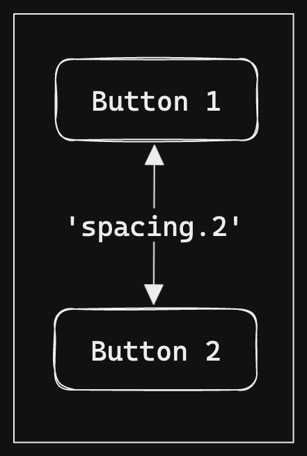

# Layout primitives and components

## Summary

This proposal outlines Blade's approach towards _the much requested_ layout primitives and components. It covers the proposed components, APIs along with prior art and alternatives considered.

### Background

In the React ecosystem, there are a plethora of ways to do layouts. With this design, our aim is to strike a fine balance between flexibility and constraints, so everything fits nicely with Blade's philosophy.

Since Blade is a [cross platform design system](https://portal.gitnation.org/contents/the-sorcery-of-building-a-cross-platform-design-system-architecture) that works in both React and React Native _(Learn Once, Write Anywhere)_; we've to make the layout strategy work within the constraints of both.

## Basic Example

With this proposal, we'll implement few primitives for handling layouts. Here are some pseudo code examples to explain how layout primitives / components can look in practice:

```tsx
import { Box, Button, Heading, Text } from '@razorpay/blade/components';

// adding spacing adjustments to entire container
<Box marginTop="spacing.1">
  <Button>Space on top</Button>
</Box>;

// adding space in between siblings
<Box display="flex" flexDirection="column" alignItems="center" gap="spacing.2">
  <Button>Need</Button>
  <Button>Some</Button>
  <Button>Space</Button>
</Box>;

// components themselves can include layout props
<Heading>Title</Heading>
<Text marginTop="spacing.1">Content</Text>
```

## Motivation

### Why

At the moment, we don't provide any primitives from Blade to help with composing multiple UI elements to build a larger layout. Consider a small example with two buttons aligned vertically and some spacing in between:

<div align="center">

</div>

Here's one contrived way to implement this UI in current state:

```tsx
<div style={{ display: 'flex', flexDirection: 'column', alignItems: 'center' }}>
  <Button>Button 1</Button>
  <div style={{ marginTop: theme.spacing[2] }}>
    <Button>Button 2</Button>
  </div>
</div>
```

There can be multiple ways to implement this in practice, for example:

1. Instead of using `style`, `className` could be used by consumers preferring to keep CSS separate.
1. React Native consumers might be using `View` instead of `div` with [`StyleSheet`](https://reactnative.dev/docs/stylesheet) API.
1. Some may be using `styled-components` and instead of writing styles inline creating [wrapper components](https://styled-components.com/docs/basics#getting-started) like `FlexContainer`, `ButtonContainer` with `styled.div` API and applying the style attributes there.
1. Some may have a custom `Flex` component that accepts props such as `flexDirection`, `alignItems` or a custom `Box` component for applying spacing with a `marginTop` prop.

Considering the variety of ways this can be implemented, few things are quite cumbersome:

1. Need for a lot of wrapper components _(wrapocalypse)_ for spacing and alignment, which quickly grows out of hand as UI evolves. One can't add styling for layout directly on a Blade component because we don't support `className` or `style` prop, which makes wrappers a necessity even for small things.
1. No built-ins for responsive layouts, say you want more spacing on desktop and less on mobile or you want the items to be aligned horizontally on desktop and vertically on mobile.
1. Need for manually hooking into the `theme` object for reaching into token values so the consumers can utilize them (eg. `theme.spacing[2]`).
1. Considering Blade is aimed at bridging cross platform gaps, you still need to write JSX with platform specific elements such as `div`, `View`.

#### `blade-old`

Historically, in `blade-old` _(deprecated)_ we followed an enhancer components based pattern which looked like below:

```tsx
<Space padding={[2.5, 0, 5, 0]}>
  <View>
    <Heading>Account Blocked</Heading>
  </View>
</Space>
```

This suffered from some related problems:

1. Need for creating nested wrapper components for everything for any adjustments - `Space`, `Size` and `View`
1. Readability wasn't as good because actual styles would get applied to the nested `View` which also made refactors harder
1. Slightly higher learning curve
1. No built-ins for responsive styles

### Proposed solution

With layout primitives in place, the above example could be implemented like:

```tsx
// one of the ways
<Box display="flex" flexDirection="column" alignItems="center">
  <Button>Button 1</Button>
  <Button marginTop="spacing.2">Button 2</Button>
</Box>
```

Thus, layout primitives can ease up building UIs with:

1. Cross platform components such as `Box` that work for both React and React Native with the same API.
1. Avoiding need for dedicatedly creating wrapper components for majority of usecases with ability to apply spacing directly on components with style props such as `marginTop`, having props such as `gap` for adding spacing between siblings or max flexibility with a `Box` component
1. Provide built-in capabilities for easing up responsive layouts with breakpoints based props such as `{ base: 'spacing.1', m: 'spacing.2' }`
1. No need to manually pass tokens for layout styling, the primitives will be able to derive actual value from tokens like `spacing.1`, `spacing.2`, etc.

Indubitably, layouts have been one of the most requested features by developers using Blade _([link](https://docs.google.com/document/d/14VAfBW7vz6hYOC1eWQO-_wOcECLU9UXRHVOSPC6OxZ8/edit#heading=h.zg0vxpo7xuc8) to internal document)_.

## Detailed Design

### Prior art

Every existing design system has tried to solve layouts bit differently. However, I've observed a few trends that seem to offer the best DX:

- A general purpose `Box` component along with helpful derivatives such as `Flex`, `Grid`, `Stack`, etc.
- Having support for theme aware styling props directly on components (such as `marginTop`, `paddingRight`, etc.)
- Reliance on having a `sx` prop for theme aware styling on components
- Built-in support for responsive styles on theme aware properties by either accepting an array / object format for values at different breakpoints
- Finally, some design systems also support a `style` or `className` prop on components for overrides and layouts for maximum flexibility

A brief study of some layout primitives is compiled in the [references](#references) section below.

### Layout primitives and components for Blade

In order to provide a good balance of flexibility and constraints within blade we should support the theme aware components and primitives listed below.

#### `Box` component

A general purpose component for building layouts. This component will do a bulk of heavy lifting for composing layouts. Sample usage:

```tsx
<Box
  display="flex"
  flexDirection="column"
  alignItems="center"
  marginTop="spacing.1"
  marginBottom="spacing.2"
  paddingX="spacing.1"
  gap="spacing.1"
>
  <Button>Button 1</Button>
  <Button>Button 2</Button>
  <Button>Button 3</Button>
</Box>
```

Since blade is not a general purpose design system we should lean more towards constraints initially, assess usecases in the future and then increase flexibility. Proposed props for initial version:

| Category            | Props                                       | Notes                                                                                                                                  |
| ------------------- | ------------------------------------------- | -------------------------------------------------------------------------------------------------------------------------------------- |
| Spacing             | `margin*`, `padding*`,                      | [List of props](https://github.com/styled-system/styled-system/blob/master/docs/table.md#space) referenced from styled-system.         |
| Layout              | `width*`, `height*`, `overflow*`, `display` | [List of props](https://github.com/styled-system/styled-system/blob/master/docs/table.md#layout) referenced from styled-system.        |
| Flexbox             | `flex*`, `align*`, `justify*`, `order`      | [List of props](https://github.com/styled-system/styled-system/blob/master/docs/table.md#flexbox) referenced from styled-system.       |
| Gap                 | `gap`, `rowGap`, `columnGap`                | Provides native flex functionality for spacing siblings.                                                                               |
| Position            | `position`, `zIndex`, `top`, etc.           | [List of props](https://github.com/styled-system/styled-system/blob/master/docs/table.md#position) referenced from styled-system.      |
| Grid **(web only)** | `grid*`                                     | [List of props](https://github.com/styled-system/styled-system/blob/master/docs/table.md#grid-layout)\* referenced from styled-system. |

> **Note**
>
> Not all CSS grid properties are covered in `styled-system` spec. These should be referenced from MDN during implementation. Here's a nice reference from [CSS Tricks](https://css-tricks.com/snippets/css/complete-guide-grid).

**Spacing values**

- All spacing based properties should accept spacing tokens i.e. `spacing.1`, `spacing.2`, etc.
- TypeScript auto suggestion hints should also show the `px` value associated with a spacing token, this helps in translating design from Figma to code since designs would have these in `px`.
- They should also accept `string` values eg. `'1px'`, `'100%'`, `'auto'`, `'1fr'` etc.
- `number` values should be disallowed eg. `1` as it can lead to confusions _(does this `2` imply `2px` or `spacing.2`)_, if someone wants to use a spacing token it must be prefixed like `spacing.*`.
- **Tradeoff:** The ability to pass any values here can lead to inconsistencies, where users may be passing values not in tokens (eg. `7px`) or passing the token value directly rather than using the actual token (eg. `2px` instead of `spacing.1`). However, this flexibility is needed in order to ease up building UIs. There are genuine usecases of using percentages and spacings not in spacing tokens (especially in landing pages). Also, spacing tokens are capped (`spacing.11`) so it wouldn't be feasible for users to specify larger spacings (without updating spacing tokens in theme), in such cases they would've to rely on custom components or styling.

**Negative values**

There are some usecases where you may want to pass negative values (eg. negative margin values to create full-bleed layouts that break out of main content). In order to support this we would need spacing values to support negative tokens as well. Instead of negative spacing tokens like `-spacing.1`, `-spacing.2`, etc. we'll let users pass negative values directly eg. `'-4px'`, `'-10%'` etc.

**Few points to note for React (web)**

- We should avoid supporting shorthands to save from confusions _(should I use `mb` or `marginBottom`)_.
- Flex gap has ~91% global [coverage](https://caniuse.com/?search=flex%20gap) (support added in some browsers mid 2020). Although the support looks decent, this might be problematic for some products supporting these browsers. There is a [post CSS plugin](https://github.com/gavinmcfarland/flex-gap-polyfill) which can polyfill this _(with some known limitations)_. Alternative is to internally translate gap properties to utilize CSS selectors such as [lobotomized owl](https://alistapart.com/article/axiomatic-css-and-lobotomized-owls/) `* + *`.
- Going forward with native `gap` supports seems like a fine choice here in favor of keeping things simple and native _(keeping it close to CSS `gap` today)_. Tradeoff being, older browsers will be able to render the layout with a degraded experience _(without spacing)_. If users wish to target older browsers they can opt for not using native flex gap and instead use margins (supported with layout styling props).
- CSS grid has ~96% global [coverage](https://caniuse.com/?search=css%20grid). Although we can only natively support it on web, it's worth the investment since it can simplify building grid based layouts.

**Few points to note for React Native**

- React Native [recently added](https://reactnative.dev/blog/2023/01/12/version-071) native support for `gap` specific properties in `v0.71`.
- Same should be updated in our docs and mobile apps onboarding
- Polyfilling this on native for older releases seems bit hacky _(with cloning and wrapping child elements)_ and unneeded because unlike browsers, all users can receive an updated React Native v0.71 app, tradeoff being we will only be supporting `gap` based props in React Native going forward from `0.71`, so consumer apps should update their React Native version in order to consume these APIs.
- No support for grid props since it isn't supported natively.
- The TypeScript typings and autosuggestions should appropriately be adjusted for web and native to accommodate the differences, eg. grid properties, `inline-flex`, `block` display properties won't be supported. This can be done with [`moduleSuffixes`](https://www.typescriptlang.org/tsconfig#moduleSuffixes) detailed in the [related RFC](./writing-cross-platform-typescript.md).

We have an [internal Box component](../packages/blade/src/components/Box/) but it exposes lot more properties than the ones associated with layout. It seems like a good idea to have a different public `Box` component with the restrictive but fully covered layout properties from above table.

**Not doing**

- We will not provide helper components such as `Flex`, `Grid`, `Spacer`.
- These create multiple ways of doing the same thing.
- These components seem unneeded with `Box` and can be created by users as local abstractions as needed.

#### Responsive styles

In order to ease up building responsive UIs all the style prop values will also support an alternate **object based format** that accepts breakpoints specific values, keeping mobile-first approach (`@media(min-width)`). Sample usage:

```tsx
<Box
  display="flex"
  flexDirection={{ base: 'column', l: 'row' }}
  alignItems="center"
  marginTop="spacing.1"
  marginBottom="spacing.2"
  paddingX="spacing.1"
  gap={{ base: 'spacing.1', m: 'spacing.2', l: 'spacing.3' }}
>
  <Button>Button 1</Button>
  <Button>Button 2</Button>
  <Button>Button 3</Button>
</Box>
```

The keys are derived from **breakpoints tokens**. An extra `base` key can be added as a helper to define values for breakpoints below the ones provided, for example `{ base: 'column', l: 'row' }` implies the value is `column` for all breakpoints less than `l`. All wider viewports will inherit largest provided breakpoint value because of `min-width`.

> **Note**
>
> Right now our breakpoints tokens are named as shorthands `s`, `m`, `l`, etc. We should keep the responsive properties same as breakpoints tokens. We can also consider making these device specific such as `smallMobile`, `largeMobile`, etc. to match the `useBreakpoints` hook. Tradeoff being, the current convention _(`xs`, `s`, `m`, `l`)_ sounds easier to compare _(is `largeMobile` larger than `smallTablet` or vice-versa)_. Changing these to `xsmall`, `small`, `medium` etc. can also work. Regardless, the responsive properties keys should match the breakpoints tokens.

#### Layout based styling props

All presentational components in Blade will support a subset of layout specific properties as top level props. The values will also be same as the ones supported in `Box`. Sample usage:

```tsx
<Box
  display="flex"
  flexDirection="column"
  alignItems="center"
  marginTop="spacing.1"
  marginBottom="spacing.2"
  paddingX="spacing.1"
>
  <Button>Button 1</Button>
  <Button marginTop="spacing.1">Button 2</Button>
  <Button marginTop="spacing.2">Button 3</Button>
</Box>
```

Styling props will be the preferred choice for minor adjustments that can be done directly on the component without a need for creating extra `Box` wrapper _(which also keeps the DOM less nested and easier to read)_. Later on, we might want to expand the scope of these props to cover things beyond layout if need arises.

As a tradeoff, styling props are pretty dangerous in terms of the flexibility they provide. They give power to customize any component to beyond recognition, for example you could customize the padding that comes on `Button`. In light of this capability we should support only a restricted set of properties to begin with _(which can't have adverse effect on look and feel of components)_.

Styling props should be the preferred choice for minor adjustments only. You may note `padding*` is skipped since it can break existing padding of blade components. Supported restricted properties:

| Category            | Props                                                                          | Notes                                                                                                                                                               |
| ------------------- | ------------------------------------------------------------------------------ | ------------------------------------------------------------------------------------------------------------------------------------------------------------------- |
| Spacing             | `margin*`                                                                      | `marginTop`, `marginLeft`, `marginRight`, `marginBottom`, `marginX`, `marginY` (React Native `marginHorizontal`, `marginVertical` mapped to these)                  |
| Flexbox             | `alignSelf`, `justifySelf`, `order`                                            | Only restricted set of properties applicable on flex children. Note: `justifySelf` doesn't work for flex layout but it can be used for block layout (web only).     |
| Position            | `position`, `zIndex`, `top`, etc.                                              | [List of props](https://github.com/styled-system/styled-system/blob/master/docs/table.md#position) referenced from styled-system.                                   |
| Grid **(web only)** | `gridColumn*`, `gridRow*`, `gridArea`, `justifySelf`, `alignSelf`, `placeSelf` | Only restricted set of properties applicable on [grid children](https://css-tricks.com/snippets/css/complete-guide-grid/#aa-properties-for-the-childrengrid-items). |
| Layout              | None                                                                           |                                                                                                                                                                     |
| Gap                 | None                                                                           |                                                                                                                                                                     |

#### Not doing, yet

The following shouldn't be considered right now:

- Separate components for `Flex`, `Grid`, `Spacer`, same can be achieved with `Box`
- Stack components (same can be achieved with `Flex`, `Grid`)
- `sx` prop, same can be achieved with layout based styling props on components
- `useSx` hook _(see [reference](#usesx-hook))_
- `className`, `style` props support _(see [drawbacks and constraints](#drawbacksconstraints))_
- Grid systems
- Bleed layout components
- Separate utility component for hiding (same can be achieved with responsive properties on `display` set to `none`, `flex`, `block`, etc.)
- Page level layout components (nav, header, sidebar, footer, etc.)

### Roadmap

Since layout components have a huge scope we should target to launch these progressively _(or we can release all at once)_. This also gives us room to iterate based on feedback from consumers.

Here's a proposed timeline:

1. `Box` component + responsive styles
1. Layout styling props on components

## Drawbacks/Constraints

- `className` and `style` props aren't supported. A drawback of this is people relying on maintaining their styles separately (`.css` files) wouldn't be able to set custom CSS properties on blade components. They'll have to rely on the supported primitives and components. As a constraint this helps us to keep the components less prone to getting styled unexpectedly _(a `padding` property on CSS can mess up the built-in spacing on a component)_. For example - exposing `className` enables users to [style the component](https://styled-components.com/docs/basics#styling-any-component) to anything.
- If someone is customizing the spacing theme tokens then default spacing typings might be off. This might need a utility such as [this](https://chakra-ui.com/docs/styled-system/advanced-theming#theme-typings) to correctly generate typings if we see usecases in the future.
- People can pass values that aren't part of spacing tokens eg. `7px`. It was considered to keep these restricted only to spacing tokens but that would have heavily restricted genuine usecases where some off scale values might be needed eg. in landing pages.
- We're not accepting `number` values for styling props and properties in order to avoid confusions. However, this behavior is different from vanilla React where you could pass unit-less values and they're internally transformed to corresponding pixel counterparts.
- We've constrained the supported properties both on layout components plus styling props in order to avoid unexpected usage, look and feel of components. This might feel too restrictive to some users compared to other general purpose design systems. The idea is to iterate and evolve what all properties should be supported based on feedback and usecases we see as users start using these primitives.
- Minor caveat of object based responsive properties, users will pass object literals so it would re-render all the time, however not a concern for now. This is applicable in general to React.
- A drawback of not exposing the helper components such as `Flex`, `Grid`, `Spacer` from our side is it can lead to deviating implementations. Some users may directly use `Box` component everywhere which will make the markup slightly harder to read (compared to having more readable `Flex`, `Grid`, etc.) in the JSX. However, as a constraint this ensures we don't have multiple components to do the same thing, affecting learning curve and usage.

As a contrasting philosophy, Primer has an interesting take on supporting all properties _which means you can actually style a button to look something very different from a button_:

> Assume that people will break the rules, provide safe ways for them to do so
>
> - [Primer](https://primer.style/react/philosophy#assume-that-people-will-break-the-rules-provide-safe-ways-for-them-to-do-so)

## Alternatives

- Not doing this and let users manage layout on their own (non ideal because of reasons mentioned in [motivation](#motivation)).
- Supporting all possible CSS properties, this gives maximum flexibility but also offers least constraints and therefore can lead to inconsistent UIs.
- Having a different API for accepting arbitrary values in layout props or keys like `unsafeSpacing`, `unsafeMarginTop` etc. However this would mean there would be multiple ways to do the same thing which could be used together like `marginTop`, `unsafeMarginBottom` which seems confusing. Also the friction here doesn't help in ensuring consistency. There can be genuine usecases where people might want to build custom components et al.
- Instead of supporting style props directly on components an alternative is to put all these inside a `sx` prop _(see [reference](#sx-prop))_. This primarily helps with separating layout properties in a separate prop which is focussed purely for this. However:
  - It creates another API, where on `Box` component users have to rely on props but on other components pass these properties in an object format to `sx` prop
  - Users have to pass some props directly but use an `sx` prop for other layout specific props
  - The properties right now are scoped intentionally to layout, however `sx` terminology can imply that all CSS properties would be supported by it

## Adoption strategy

1. Storybook guideline doc for understanding how to work with layouts in Blade, talking about best practices and common examples.
1. This is a progressive, non-breaking change (we can release components incrementally) which teams should be able to adopt on their own since it should drastically simplify building layouts.
1. Doesn't need separate prioritization from product, engineers can start using this for newer layouts and gradually replace their existing layout solutions (eg. their custom `Box` implementation). During this migration phase we might receive feedback on some edge cases that might not be smoothly addressed by layout primitives.

## How do we educate people?

- Add a guideline doc in storybook which talks about layout strategy with some sample examples (covering all supported APIs with best practices), include this rfc for background reading.
- TS docs and auto suggestions so people don't need to always refer documentation site. These should be correctly reflected for React and React Native.

## Open Questions

**Q1.** Should the base component be called `Box` or something else like `Layout`, `View`, etc.

| Box                                                                       | Layout                                                      | View                                                |
| ------------------------------------------------------------------------- | ----------------------------------------------------------- | --------------------------------------------------- |
| Well known terminology amongst existing systems                           | New terminology                                             | Seen across some implementations                    |
| Sounds quite generic                                                      | Sounds layout specific                                      | Sounds native only - related to React Native `View` |
| Users might expect this to support all CSS properties as in other systems | Can be reasoned to be limited to layout specific properties | Similar to `Box`                                    |

> There are only two hard problems in software engineering - cache invalidation, naming things and off by one error.

Considering the scope of `Box` may be expected to increase over time I'm leaning towards going ahead with `Box`. This also has an added benefit of incremental migration _(new properties will be available on this component)_. Plus it's a relatively well known terminology in the community. `Layout` does address the issue of reasoning about restricted set of properties but if we come across the need for having other CSS properties _(as usecases grows)_ they won't fit within `Layout` and we may need other components to support them. So, just by calling this primitive `Layout` it won't necessarily contain the need for other properties in building UIs.

**Q2.** Is there any property / primitive / component that you feel should be included besides the ones documented above? Please add any valid usecases in such case.

## References

This RFC takes inspiration from a lot of existing design systems and UI libraries _standing on the shoulders of giants_:

- Chakra
- Reshaped
- Spectrum
- Primer
- Mantine
- MUI
- Polaris
- Styled system / Theme UI
- Dripsy
- Nativebase
- `blade-old`

### General purpose `Box` component

- [Chakra](https://chakra-ui.com/docs/components/box) - supports general purpose `Box` plus helpers such as [`Flex`](https://chakra-ui.com/docs/components/flex), [`Spacer`](https://chakra-ui.com/docs/components/flex/usage#using-the-spacer) [`Grid`](https://chakra-ui.com/docs/components/grid)
- [Polaris](https://polaris.shopify.com/components/box) - supports a general purpose `Box`
- [Reshaped](https://reshaped.so/content/docs/utilities/view) - supports a general purpose `View` component that supports style props, grid based layouts, responsive styles, gaps (spacing in between siblings)
- [MUI](https://mui.com/material-ui/react-box/)
- [Mantine](https://mantine.dev/core/box/) - along with helpers such as [`Flex`](https://mantine.dev/core/flex/), [`Space`](https://mantine.dev/core/space/)
- [Spectrum](https://react-spectrum.adobe.com/react-spectrum/View.html) - along with helpers for [`Flex`](https://react-spectrum.adobe.com/react-spectrum/Flex.html), [`Grid`](https://react-spectrum.adobe.com/react-spectrum/Grid.html)
- [Primer](https://primer.style/react/Box) - they deprecated `Flex` and `Grid` helpers
- [Styled system](https://styled-system.com/guides/build-a-box)
- [Nativebase](https://docs.nativebase.io/next/box) - along with helpers for [`Flex`](https://docs.nativebase.io/next/flex), [`Spacer`](https://docs.nativebase.io/next/flex#h3-using-the-spacer)

### Style props

Theme aware style props to map the passed value to apt token in scale (for example `padding={4}` maps to 4th index in the spacing scale). Users may also pass values that don't exist in the scale such as `padding="7px"` in most such design systems.

- [Chakra](https://chakra-ui.com/docs/styled-system/style-props) - supports style props on all components with some helpful shorthands such as `mb`, `mx`, etc.
- [Reshaped](https://reshaped.so/content/docs/getting-started/react/core-concepts#values-and-tokens) - supported on some components such as `Card`, `View` (not all, eg. not supported on `Alert`).
- [Mantine](https://mantine.dev/styles/style-props/)
- [Spectrum](https://react-spectrum.adobe.com/react-spectrum/styling.html#style-props)
- [Primer](https://primer.style/react/system-props) - supported only on `Box` and `Text` components, recommends using `sx` prop on other components.
- [Nativebase](https://docs.nativebase.io/next/utility-first)

### `sx` prop

Quite similar to style props. Seen in various design systems:

- [Chakra](https://chakra-ui.com/docs/styled-system/the-sx-prop) - recommended as an escape hatch when something is not supported by style props or for writing custom [theme aware CSS rules](https://chakra-ui.com/docs/styled-system/the-sx-prop#creating-nested-selectors), pseudo selectors
- [MUI](https://mui.com/material-ui/react-box/#the-sx-prop)
- [Primer](https://primer.style/react/overriding-styles) - with a nice [philosophical quote](https://primer.style/react/philosophy#assume-that-people-will-break-the-rules-provide-safe-ways-for-them-to-do-so)
- [Mantine](https://mantine.dev/styles/sx/)
- [Dripsy](https://www.dripsy.xyz/usage/overview) - along with a helper hook for [`useSx`](https://www.dripsy.xyz/apis/useSx)

#### `useSx` hook

A `useSx` hook, inspired from [Dripsy](https://www.dripsy.xyz/apis/useSx#recommendations) can be helpful for targeting some minor usecases where users may want to style custom components or components which aren't directly accessible to be styled (for eg. `contentContainerStyle` on `FlatList`). I don't suspect a lot of usecases of this prop currently so this can be taken up later as en enhancement. Sample usage:

```tsx
import { useSx } from '@razorpay/blade/utils';

// ...

const sx = useSx();

return (
  <>
    <CustomHeader style={sx({ marginBottom: 'spacing.2' })} />
    <FlatList
      contentContainerStyle={sx({ marginX: 'spacing.1' })}
      data={data}
      renderItem={renderItem}
    />
  </>
);
```

`useSx` should return a function (named `sx` above) that can accept the same keys supported by `sx` prop.

### Responsive styles

Generally there are built-ins to handle responsive styles by either accepting values as object or array such as `padding={{ sm: 2, md: 3 }}`.

- [Chakra](https://chakra-ui.com/docs/styled-system/responsive-styles) - supports both object and array formats
- [Reshaped](https://reshaped.so/content/docs/getting-started/react/core-concepts#responsive-properties) - supports object format with mobile first approach.
- [Spectrum](https://react-spectrum.adobe.com/react-spectrum/layout.html#responsive-layout)
- [Primer](https://primer.style/react/overriding-styles#responsive-values)

### `Stack` component for spacing

- [Chakra](https://chakra-ui.com/docs/components/stack)
- [Mantine](https://mantine.dev/core/stack/)
- [MUI](https://mui.com/material-ui/react-stack/)
- [Polaris](https://polaris.shopify.com/components/stack)
- [Antd](https://ant.design/components/space) - utilizes a `Space` and `Space.Compact` component
- [Nativebase](https://docs.nativebase.io/next/stack)

### `className` or `style` props

- [Reshaped](https://reshaped.so/content/docs/getting-started/react/core-concepts#classnames-and-attributes) - supports `className` on all components
- [Mantine](https://mantine.dev/styles/styles-api/)
- [Spectrum](https://react-spectrum.adobe.com/react-spectrum/styling.html#escape-hatches) - supports `UNSAFE` prefix props and recommends users to talk to the design system team if these are actually needed

### Grid system

Few design systems support a grid system _(12 column, 24 column, etc.)_, although not as flexible it seems to work for applications strictly following grids from design.

- [Carbon](https://react.carbondesignsystem.com/?path=/docs/elements-grid--default)
- [Reshaped](https://reshaped.so/content/docs/utilities/view#multi-column-layout)
- [Polaris](https://polaris.shopify.com/components/grid)
- [Mantine](https://mantine.dev/core/grid/)
- [MUI](https://mui.com/material-ui/react-grid/)
- [Antd](https://ant.design/components/grid)
- [Bootstrap, the real OG](https://getbootstrap.com/docs/5.3/layout/grid/#how-it-works)
