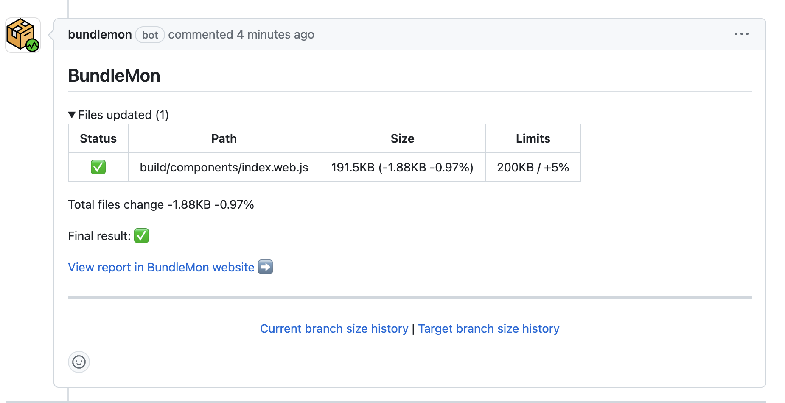
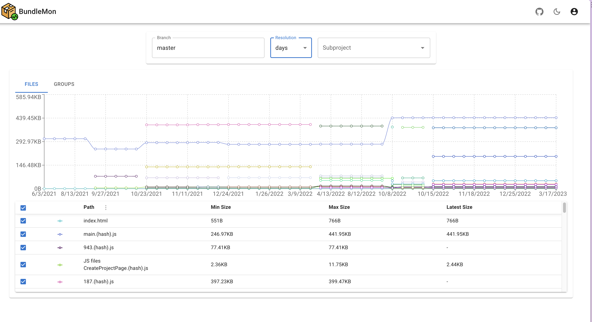

# Bundle Size Checks <!-- omit in toc -->

### Table Of Contents <!-- omit in toc -->
- [Summary](#summary)
- [Motivation](#motivation)
- [Detailed Design](#detailed-design)
    - [Bundle Size Limit \& Master Diff](#bundle-size-limit--master-diff)
      - [Bundlemon](#bundlemon)
    - [Tree Shaking Check](#tree-shaking-check)
- [Drawbacks/Constraints](#drawbacksconstraints)
- [Alternatives](#alternatives)
- [Adoption strategy](#adoption-strategy)
- [How do we educate people?](#how-do-we-educate-people)
- [Open Questions](#open-questions)

# Summary
This RFC proposes the integration of bundle checker into Blade to add checks for the bundle size. This will help us to keep track of the bundle size and prevent any regressions in the future.

# Motivation
As Blade grows, the size of the generated bundles also grows. This can lead to longer load times and increased bandwidth usage for our consumers. To prevent this, we need a way to monitor the size of our generated assets and ensure that they stay within acceptable limits. We also need to ensure that any changes we make to the design system don't inadvertently increase the size of our bundles, which can impact our users' experience.

# Detailed Design
We want to achieve the following:
1. Enable a way for the PR author to visualize the impact of their changes on the bundle size by having a diff from master's bundle size.
2. Ensure our tree-shaking works as expected by adding a check to ensure that unused components are not included in the bundle.

### Bundle Size Limit & Master Diff
We will achieve the following with this:
1. Enable a way for the PR author to visualize the impact of their changes on the bundle size by having a diff from master's bundle size.

#### Bundlemon
- We will use [bundlemon](https://github.com/LironEr/bundlemon) to achieve this. Bundlemon is a tool that helps us to keep an eye on our bundle size. It works by comparing the size of our bundles against a predefined limit. If the size of the bundle exceeds the limit, the build fails. It also provides a diff between the current bundle size and the size of the bundle on master. This helps us to visualize the impact of our changes on the bundle size.
- Bundlemon allows us to pass a config like this in `package.json`:
```json
{
  "files": [
    {
      "path": "./build/components/index.web.js",
      "maxSize": "200kB"
    },
    {
      "path": "./build/tokens/index.web.js",
      "maxSize": "100kB"
    },
    {
      "path": "./build/components/index.native.js",
      "maxSize": "200kB"
    },
    {
      "path": "./build/tokens/index.native.js",
      "maxSize": "100kB"
    }
  ]
}
```
- We will need to add a github action to run bundlemon on every PR. This can be a part of `blade-validate`(for PR) + `release`(for master push) workflow or a separate `bundle-check` workflow(that triggers on PR & master push).
- This github action will pass or fail based on the limits defined in the config.
- Bundlemon posts a comment on the PR like this:

  

- On visiting their report you can see a detailed view like this:
  

- You can also visualize the bundle history branch-wise like this:
  

### Tree Shaking Check
We will achieve the following with this:

3. Ensure our tree-shaking works as expected by adding a check to ensure that unused components are not included in the bundle.

- We will use [size-limit](https://github.com/ai/size-limit) for this
- size-limit is a tool that helps us to keep an eye on our bundle size. It works by comparing the size of our bundles against a predefined limit. If the size of the bundle exceeds the limit, the build fails.
- size-limit creates an empty project and imports the component that we want. It then creates a bundle and checks the size of the bundle. If the size of the bundle exceeds the limit, the build fails.
- This will enable us to limit importing only a small set of components like `{ Button, Text }` and check the bundle size to ensure that tree-shaking is working as intended and the overall bundle size is limited to the imported components.
- size-limit configuration looks like this:
```json
  "size-limit": [
    {
      "path": "./build/components/index.web.js",
      "import": "{ Button, Text }",
      "limit": "100 kB"
    }
  ]
```
- We are not using size-limit to do a total bundle size check or master diff because it doesn't support it as well as bundlemon does. Bundlemon has an infra set up that stores master bundle size and diffs it on every PR. We can't do that with size-limit.

# Drawbacks/Constraints
- Bundlemon is a free service but it also seems unmaintained since Jan 2022.
- If Bundlemon service goes down, we will not be able to get any master diffs but we will still be able to get the total bundle size limit check.
- Alternate to using bundlemon is setting up our own infra to store master bundle size and diff it on every PR. This would also be a lot of work and we would have to maintain it.
- I'd suggest taking the shorter route and using bundlemon for now. 
- [size-limit](https://github.com/ai/size-limit) is an open source project and is actively maintained.
- size-limit does not support master diffing. Ref: https://github.com/ai/size-limit/issues/318
- While setting up size-limit, I encountered certain cases where size-limit was not respecting the config (especially to disable load time checks, disabling gzip and compareWith configs). It works for the use-case we want it to work for. Since it's actively maintained, it could be fixed in the future.

# Alternatives
- Explored other design systems and how they do it.
  - Most design systems have their own infra for diffing bundle size with master
  - Some of the design systems were limited to only checking bundle size limit and not doing any diff
- Explored internal razorpay projects.
  - All the projects are only doing bundle size limits and none of them are doing master diffing.
- ~Discovered [bundlemon](https://github.com/LironEr/bundlemon) while writing this RFC, exploring it as an alternative to bundlewatch~ We will go ahead with bundlemon as it has a few extra features and is actively maintained
- Bundlewatch was an alternative we explored but we will go ahead with bundlemon as it has a few extra features and is actively maintained

# Adoption strategy
- NA
  
# How do we educate people?
- NA

# Open Questions
- Do we skip setting up our own infra for master diffing and use bundlewatch for now?
- Are there any other alternatives that would help us solve the 3 problem statements mentioned in this RFC better than the proposed solution?

