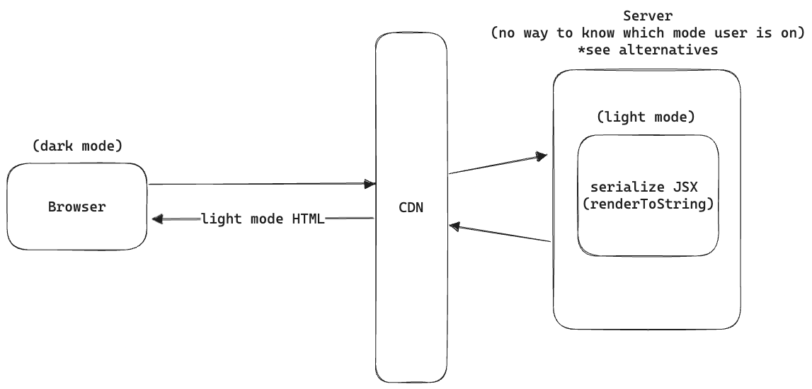

# Theme Switching and Dark Mode with SSR / SSG

## Summary

This proposal lays out the approach for leveraging dynamic themes when using Blade along with Server Side Rendering (SSR) or Static Site Generation (SSG) without any [Flash of Unstyled Content (FoUC)](https://www.wikiwand.com/en/Flash_of_unstyled_content).

> **Note**
>
> This proposal is only applicable for web apps (no changes for mobile apps).

## Basic Example

Consider the following example _(see steps below)_:



Steps:

1. User is on dark mode, browser sends request to server via CDN
1. Server has no context of user preference _(see [alternatives](#alternatives))_
1. Server serializes all the styles in default light mode _(we use CSS in JS in Blade)_ and sends back the HTML
1. User receives the markup in light mode
1. React [hydrates](https://react.dev/reference/react-dom/client/hydrateRoot) and changes the mode to match user preference (dark mode)
1. There was a visible FoUC from the initial HTML rendered by browser till React hydrated

## Motivation

With Blade we can already do theme switching (eg. between `paymentLight` and `bankingDark`) using `ThemeProvider`. However, since we're using CSS in JS solution (`styled-components`), it means we can't do this theme switching before React has had a chance to hydrate.

This leads to the primary motivation for this proposal:

- With current approach components can't dynamically adjust to [user preferences](https://developer.mozilla.org/en-US/docs/Web/CSS/@media/prefers-color-scheme) before hydrating / initial render
- Current approach can lead to FoUC for products relying on SSR

## Detailed Design

> **Note**
>
> [Josh's blog](https://www.joshwcomeau.com/react/dark-mode) covers almost everything that is required and a recommended read before going through this RFC. In detailed design I'll cover things primarily from Blade's angle.

### Rely on CSS variables for color related properties

Currently, whenever we're applying color related properties on components (eg. `color`, `backgroundColor`) we read them off `theme` context. For example:

```tsx
// StyledAccordionButton.web.tsx
{
  // ...
  color: theme.colors.surface.action.icon.hover.lowContrast;
  // ...
}
```

Such occurrences lead to FoUC because `theme` is updated only after hydration. Now consider using [CSS variables](https://developer.mozilla.org/en-US/docs/Web/CSS/Using_CSS_custom_properties) here:

```tsx
// StyledAccordionButton.web.tsx
{
  // ...
  color: var(--colors-surface-action-icon-hover-lowContrast);
  // ...
}
```

Anytime we change this variable `--colors-surface-action-icon-hover-lowContrast` in CSS _(even before hydration)_, it would reflect the changes on the UI immediately. Even if React fails to hydrate, the color changes will get reflected.

This is approach and the bulk of change that would be required on Blade side, following sub-sections cover details on achieving the same.

### Generate CSS variables

We're already generating these in `generateCssThemeVariables.js`. Build outputs different CSS files for payment and banking themes in light and dark modes. However this requires users to include the CSS files on their sides.

Since most users don't need to include the CSS theme files, we can populate these color based CSS variables from `ThemeProvider` using [global styles](https://styled-components.com/docs/api#createglobalstyle). With this, the CSS variables will be available in `:root` context.

### Changes for reading color tokens in Blade

Writing `var(--colors-surface-action-icon-hover-lowContrast)` like syntax every time is cumbersome and error prone. Instead we can add a utility that reads color tokens from CSS variables:

```tsx
{
  //...
  // returns the CSS variable: var(--colors-surface-action-icon-hover-lowContrast)
  color: getColorFromCSSVariables('surface.action.icon.hover.lowContrast');
}
```

To keep parity with native, the `.native` version of this utility would operate on `theme` so `.native` modules will continue to work as it is.

In order to prevent us from reading `theme.colors` directly after this change, we can add a [linting rule](https://eslint.org/docs/latest/rules/no-restricted-properties). This will flag occurrences wherever we accidentally read `theme.colors`.

### Script utilities

- `getInitialColorMode` - a function that would read user's preference from either `localStorage` (if present) or else fallback to `matchMedia` `prefers-color-scheme` and return `light` or `dark`. This will be used by `ThemeProvider` and may be used by user's for any custom logic.
- `BLADE_COLOR_MODE_INLINE_SCRIPT` - a serialized script that users can put in their HTML, this will be blocking and update CSS variables based on user preferences (light / dark).
- Setter and getter utilities - for reading and writing color modes, this will be useful to build color scheme toggles by users - these will involve syncing color mode preference to and from `localStorage` and also updating required CSS variables.

## Drawbacks/Constraints

Primary drawback for this approach is increase in complexity on Blade side, however the tradeoff is essential for creating a seamless theme switching UX for SSR products.

## Alternatives

- `Sec-CH-Prefers-Color-Scheme` header [reference](https://web.dev/user-preference-media-features-headers/#demo-of-sec-ch-prefers-color-scheme) to make server have context of user preferences and accordingly send an appropriate serialized markup. However [browser support](https://caniuse.com/?search=Sec-CH-Prefers-Color-Scheme) is limited (recent Chrome versions only).
- Instead of CSS variables adding a `className` _(say `dark`)_ on root and writing color related properties two times (for both light and dark modes). This is the approach I used on [my blog](https://divyanshu013.dev/blog/gatsby-dark-mode/) but it doesn't scale well with the number of properties and components we've. It would also involve duplication.

## Adoption strategy

- This will be a minor version upgrade (non-breaking)
- This will involve internal changes on reading color based tokens, primarily with CSS variables, these will be automatically injected from Blade's side globally so consumers shouldn't need any changes for adding CSS variables at their end
- For consumers relying on tokens to build custom components (SSR), we'll include in the docs a section on how they can leverage CSS variables from Blade so there is no visible FoUC for these custom components

## How do we educate people?

- Add a theme switching / dark mode guide to docs

## Open Questions

N/A

## References

- [Josh's blog on implementing dark mode with CSS variables](https://www.joshwcomeau.com/react/dark-mode/)
- [Divyanshu's blog on implementing dark mode with CSS classes](https://divyanshu013.dev/blog/gatsby-dark-mode/)
- [Adding dark mode with NextJS (outdated)](https://brianlovin.com/writing/adding-dark-mode-with-next-js)
