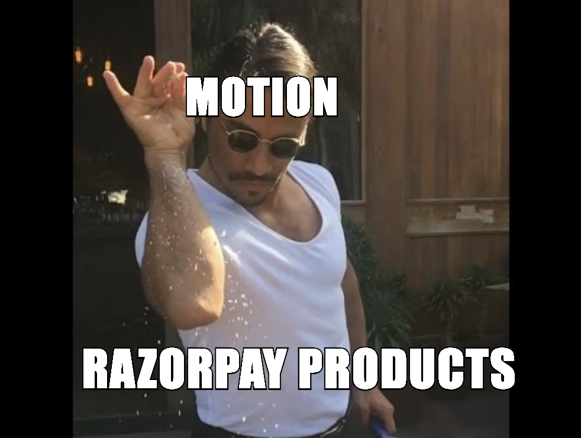
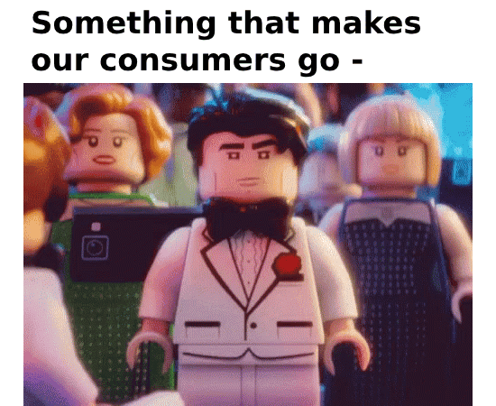

# Motion Presets RFC <!-- omit in toc -->

### Table Of Contents <!-- omit in toc -->

- [Summary](#summary)
- [Basic Example](#basic-example)
- [Motivation](#motivation)
- [Detailed Design](#detailed-design)
- [Drawbacks/Constraints](#drawbacksconstraints)
- [Alternatives](#alternatives)
- [Adoption strategy](#adoption-strategy)
- [How do we educate people?](#how-do-we-educate-people)
- [Open Questions](#open-questions)
- [References](#references)

# Summary

# Basic Example

```jsx
import { Fade, Card, CardBody } from '@razorpay/components/blade';

<Fade isVisible={showCard}>
  <Card>
    <CardBody>{/* Blade Card */}</CardBody>
  </Card>
</Fade>;
```

Checkout full [API Decisions for Motion Presets](#api-decisions)

# Motivation

You might have seen our previous [RFC on Motion Foundations](./2022-03-22-motion-rfc.md) we wrote in 2022. In that RFC we defined token structure and foundational principles for motion.

As our org grows, we believe our products need to go a bit beyond the functionality. How do we make sure that our consumers really love our products? How do we add that cherry on top, those sprinkles, that pineapple on pizza?

 

To solve for consumer delight, the blade team is working on simplifying adding motion in our consumer applications and introduce consistent animations to our product.

You can check our detailed design proposal on [Motion Refresh](https://docs.google.com/document/d/1Vj2E0v2IdLSHuJNRrmX7X-BFSqGpXMFU0jj7LLfoZGk/edit?usp=sharing) (Only accessible to Razorpay Employees)

# Detailed Design

For building presets, we have to figure out few things like

- [API Decision for Motion Presets](#api-decisions)
- [Libarary to use for Animations](#library-comparison)

## API Decisions

> [!NOTE]
>
> The API decisions here are only there to give some basic idea on the structure and usage. More accurate props will be updated here later once they are finalised in design.

### Entry / Exit Animation Presets

#### Fade

<table>
<tr>
  <td>

```jsx
import { Fade } from '@razorpay/blade/components';

<Fade isVisible={showCard}>
  <Card>
    <CardBody>
      <Text>Fade In/Out Card</Text>
    </CardBody>
  </Card>
</Fade>;
```

```ts
type FadeProps = {
  /**
   * whether to animate entry and / or exit
   *
   * @default inout
   */
  variant: 'in' | 'out' | 'inout';

  /**
   * What should trigger the motion
   *
   * @default ['mount']
   */
  motionTriggers: ('mount' | 'hover' | 'tap' | 'inView')[];

  /**
   * Visibility state. Only required when motionTriggers is set to mount
   *
   * @default true
   */
  isVisible?: boolean;
};
```

  </td>
  <td>

https://github.com/user-attachments/assets/65e056e6-e00f-4516-b7b1-4d9b27a5faec

_Previews are just examples of presets. They don't use actual durations and easings yet_

  </td>
</tr>
</table>

<details>
<summary>View API Decision for Slide, Move, and other Entry / Exit Animations</summary>

#### Slide

```jsx
import { Slide } from '@razorpay/blade/components';

<Slide>
  <Card>
    <CardBody>
      <Text>Fade In/Out Card</Text>
    </CardBody>
  </Card>
</Slide>;
```

```ts
type SlideProps = {
  /**
   * @default inout
   */
  variant: 'in' | 'out';
  /**
   * @default 'bottom'
   */
  direction: 'top' | 'right' | 'bottom' | 'left';
};
```

#### Move

```jsx
import { Move } from '@razorpay/blade/components';

<Move isVisible={showCard}>
  <Card>
    <CardBody>
      <Text>Fade In/Out Card</Text>
    </CardBody>
  </Card>
</Move>;
```

```ts
type MoveProps = {
  /**
   * @default inout
   */
  variant: 'in' | 'out' | 'inout';
  /**
   * @default 'bottom'
   */
  direction: 'top' | 'right' | 'bottom' | 'left';

  /**
   * Visibility state
   */
  isVisible?: boolean;
};
```

</details>

### Highlight Animations

#### Morph

> [!Note]
>
> Defining morph as preset is a bit tricky and need to make sure the API is feasible with all possible scenarios. Currently we've done a basic feasibility check but we might change / update the API if we come across some animation that can't be built with this API.

<table>
<tr>
  <td width="600px">

<!-- prettier-ignore -->
```jsx
import { AnimatePresence } from 'framer-motion';
import { 
  Button, 
  Morph 
} from '@razorpay/blade/components';

<AnimatePresence>
{
  isChatVisible ? (
    <Morph layoutId="chat-interface">
      <ChatInterface />
    </Morph>
  ) : (
    <Morph layoutId="chat-interface">
      <Button icon={RazorpayIcon} />
    </Morph>
  )
}
</AnimatePresence>
```

  </td>
  <td width="500px">

https://github.com/user-attachments/assets/2ec967a5-1e17-443a-a3a9-230962f6bd9a

_Previews are just examples of presets. They don't use actual durations and easings yet_

  </td>
</tr>
</table>

<details>
<summary>Alternate Morph APIs</summary>

#### 2. Using `motion` from framer-motion

```jsx
import { motion } from 'framer-motion';
import { Heading } from '@razorpay/blade/components';

const CardHeading = motion(Heading);

<CardHeading layoutId="card-heading" transition={{ duration: theme.motion.duration.slow }}>Hello, World!</CardHeading>
<CardHeading as="h1" layoutId="card-heading">Hello, World!</CardHeading>
```

**Cons:**

- We won't be able to preset the animation styles and durations with this approach
- Can lead to inconsistent animations
- Inconsistent with other motion presets so not very intuitive and requires learning framer-motion for syntax

#### 3. Exposing `morph` Function from Blade

```jsx
import { Heading, morph } from '@razorpay/blade/components';

const CardHeading = morph(Heading);

<CardHeading layoutId="card-heading">Hello, World!</CardHeading>
<Card>
  <CardBody>
    <CardHeading as="h1" layoutId="card-heading">Hello, World!</CardHeading>
    <Box>
      <Text>Other Text</Text>
    </Box>
  </CardBody>
</Card>
```

**Pros:**

- Allows presetting animation properties on blade

**Cons:**

- Inconsistent with other motion presets so not very intuitive
- Comparitively more verbose than suggested API

</details>

#### AnimateInteractions

When we wrap a certain component in AnimateInteractions wrapper from blade, we can animate the children component on interactions of the parent component.

#### Scale

Scale animation can be used indepedently to scale item on certain actions but also inside AnimateInteractions.

<table>
<tr>
  <td width="700px">
In below example, the images scales up when its parent container is hovered<br/><br/>

<!-- prettier-ignore -->
```jsx
import { 
  AnimateInteractions, 
  Scale 
} from '@razorpay/blade/components';

<AnimateInteractions motionTriggers={['hover']}>
  <Card>
    <CardBody>
      <Scale>
        
      </Scale>
    </CardBody>
  </Card>
</AnimateInteractions>;
```

  </td>
  <td width="400px">

https://github.com/user-attachments/assets/5934de65-6d55-4901-a513-a8de21cb56dc

_Previews are just examples of presets. They don't use actual durations and easings yet_

  </td>
</tr>
</table>

You can also use `motionTriggers` prop directly on scale to scale up the element on hover / tap, etc.

E.g. in this case, the image scales up on hover of the image

```jsx
<Scale motionTriggers={['hover']}>
  
</Scale>
```

## Staggered Animations

<table>
<tr>
  <td width="600px">

<!-- prettier-ignore -->
```jsx
import { 
  Stagger, 
  Fade 
} from '@razorpay/blade/components';

<Stagger isVisible={showCards}>
  <Fade>
    <Box />
  </Fade>
  <Fade>
    <Box />
  </Fade>
  <Fade>
    <Box />
  </Fade>
</Stagger>;
```

```ts
type StaggerProps = {
  /**
   * Visibility state
   */
  isVisible?: boolean;
};
```

  </td>
  <td width="600px">

https://github.com/user-attachments/assets/392a2aca-a943-49cf-8c94-cb0acd65df97

_Previews are just examples of presets. They don't use actual durations and easings yet_

  </td>
</tr>
</table>

- [Stagger Animations POC](https://codesandbox.io/p/sandbox/framer-motion-side-menu-forked-3flyxv)

## Page Transitions

The same presets that we have for Entry / Exit, can be used for page transitions. The exit runs on removal of route, and entry runs on enter of route.

It requires additional wrapper of AnimatePresence around the route. You can check code in [POC: Page Transitions with Framer Motion and React Router](#page-transitions-with-framer-motion-and-react-router).

Detailed docs and examples will be added post implementation.

### View Transitions API for MPA

There is new experimental view transitions API that is available inside a flag in chrome.

Although we explored it, we're not planning to build presets around it yet since

1. Lack of browser support in modern browsers
2. The syntax being CSS so requires different exploration than our other framer motion presets
3. Rare usecase because its only valid in cross-application navigations such as navigating to dashboard post login
4. The syntax of view-transition for MPA has changed in the past and might change again since its not well adopted yet.

https://stackblitz.com/edit/stackblitz-starters-jevyms?description=HTML/CSS/JS%20Starter&file=script.js,styles.css,page2.html&terminalHeight=10&title=Static%20Starter

**Conclusion:** Thus we can wait for some time for it to mature and be supported in browsers. Framer Motion itself might come up with some wrappers on top of their API to support this which will make it easier for us to implement presets

## Library Comparison

### Goals of Ideal Library

1. License (Preferrably free to use)
2. Hardware Accelarated Animations (Using CSS or [WAAPI](https://developer.mozilla.org/en-US/docs/Web/API/Web_Animations_API))
3. Easy to implement complex animations
4. React Router page transition support
5. Morph Animations / Layout Animations
6. Small bundle-size

Lets compare some libraries over these ideals-

### Comparison Table

| **Goal**                                 | **Framer Motion**                                                                                                                             | **Motion One**                                | **GSAP**                               | **Vanilla CSS Animations**                    |
| ---------------------------------------- | --------------------------------------------------------------------------------------------------------------------------------------------- | --------------------------------------------- | -------------------------------------- | --------------------------------------------- |
| **License** (Preferrably free to use)    | ✅ MIT                                                                                                                                        | ✅ MIT                                        | ❌ (Commercial License + Paid Plugins) | ✅ No License                                 |
| **Hardware Accelarated Animations**      | ✅ (Hybrid - WAAPI for some transformations with fallback to JS) [Hardware Accelarated POC](#hardware-accelarated-motion-using-framer-motion) | ✅ (Built on WAAPI)                           | ❌                                     | ✅                                            |
| **Easy to implement complex animations** | ✅ (Declarative API)                                                                                                                          | ❌                                            | ❌                                     | ❌                                            |
| **React Router Page Transition**         | ✅                                                                                                                                            | ❌ (No native support but can be implemented) | ✅                                     | ❌ (No native support but can be implemented) |
| **Morph Animations / Layout Animations** | ✅ [Framer Motion POC](#morph-animations-with-framer-motion)                                                                                  | ❌                                            | ✅                                     | ❌                                            |
| **Small bundle size**                    | ❌ (4.6kb core + 15kb (for base animations) + 10kb (if Morph preset is used))                                                                 | ✅ (4kb )                                     | ❌ (26kb core + features)              | ✅ (0kb)                                      |

There is also detailed comparison of these libraries at [Motion One Docs - Feature Comparisons](https://motion.dev/docs/feature-comparison#comparison-table)

## POCs

### Hardware Accelarated Motion using Framer Motion

https://github.com/user-attachments/assets/5aa7ba3f-666e-449c-ae1d-821f93c12962

<p align="right">
  <a href="https://codesandbox.io/p/sandbox/framer-motion-enter-animation-forked-rk3tvd?file=%2Fsrc%2FApp.tsx%3A27%2C28"></a>
</p>

### Hardware Accelarated Motion using GSAP

> [!NOTE]
>
> While GSAP does offload some work to hardware using CSS, it still requires javascript to work and stops working if JS thread is blocked

https://github.com/user-attachments/assets/57593b19-3a19-4713-b768-9bcbf69097ee

<p align="right">
<a href="https://codesandbox.io/p/sandbox/framer-motion-hardware-accelarated-animations-forked-7qjyg9">
  
</a>
</p>

### Morph / Layout Animations with Framer Motion

https://github.com/user-attachments/assets/ad3d4a23-c3b9-4980-a051-a0f44e7224dc

<p align="right">
  <a href="https://codesandbox.io/p/sandbox/framer-motion-hardware-accelarated-animations-forked-q674t5">
  
</a>
</p>

### Page Transitions with Framer Motion and React Router

Goal of the POC was to make sure if its possible to animate some part of the page while keeping the other part of the page stable. It was success with framer motion

https://github.com/user-attachments/assets/b53779ec-55ec-4ef4-bdca-60b2e46cb3ae

<p align="right">
  <a href="https://codesandbox.io/p/sandbox/inspiring-stallman-2wn2v5">
  
</a>
</p>

### Other POCs

- [Stagger Animations POC](https://codesandbox.io/p/sandbox/framer-motion-side-menu-forked-3flyxv)
- [Framer Motion Layout Animations with Blade Components](https://stackblitz.com/edit/framer-motion-blade-poc?file=App.tsx,Logger.tsx)
- [Enhancer Component POC to check API feasibility](https://stackblitz.com/edit/enhancer-component-poc?file=App.tsx)

# Accessibility

On [reduced motion setting](https://developer.mozilla.org/en-US/docs/Web/CSS/@media/prefers-reduced-motion), we'll stop the motion (internally set duration to 0 for all animations). The UI will continue to work but without motion.

# Drawbacks/Constraints

- Framer Motion as a library will be introduced in customer projects which might increase their bundle size.

We'll be using the reduced bundle size version of motion core `m` internally for presets to ensure Blade uses minimal bundle size.

Recommended way to load framer motion would be -

### Lazy Loaded Motion

#### `features.ts`

```js
// If you're using basic presets like Fade, Move, Slide, Scale, etc
import { domAnimations } from 'framer-motion';
export default domAnimations; // 15kb;

// OR

// If you're using previously mentioned presets + `Morph` preset or drag / drop animations from framer-motion
import { domMax } from 'framer-motion';
export default domMax; // 25kb
```

#### App.tsx

```jsx
// Make sure to return the specific export containing the feature bundle.
const loadFeatures = () => import('./features').then((res) => res.default);

// This animation will run when loadFeatures resolves.
function App({ children }) {
  return <LazyMotion features={loadFeatures}>{children}</LazyMotion>;
}
```

# Alternatives

- Alternative libraries and native CSS solution is compared in [Library Comparison Section](#library-comparison)
- Other alternative is to let consumers do animations
  - Since there are less high level primitives available and it has led to inconsistent motion across products, we prefer to simplify building animations while giving out consistency

# Adoption strategy

- We plan to target 1 project this quarter (Q2) to get motion adopted
- The new projects that are built, should be built with motion presets on design and dev
- The earlier project that we have should use motion presets when they redesign / revamp

# How do we educate people?

- Interactive documentation will be added on blade.razorpay.com explaining how to use each preset
- Close-to-real-life examples will be added in documentation to help give idea on how these presets can be used to build complex real-world animations

# Open Questions

- React Native support for presets?
  - We will continue to use React Native Reanimated for now. Similar presets can be built on top of react native reanimated in future
- Should motion components be imported from `@razorpay/blade/components` like other components or `@razorpay/blade/motion`
  - We'll continue to import from components and utils since they are also components only.

# References

- ### Libraries

  - [Framer Motion](https://www.framer.com/motion/)
  - [Motion One](https://motion.dev/docs)
  - [GSAP](https://gsap.com/)

- ### Design Systems with Motion Presets

  - [Material UI - Transitions](https://mui.com/material-ui/transitions/)
  - [Carbon - Motion (Only export easing curves to consumers)](https://carbondesignsystem.com/elements/motion/code)
  - [Fluent UI - Motion APIs](https://react.fluentui.dev/?path=/docs/motion-apis-createmotioncomponent--docs)
  - [Atlaskit by Atlassian - Motion Components](https://atlassian.design/components/motion/entering-motions/examples)

- ### Other Motion References

  - [Framer Motion vs Motion One by Matt Perry (Creator of both libraries)](https://motion.dev/blog/should-i-use-framer-motion-or-motion-one)
  - [Motion One vs Other Libraries - Feature Comparison](https://motion.dev/docs/feature-comparison)
  - [Motion One & Browser Performance Guide](https://motion.dev/docs/performance)
  - [Framer Motion - Hardware Accelarated Animations](https://www.framer.com/motion/animation/#hardware-accelerated-animations)
    - [Release Date](https://github.com/framer/motion/blob/main/CHANGELOG.md#910-2023-02-23)
  - [View Transitions API - MDN](https://developer.mozilla.org/en-US/docs/Web/API/View_Transitions_API)
  - [Web Animations API - MDN](https://developer.mozilla.org/en-US/docs/Web/API/Web_Animations_API/Using_the_Web_Animations_API)
  - [CSS Triggers - What CSS property triggers which type of render](https://csstriggers.com/)
  - [Framer Motion Page Transitions Demo](https://codesandbox.io/p/sandbox/framer-motion-react-router-6-page-transitions-2f2olf?file=%2Fsrc%2Ftemplate%2FGallery.tsx%3A18%2C38&from-embed=)
  - [Framer Motion Scroll Animations](https://codesandbox.io/p/sandbox/framer-motion-whileinview-2hbg5?file=%2Fsrc%2Findex.tsx&from-embed=)
